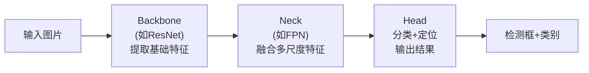
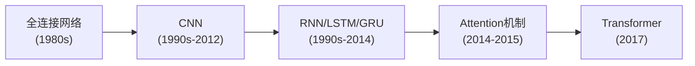

+++
date = '2026-07-03T20:20:00+08:00'
draft = false
title = 'Ask anything'
isCJKLanguage = true
math = true
+++

# Chat Transcript: 神经网络架构及注意力

## User

这里说的神经网络架构是指什么？和backbone是一个意思吗？我不太了解神经网络，需要你为我介绍，以及它说注意力机制取代了循环和卷积层是指什么？

## Aurelle

> 用户问的是神经网络架构和"骨干网络"的区别，以及注意力机制如何替代循环和卷积，需要用中文逐步解释并配合类比。我应该从架构的基本概念开始，然后说明骨干网络的含义，最后解释注意力机制的作用，可以引用《Attention is All You Need》这篇论文来支撑说明。
> 
> 现在我要继续讲解RNN和CNN的作用原理，为什么它们之前被广泛使用，然后引入Transformer如何用自注意力机制来替代这两种方法，并用具体例子逐步说明这个转变。

## 神经网络"架构"是什么？

先从一个比喻开始理解。把神经网络想象成一个**处理信息的工厂流水线**：原材料（比如一句话）从一端进去，经过一系列加工车间（每个车间做不同的数学运算），最后从另一端产出成品（比如翻译后的句子，或者对图片的分类结果）。

"**架构**（architecture）"指的就是这条流水线的**整体设计蓝图**——有多少个车间、车间之间怎么连接、每个车间内部用什么样的加工方式。不同的架构设计（比如循环神经网络 RNN、卷积神经网络 CNN、Transformer）就像是不同的工厂布局方案，都能完成"处理数据"这个大目标，但内部运作方式完全不同。

### "架构"和"backbone"是一个意思吗？

不完全一样，但有联系：

- **架构（architecture）**是一个更宽泛的词，指整个模型的设计——包括输入怎么处理、中间怎么计算、输出怎么产生。
- **Backbone（骨干网络）**通常特指模型中负责**提取特征**的那个核心部分，尤其在计算机视觉里常用这个词（比如用 ResNet 作为图像模型的 backbone，然后再接一个专门做分类或检测的"头部"）。

打个比方：架构是整栋大楼的设计图（地基、承重墙、楼层布局、外立面全都算），而 backbone 更像是这栋楼的**承重骨架**——是架构中最核心、支撑其他部分的那一段。在这篇论文里，作者提出的 Transformer 本身就是一种全新的**架构**，它的编码器（encoder）部分有时候在后续研究中也会被当作"backbone"来使用，用来给其他任务提取特征。

---

## 注意力机制取代了循环和卷积层是什么意思？

要理解这句话，得先明白 RNN 和 CNN 原本是怎么处理序列数据（比如一句话）的，然后再看 Transformer 换了一种完全不同的思路。

### 第一步：循环神经网络（RNN）是怎么工作的

想象你在**逐字阅读**一句话，每读一个字，你都会在脑子里更新一下"到目前为止我理解的意思"，然后带着这个理解继续读下一个字。RNN 就是这样工作的：它一个词一个词地处理句子，每一步都根据"前一步的理解状态"和"当前这个词"来生成新的理解状态。

> "Recurrent models typically factor computation along the symbol positions of the input and output sequences. Aligning the positions to steps in computation time, they generate a sequence of hidden states h_t, as a function of the previous hidden state h_{t−1} and the input for position t." [RNN工作方式](https://www.alphaxiv.org/abs/1706.03762?page=2)

这种方式有个明显的问题：因为你必须**按顺序**一个字一个字地读，不能跳着读或者同时读多个字，所以在用GPU这种擅长并行计算的硬件训练时，效率很低——句子越长，这个问题越严重。

> "This inherently sequential nature precludes parallelization within training examples, which becomes critical at longer sequence lengths" [RNN的局限](https://www.alphaxiv.org/abs/1706.03762?page=2)

### 第二步：卷积神经网络（CNN）的做法

CNN 换了一种思路：它不是按顺序一个个读，而是用一个**固定大小的"窗口"**（叫做卷积核）同时扫过句子的不同片段，就像用放大镜同时观察好几个相邻的词。这样做的好处是可以并行计算（不同窗口位置可以同时处理），但问题是：如果两个词离得很远（比如句子开头和结尾各有一个词，它们之间有关联），窗口很小的话就需要**堆叠很多层**卷积才能让这两个远距离的词"产生联系"。

> "the number of operations required to relate signals from two arbitrary input or output positions grows in the distance between positions, linearly for ConvS2S and logarithmically for ByteNet. This makes it more difficult to learn dependencies between distant positions" [CNN的局限](https://www.alphaxiv.org/abs/1706.03762?page=2)

### 第三步：自注意力（Self-Attention）换了什么思路

自注意力机制的核心想法是：**让句子中的每一个词都可以直接"看"句子中的所有其他词，一步到位地判断彼此的关联程度，不需要按顺序传递信息，也不需要一层一层堆叠。**

打个比方：如果说 RNN 是"传话游戏"（信息必须一个人传给下一个人，传到最后可能失真，也很慢），CNN 是"分组讨论"（每个小组只能看到附近几个人的意见，想了解全班意见得开好几轮会），那么自注意力就像是**开一场全班圆桌会议**——每个人都可以同时听到、也可以直接和班上任何一个人交流，一轮就能获取全局信息。

具体来说，对于句子中的每个词，模型会计算它和其他所有词之间的"相关程度"（用 Query、Key、Value 三个向量做匹配），然后根据相关程度对所有词的信息做加权求和：

$$\text{Attention}(Q, K, V) = \text{softmax}\left(\frac{QK^T}{\sqrt{d_k}}\right)V$$

[缩放点积注意力](https://www.alphaxiv.org/abs/1706.03762?page=4)

这样带来了两个关键好处，对应论文表1里对比的三个维度（每层计算量、能否并行、任意两个词之间信息传递的路径长度）：

- **完全并行**：因为每个词和其他词的关联可以同时计算，不用像 RNN 那样等前一步算完才能算下一步。
- **任意两个词之间只需要一步**：不管两个词离多远，自注意力都能一步直接建立联系，不需要像 CNN 那样堆叠很多层。

> "As noted in Table 1, a self-attention layer connects all positions with a constant number of sequentially executed operations, whereas a recurrent layer requires O(n) sequential operations." [自注意力优势](https://www.alphaxiv.org/abs/1706.03762?page=6)

所以"用注意力机制取代循环和卷积层"的意思就是：Transformer 这个新架构里，**完全没有** RNN 那种"一步步传递"的循环结构，也**完全没有**CNN 那种"局部窗口扫描"的卷积结构，全部换成了自注意力这一种机制来处理序列中词与词之间的关系。这也是论文标题"Attention Is All You Need"（你只需要注意力）的由来。

> "In this work we propose the Transformer, a model architecture eschewing recurrence and instead relying entirely on an attention mechanism to draw global dependencies between input and output." [Transformer核心思想](https://www.alphaxiv.org/abs/1706.03762?page=2)

---

### 小结一下

| 概念 | 类比 | 特点 |
|---|---|---|
| RNN | 传话游戏，一个字一个字顺序处理 | 慢，难并行，长距离信息容易丢失 |
| CNN | 分组讨论，用固定窗口扫描局部 | 可并行，但远距离信息需要堆很多层才能传到 |
| 自注意力（Transformer核心） | 圆桌会议，人人可直接对话 | 可并行，任意两个词一步建立联系 |

如果你想继续深入，我可以进一步拆解"多头注意力（Multi-Head Attention）"是怎么让模型从不同角度同时理解句子的，这也是这篇论文里另一个很巧妙的设计。

## User

1.进一步讲解神经网络的结构是什么，发展历程是什么，骨干网络，头，尾？neck都分别是什么？对应CNN、RNN等等是怎么做的？LSTM是什么，GRU是什么？进一步拆解"多头注意力（Multi-Head Attention）"是怎么让模型从不同角度同时理解句子的

## Aurelle

> I'm planning a comprehensive educational breakdown of neural networks in Chinese, starting with foundational concepts like network architecture and historical development, then progressing through key components like CNNs, RNNs, LSTMs, and GRUs before diving into multi-head attention mechanisms with reference to the current paper.

## 神经网络结构全景图：从骨架到发展史

这是一个大话题，我们按照"整体框架 → 发展历程 → 经典结构详解 → 回到 Transformer 的多头注意力"这个顺序，一步步搭建理解。

---

### 一、神经网络的"结构"到底长什么样？

先用一个比喻打底：把一个深度学习模型想象成一个**人体**。

- **躯干/骨架（Backbone）**：负责从原始输入（图片的像素、句子的文字）里提取"有用的特征"，就像人体的骨骼和肌肉系统，支撑起整个身体的运作。这是模型最"重"、参数最多、最耗计算的部分。
- **脖子（Neck）**：连接骨架和头部的过渡部分，负责把骨干提取出来的多层次特征进行**融合、加工、整理**，让头部更容易使用。就像脖子把身体的神经信号汇总、传递给大脑。
- **头（Head）**：负责根据整理好的特征做出**最终决策**——比如"这张图里有没有猫"、"这个词应该翻译成什么"。头部通常比较轻量，专门针对具体任务定制。

打个更具体的例子（目标检测任务，比如识别照片里的汽车）：

- Backbone 好比"眼睛看到了什么形状、颜色、纹理"（低级到高级的视觉特征）；
- Neck 好比"把远处看到的大轮廓和近处看到的细节结合起来"（多尺度信息融合）；
- Head 好比"大脑做出判断：这是一辆车，位置在这里"。

**为什么要这样分工？** 因为 backbone 通常是在大规模数据（如 ImageNet）上"预训练"好的通用特征提取器，可以像乐高积木一样被复用到不同任务中；而 neck 和 head 则根据具体任务（分类、检测、分割、翻译……）单独设计和训练。这种"骨架通用、头部专用"的思路极大提升了开发效率。

⚠️ 需要说明的是：Transformer 论文本身并没有使用 backbone/neck/head 这套术语（这套术语更多来自后来的计算机视觉领域，尤其是目标检测），但理解了这个框架后，你会发现很多现代模型（包括基于 Transformer 的视觉模型）都能被套进这个框架里理解。

---

### 二、神经网络结构的发展历程（一条时间线）

用一条故事线来讲，会更容易记住"为什么会出现这些结构"：

1. **全连接网络（Fully Connected Network）**：最早最朴素的结构，每个神经元都和上一层所有神经元相连。问题：参数太多，处理图片、文字这种有"结构"的数据时效率低、容易过拟合。

2. **CNN（卷积神经网络，约1990s提出，2012年AlexNet爆发）**：专门为图片设计，利用"局部相关性"（相邻像素更相关）和"权重共享"（同一个卷积核扫描全图）大幅减少参数。适合处理**空间结构**数据。

3. **RNN 及其改进版 LSTM、GRU（1990s-2014）**：专门为**序列数据**（文字、语音、时间序列）设计，通过"记忆状态"按顺序处理数据。

4. **Attention 机制（2014-2015）**：一开始是**辅助**RNN的工具，帮助模型在处理长句子时"回头看"更相关的部分，解决RNN记忆力不够的问题。

5. **Transformer（2017，也就是你正在看的这篇论文）**：作者们的洞察是——**既然注意力机制这么好用，为什么还需要RNN？干脆把RNN和CNN都扔掉，只用注意力机制。** 这就是论文标题"Attention Is All You Need"的由来。

---

### 三、CNN 具体是怎么做的？

CNN 的核心操作是**卷积（convolution）**：用一个小的"滑动窗口"（卷积核，比如3×3的小方框）在图片上滑动，每滑到一个位置就做一次局部的加权求和，提取局部特征（比如边缘、角点）。

- **低层**卷积层提取简单特征（边缘、颜色块）
- **高层**卷积层组合低层特征，提取复杂特征（眼睛、轮子、整张脸）

这就像你先看清楚一小块一小块的拼图碎片（边缘线条），再把碎片组合起来认出整张图（一只猫）。CNN 的局限正是论文中提到的——要让相距很远的两个位置产生联系，需要堆叠很多层：

> "A single convolutional layer with kernel width k < n does not connect all pairs of input and output positions. Doing so requires a stack of O(n/k) convolutional layers" [CNN局限性](https://www.alphaxiv.org/abs/1706.03762?page=7)

### 四、RNN、LSTM、GRU 分别是什么？

#### RNN（基础版）
上一轮我们讲过，RNN 就是"传话游戏"——按顺序读词，每读一个词就更新一次"记忆状态"$h_t$，这个状态既依赖当前输入，也依赖上一步的状态：

$$h_t = f(h_{t-1}, x_t)$$

**问题**：如果句子很长，最开始读到的信息在传递很多步之后会逐渐"稀释"甚至丢失，就像传话游戏传到第20个人时,原始信息已经严重失真——这叫**长期依赖问题（long-term dependency problem）**。这也正是论文里提到的：

> "the length of the paths forward and backward signals have to traverse in the network. The shorter these paths between any combination of positions... the easier it is to learn long-range dependencies" [长距离依赖问题](https://www.alphaxiv.org/abs/1706.03762?page=6)

#### LSTM（长短期记忆网络，1997年提出）
LSTM 是对 RNN 的改进，专门为了解决"记忆容易丢失"的问题。它引入了一个额外的"传送带"式的**记忆细胞（cell state）**，并用三个"闸门"来控制信息流动：

- **遗忘门（forget gate）**：决定要"忘掉"多少旧记忆
- **输入门（input gate）**：决定要"记住"多少新信息
- **输出门（output gate）**：决定当前要"输出"多少记忆内容

打个比方：LSTM 就像一个有笔记本的读者——读到重要信息就记在笔记本上（长期保留），读到不重要的信息就随手丢掉，需要用的时候再翻笔记本查阅，而不是完全依赖"脑子里刚记住的内容"（普通RNN的隐藏状态）。这样即使句子很长，重要的早期信息也不会轻易丢失。

论文的引言部分正是提到了这个背景：

> "long short-term memory [13] and gated recurrent [7] neural networks in particular, have been firmly established as state of the art approaches in sequence modeling and transduction problems" [LSTM/GRU背景](https://www.alphaxiv.org/abs/1706.03762?page=2)

#### GRU（门控循环单元，2014年提出）
GRU 可以理解为 LSTM 的"简化版"——把三个门简化成两个门（重置门+更新门），去掉了单独的记忆细胞，直接在隐藏状态里融合了记忆机制。效果和 LSTM 接近，但参数更少、计算更快，是一种"够用就好，追求效率"的设计思路。

**LSTM vs GRU 的关系**：好比LSTM是配置齐全但稍显复杂的智能手表（三个功能按钮），GRU是精简版（两个按钮），大部分场景下功能差不多，但GRU开销更小。

**但无论是LSTM还是GRU，都没有摆脱"必须按顺序一步步处理"这个根本限制**——这正是 Transformer 要彻底解决的问题。

---

### 五、深入拆解：多头注意力（Multi-Head Attention）

现在回到 Transformer 本身。先回顾单头（普通）自注意力是怎么算的，再看"多头"带来了什么。

#### 第一步：回顾单头注意力

单头注意力对每个词计算一次"和其他所有词的关联程度"，然后加权求和：

$$\text{Attention}(Q, K, V) = \text{softmax}\left(\frac{QK^T}{\sqrt{d_k}}\right)V$$

[缩放点积注意力公式](https://www.alphaxiv.org/abs/1706.03762?page=4)

**问题在哪？** 一个句子中，词与词之间的关系其实是**多维度**的。比如句子 "The animal didn't cross the street because it was too tired"：

- "it" 指代的是 "animal"（这是**语义指代关系**）
- "tired" 修饰的是 "it"（这是**语法修饰关系**）
- "cross" 和 "street" 是动宾搭配（这是**句法搭配关系**）

如果只用**一组**Query/Key/Value 去计算注意力，模型就只能从**一个角度**去捕捉这些关系，把所有类型的关联都混在一起、平均处理——这就好比只用一双眼睛，同时观察颜色、形状、动作三种不同的信息，观察结果会互相干扰、模糊不清。论文里正是这么说的：

> "Multi-head attention allows the model to jointly attend to information from different representation subspaces at different positions. With a single attention head, averaging inhibits this." [多头注意力动机](https://www.alphaxiv.org/abs/1706.03762?page=5)

#### 第二步：多头注意力的解决办法

思路很简单但很巧妙：**与其用一组 Q/K/V 观察一次，不如把 Q、K、V 先"切分投影"成多组（比如8组），让每一组独立地去关注不同类型的关系，最后把结果拼起来。**

具体步骤（用"8个专家小组同时开会"来类比）：

1. **投影分组**：把原始的 Query、Key、Value 向量分别用8套不同的"学习到的"线性变换，投影成8份维度较小的版本。相当于把"综合分析师"分成8个"专项小组"——组1专门看语法关系，组2专门看指代关系，组3专门看情感色彩……（当然实际训练中模型自己学出每组关注什么，不是人为指定的）。

2. **并行计算注意力**：8个小组**同时、独立**地各自做一次缩放点积注意力计算，互不干扰。

3. **拼接与融合**：把8个小组的输出结果拼接（concat）在一起，再通过一个线性变换把它们融合成最终输出。

用公式表示：

$$\text{MultiHead}(Q, K, V) = \text{Concat}(\text{head}_1, ..., \text{head}_h)W^O$$

其中每个头是：

$$\text{head}_i = \text{Attention}(QW_i^Q, KW_i^K, VW_i^V)$$

[多头注意力公式](https://www.alphaxiv.org/abs/1706.03762?page=5)

在这篇论文的具体设置中，作者用了 $h=8$ 个头，模型总维度 $d_{model}=512$，每个头分到的维度是 $d_k=d_v=512/8=64$：

> "In this work we employ h = 8 parallel attention layers, or heads. For each of these we use d_k = d_v = d_model/h = 64." [多头具体参数](https://www.alphaxiv.org/abs/1706.03762?page=5)

**关键点**：因为每个头的维度变小了（从512降到64），8个头**并行**计算的总计算量和一个512维的单头注意力**差不多**——这是一个很聪明的设计，多头带来了"多角度理解"的能力，却几乎没有增加额外计算成本：

> "Due to the reduced dimension of each head, the total computational cost is similar to that of single-head attention with full dimensionality." [计算成本对比](https://www.alphaxiv.org/abs/1706.03762?page=5)

#### 第三步：实验证据——多头确实有用

论文在消融实验（Table 3）中验证了头数的影响：

> "While single-head attention is 0.9 BLEU worse than the best setting, quality also drops off with too many heads." [头数消融实验](https://www.alphaxiv.org/abs/1706.03762?page=9)

这说明头数不是越多越好——太少（比如1个头）无法从多个角度理解句子，太多则每个头分到的维度太小，捕捉能力反而下降，8个头左右是一个较好的平衡点。

#### 一个直观小结

| 概念 | 类比 |
|---|---|
| 单头注意力 | 一个人从单一视角分析一句话的所有关系 |
| 多头注意力 | 8个专家同时从不同视角（语法、指代、情感……）分析同一句话，最后汇总意见 |
| 为什么能省计算量 | 每个专家只需要看"缩小版"的信息（64维而非512维），8人同时工作总量不变 |

论文附录里给出的注意力可视化例子也印证了这一点——不同的注意力头确实学会了关注不同类型的语言现象，比如有的头专门追踪长距离的动词-宾语依赖：

> "Many of the attention heads attend to a distant dependency of the verb 'making', completing the phrase 'making...more difficult'." [注意力可视化例子](https://www.alphaxiv.org/abs/1706.03762?page=13)

而另一组头则专门用于**代词指代消解**（比如判断"its"指代的是哪个名词）：

> "Two attention heads, also in layer 5 of 6, apparently involved in anaphora resolution." [指代消解可视化](https://www.alphaxiv.org/abs/1706.03762?page=14)

这正好呼应了前面讲的动机：**不同的头确实各自专注于不同类型的语言关系**，这就是"从不同角度同时理解句子"的具体体现。

---

如果你想继续深入，我可以接着讲讲**位置编码（Positional Encoding）**是怎么在没有RNN/CNN的情况下让模型感知词序的，或者讲讲编码器-解码器（Encoder-Decoder）之间的注意力具体是怎么工作的。

## User

把历史上这些神经网络关键模型的关键文献帮我整理出来，我希望读完可以对它们提出的动机，提出的灵感和应用上关键的贡献有更深刻的认识。另外，有没有注意力机制比较简单的入门项目可以让我快速上手的

## Aurelle

> I need to search for landmark papers on neural network architectures like CNNs, RNNs, LSTMs, and Transformers to give the user a comprehensive historical overview with their key contributions. I'll also look for beginner-friendly resources on attention mechanisms so they can start building a simple project.

> **Searched Papers and Sources**
> 4 searches · 40 papers · 8 sources · Titans: Learning to Memorize at Test Time · Were RNNs All We Needed? · Recurrent Neural Networks (RNNs): A gentle Introduction and Overview · An Introduction to Transformers · Efficient Transformers: A Survey · Attention Mechanism in Neural Networks: Where it Comes and Where it Goes · A Comprehensive Survey on Applications of Transformers for Deep Learning
>   Tasks · Similarity of Neural Network Models: A Survey of Functional and  Representational Measures · Attention Is All You Need · Neural Machine Translation by Jointly Learning to Align and Translate · Agentic Memory: Learning Unified Long-Term and Short-Term Memory Management for Large Language Model Agents · Sequence to Sequence Learning with Neural Networks · Convolutional Sequence to Sequence Learning · Tensor Product Attention Is All You Need · Element-wise Attention Is All You Need · Long Short-Term Memory-Networks for Machine Reading · https://parseur.com/blog/attention-is-all-you-need · https://www.linkedin.com/pulse/essay-2-attention-all-you-need-eight-page-paper-ai-bernard-d-sa-blvyc · https://papers.neurips.cc/paper/7181-attention-is-all-you-need.pdf · https://en.wikipedia.org/wiki/Attention_Is_All_You_Need · https://papers.nips.cc/paper/7181-attention-is-all-you-need · https://arxiv.org/abs/1706.03762 · https://www.reddit.com/r/ArtificialInteligence/comments/1oerf8t/coauthor_of_attention_is_all_you_need_paper_is/ · https://ai.plainenglish.io/i-finally-understood-attention-is-all-you-need-after-so-long-heres-how-i-did-it-263b46273f9f

> I need to look up some foundational deep learning papers directly since the search didn't return them. I'll use lookup_paper to find the specific citations for the LSTM paper by Hochreiter and Schmidhuber, AlexNet's ImageNet classification paper, and the GRU paper by Cho et al.
> 
> —I can make these calls in parallel since they're independent. I should also search for beginner-friendly tutorials on simple attention mechanisms to round out the learning resources.

> **Searched Papers and Sources**
> 4 searches · 30 papers · 10 sources · Quantum-Train Long Short-Term Memory: Application on Flood ... · Few-Shot Prediction for Pulsar Noise with Long Short-Term Memory ... · Spatio-Spectroscopic Representation Learning using Unsupervised ... · Long Short-Term Memory Networks for Anomaly Detection in ... - arXiv · [1412.7753] Learning Longer Memory in Recurrent Neural Networks · Application of Attention Mechanism with Bidirectional Long Short ... · LSTM versus 1D-CNN in Resource-Constrained Devices - arXiv · Deep Learning-Based Financial Time Series Forecasting via Sliding ... · High-Performance Neural Networks for Visual Object Classification · ImageNet Classification Using Binary Convolutional Neural Networks · [1409.1556] Very Deep Convolutional Networks for Large-Scale ... · Investigating the Gestalt Principle of Closure in Deep Convolutional ... · DeepSentiBank: Visual Sentiment Concept Classification with Deep ... · VoltaVision: A Transfer Learning model for electronic component ... · ELA: Efficient Local Attention for Deep Convolutional Neural Networks · logo - arXiv · Equilibrium Propagation on Oscillator Ising Machines - arXiv · Faithful Model Explanations through Energy-Constrained Conformal ... · html - arXiv · An MLP Baseline for Handwriting Recognition Using Planar ... - arXiv · Evidential Transformers for Improved Image Retrieval - arXiv · SPOOF: Simple Pixel Operations for Out-of-Distribution Fooling - arXiv · NeuroPlastic: A Plasticity-Modulated Optimizer for Biologically ... · A Sobel-Gradient MLP Baseline for Handwritten Character ... - arXiv · Implement Self-Attention and Cross-Attention in Pytorch | by Hey Amit | Medium · GitHub - changzy00/pytorch-attention: 🦖Pytorch implementation of popular Attention Mechanisms, Vision Transformers, MLP-Like models and CNNs.🔥🔥🔥 · Implementing Self-Attention from Scratch in PyTorch | by Mohd Faraaz | Medium · A Simple Implementation of the Attention Mechanism from Scratch | Towards Data Science · Implementing the Self-Attention Mechanism from Scratch in PyTorch! · GitHub - Hanhpt23/Implement-Self-attention-Pytorch: Implementing the self-attention mechanism from scratch can help people better understand the concept of attention. · GitHub · GitHub - sgrvinod/a-PyTorch-Tutorial-to-Transformers: Attention Is All You Need | a PyTorch Tutorial to Transformers · GitHub · Self-attention Made Easy & How To Implement It In PyTorch

> LeNet and LSTM are classic papers from the late 1990s that predate arXiv, so I won't find direct arXiv links for them. Rather than fabricate links, I should acknowledge these as foundational pre-arXiv papers or look for publisher versions instead.
> 
> For more recent papers like the 2014 GRU paper (arXiv:1406.1078) and AlexNet (2012 NeurIPS), I can search the web to find their actual URLs and cite them properly, whether that's arXiv links or official conference proceedings.

> **Searched Sources**
> 4 searches · 40 sources · (PDF) Long Short-Term Memory · [PDF] Long Short-Term Memory | Semantic Scholar · Long Short-Term Memory Overview | PDF | Learning · Long short-term memory · [PDF] Long Short-Term Memory by Sepp Hochreiter, Jürgen Schmidhuber · 10.1162/neco.1997.9.8.1735 · OA.mg · Long Short-term Memory RNN arXiv:2105.06756v1 [cs. ... · Long Short-Term Memory | Neural Computation · Long Short-Term Memory | Neural Computation | MIT Press · (PDF) Gradient-Based Learning Applied to Document Recognition · [PDF] Gradient-based learning applied to document recognition | Semantic Scholar · Gradient-Based Learning Applied to Document Recognition | BibSonomy · Gradient-based learning applied to document recognition · Gradient-Based Learning Applied to Document Recognition · Gradient-based Learning Applied to Document Recognition · ImageNet Classification with Deep Convolutional Neural Networks Alex Krizhevsky · ImageNet Classification with Deep Convolutional Neural Networks Alex Krizhevsky · ImageNet Classification with Deep Convolutional Neural Networks | Request PDF · [PDF] ImageNet classification with deep convolutional neural networks | Semantic Scholar · ImageNet Classification with Deep Convolutional Neural Networks · Krizhevsky, A., Sutskever, I. and Hinton, G.E. (2012) Imagenet Classification with Deep Convolutional Neural Networks. Advances in Neural Information Processing Systems, 25, 1097-1105. - References - Scientific Research Publishing · The Wolf Reads AI – Day 12- "Alex Net"- ImageNet Classification with Deep Convolutional Neural Networks · [1406.1078] Learning Phrase Representations using RNN Encoder-Decoder for Statistical Machine Translation · Learning Phrase Representations using RNN Encoder–Decoder for Statistical Machine Translation - ACL Anthology · Published as a conference paper at ICLR 2015 NEURAL MACHINE TRANSLATION · Cho, K., Van Merrienboer, B., Gulcehre, C., et al. (2014) Learning Phrase Representations Using RNN Encoder-Decoder for Statistical Machine Translation. arXiv Preprint arXiv1406.1078. - References - Scientific Research Publishing · Learning Phrase Representations using RNN Encoder-Decoder for Statistical Machine Translation | BibSonomy · [1406.1078v2] Learning Phrase Representations using RNN Encoder-Decoder for Statistical Machine Translation · Learning Phrase Representations using RNN Encoder-Decoder for Statistical Machine Translation : Kyunghyun Cho : Free Download, Borrow, and Streaming : Internet Archive · Learning Phrase Representations using RNN Encoder-Decoder for Statistical Machine Translation - Archive ouverte HAL

> I've gathered the arXiv links for the key papers—GRU, Bahdanau attention, Sutskever's seq2seq work, and the Transformer. For the older foundational papers like LSTM and AlexNet that predate arXiv, I'm tracking down their original publication sources and direct URLs instead.
> 
> Now I'm organizing everything into a table with the papers, their years, and their key contributions, then following up with a separate section on hands-on attention learning resources and project recommendations based on the search results.

## 神经网络关键模型发展史：文献清单

按时间顺序整理，帮你理解"为什么会出现这个模型" → "灵感来自哪里" → "关键贡献是什么"这条主线。

| 论文 | 年份 | 提出的动机 / 灵感 | 关键贡献 |
|---|---|---|---|
| [Gradient-Based Learning Applied to Document Recognition](https://gwern.net/doc/ai/nn/cnn/1998-lecun.pdf)（LeCun et al.，LeNet） | 1998 | 传统全连接网络处理图像时参数太多、忽略空间结构；灵感来自生物视觉皮层的局部感受野机制 | 首次系统提出**卷积+池化**结构（CNN），并用反向传播端到端训练，成功应用于手写数字识别 |
| [Long Short-Term Memory](https://direct.mit.edu/neco/article/9/8/1735/6109/Long-Short-Term-Memory)（Hochreiter & Schmidhuber） | 1997 | 普通RNN在长序列上会出现梯度消失/爆炸，导致"记不住"早期信息 | 提出**门控记忆细胞**（遗忘门/输入门/输出门），解决长期依赖问题，成为此后近20年序列建模的主流方案 |
| [ImageNet Classification with Deep Convolutional Neural Networks](https://proceedings.neurips.cc/paper_files/paper/2012/file/c399862d3b9d6b76c8436e924a68c45b-Paper.pdf)（Krizhevsky et al.，AlexNet） | 2012 | 验证"深度"CNN + GPU算力能否在大规模真实数据（ImageNet）上超越传统方法 | 用ReLU激活、Dropout、GPU训练把CNN做深，在ImageNet竞赛上大幅超越此前方法，引爆深度学习热潮 |
| [Learning Phrase Representations using RNN Encoder-Decoder（GRU）](https://www.alphaxiv.org/abs/1406.1078)（Cho et al.） | 2014 | 想用一个RNN把整句话"压缩"成固定向量，再用另一个RNN"解压"生成目标句子，同时想简化LSTM的门控设计 | 提出**编码器-解码器（Encoder-Decoder）框架**的雏形，以及**GRU**（LSTM的简化版，两个门代替三个门） |
| [Sequence to Sequence Learning with Neural Networks](https://www.alphaxiv.org/abs/1409.3215)（Sutskever et al.） | 2014 | 用统一的神经网络框架取代传统机器翻译的复杂流水线（分词、对齐、短语表等） | 用**LSTM编码器-解码器**直接做端到端翻译，证明纯神经网络方法可以媲美甚至超越传统统计翻译系统 |
| [Neural Machine Translation by Jointly Learning to Align and Translate](https://www.alphaxiv.org/abs/1409.0473)（Bahdanau et al.） | 2014/2015 | Seq2Seq把整句话压缩成**一个**固定向量，长句子信息容易丢失（"信息瓶颈"问题） | 首次提出**注意力机制**——解码时让模型"回头看"编码器每个位置，动态分配关注权重，而不是依赖单一压缩向量 |
| Attention Is All You Need（Vaswani et al.，即你正在读的这篇） | 2017 | 注意力机制已被证明很强大，但一直附属于RNN；RNN的顺序计算限制了并行化 | 完全去掉RNN和CNN，**只用自注意力+多头注意力**构建Transformer，实现更快训练和更优效果 |

**理解这条线的关键逻辑**：LeNet/AlexNet 解决的是"空间结构"数据（图像）；LSTM/GRU 解决的是"时间/顺序结构"数据（文本、语音）但受限于必须顺序计算；Bahdanau的注意力先是作为RNN的"外挂增强模块"缓解信息瓶颈；Transformer则是一次彻底的思想跃迁——**把原本只是辅助角色的注意力机制扶正为主角**，正如论文里说的：

> "In this work we propose the Transformer, a model architecture eschewing recurrence and instead relying entirely on an attention mechanism to draw global dependencies between input and output." [Transformer设计动机](https://www.alphaxiv.org/abs/1706.03762?page=2)

---

## 注意力机制入门项目推荐

如果你想**动手实现**而不只是看公式，建议按下面的难度顺序推进：

- **第一步（最推荐从这里开始）**：[Implementing Self-Attention from Scratch in PyTorch](https://mohdfaraaz.medium.com/implementing-self-attention-from-scratch-in-pytorch-776ef7b8f13e) —— 手把手用不到50行代码实现Query/Key/Value + 缩放点积注意力，非常适合验证你对上一轮讲解的公式的理解。
- **第二步**：[A Simple Implementation of the Attention Mechanism from Scratch](https://towardsdatascience.com/a-simple-implementation-of-the-attention-mechanism-from-scratch/) —— 用 `einsum` 操作展示注意力计算中矩阵维度是怎么变化的，有助于把抽象公式和实际张量形状对应起来。
- **第三步（进阶到多头）**：[Implementing the Self-Attention Mechanism from Scratch in PyTorch](https://newsletter.theaiedge.io/p/implementing-the-self-attention-mechanism) —— 提供了一个可以直接跑起来的 `Attention` 类模板，代码结构清晰，方便你在此基础上扩展成多头版本。
- **第四步（完整复现Transformer）**：[a-PyTorch-Tutorial-to-Transformers](https://github.com/sgrvinod/a-PyTorch-Tutorial-to-Transformers)（GitHub仓库）—— 专门针对"Attention Is All You Need"这篇论文的逐步教学式复现，包含完整训练脚本，适合你读完论文后想从头搭建一个真实可训的Transformer。

**建议的学习顺序**：先跑通第一步的单头注意力代码，手动打印出Q、K、V矩阵和注意力权重矩阵的形状，确认自己理解了"加权求和"的具体过程；再看第三步，尝试自己把单头改造成多头（提示：关键就是把Q/K/V切分成 `h` 份，分别算完再拼接）；最后如果想要完整体验，再挑战第四步的完整Transformer实现。
