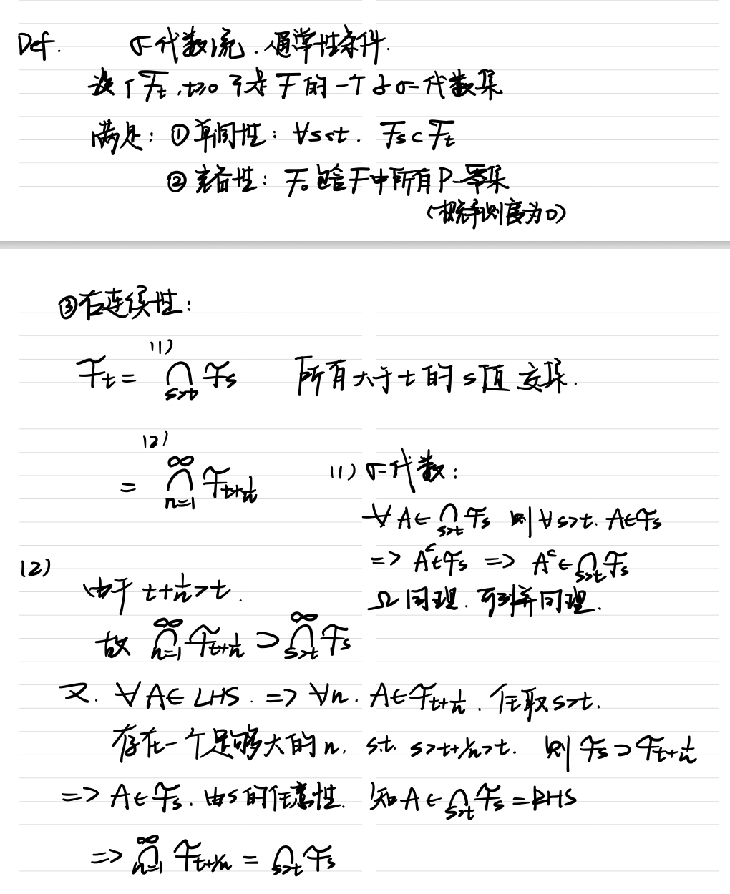

+++
date = '2026-06-04T21:00:00+08:00'
draft = false
title = 'Stochastic Analysis Final Review'
isCJKLanguage = true
math = true
categories = ['Course Notes']
+++

金融随机分析期末复习

# 前言

标记（*）表示本讲内容暂未完成校对和补充，是由本人课堂笔记，用gpt5.5 thinking——under some proper prompts and rules——转latex后的原资料。

- Ch1-10
- Ch11-13
- *Ch14-15
- *Ch16-20
- *Ch21-23

# 更新计划
- **6/5/26** 
  完成 lec1-10 的校对（完成）与 lec11-16 的更新（完成）
- **6/6/26**
  完成 lec11-15的校对与 lec17-22 的更新（完成），plus 题库 1-8 的手写更新
- **6/7/26**
  完成 lec15-20的校对，plus 题库 9-16 的手写更新
- **6/8/26**
  完成 lec21-23的校对，plus 题库 17-20 的手写更新
- **6/9/26**
  notation or 概念理解的注意事项更新

复习顺利！

# Lecture 1. 概率空间、随机变量、σ-代数流与随机过程

## Part A. 课堂内容还原

### Rmk 1.1 概率空间的基本结构回顾

本讲从 **probability space** 的复习开始。一个概率空间写作 \((\Omega,\mathcal F,\mathbb P)\).

其中：

 **$\Omega$** 是样本空间，表示所有可能结果的集合；

**$\mathcal F$** 是定义在 $\Omega$ 上的 **σ-代数**，表示我们“感兴趣”的事件（event）的集合，其中，事件是某些样本点组成的集合，σ-代数中的这些事件（event）是特别的，我们通过定义概率测度，允许讨论集合的“大小”，也就是讨论我们所说的事件发生的“概率”；

**$\mathbb P$** 是概率测度，把事件映射到实数空间。

> **【Details】**
> 
> 特别注意：概率不是直接定义在 $\Omega$ 的所有子集上，而是定义在一部分子集构成的 σ-代数 $\mathcal F$ 上，即 $\mathbb P:\mathcal F\to \mathbb R$.
>
> 核心在于**不是每个集合都天然是事件，只有落在 $\mathcal F$ 中的集合才是事件**。

这一步非常关键。后面定义随机变量、随机过程、适应过程时，所有“可测”条件本质上都在问：某个集合是不是属于对应的 σ-代数，进而能不能被当前信息系统识别为事件。

### Def 1.2 σ-代数

设 $\Omega$ 是样本空间。若 $\mathcal F$ 是 $\Omega$ 的若干子集构成的集合，并且满足以下性质，则称 $\mathcal F$ 是 $\Omega$ 上的一个 **σ-代数**：
- $\Omega\in \mathcal F$；

- 若 $A\in\mathcal F$，则 $A^c\in\mathcal F$；

- 若 $A_1,A_2,\dots,A_n,\dots\in\mathcal F$，则
  \[
  \bigcup_{i=1}^{\infty}A_i\in\mathcal F.
  \]

第三个条件是 **可列并封闭性**。由补集封闭和可列并封闭可以推出可列交封闭，因为

\[
\bigcap_{i=1}^{\infty}A_i
= \left(\bigcup_{i=1}^{\infty}A_i^c\right)^c.
\]

### Def 1.3 概率测度

设 $\mathcal F$ 是 $\Omega$ 上的 σ-代数。映射 $\mathbb P:\mathcal F\to \mathbb R$称为概率测度，如果它满足：
- $\mathbb P(\Omega)=1$；
- 对任意 $A\in\mathcal F$，有 $\mathbb P(A)\ge 0$,
- 若 $A_1,A_2,\dots\in\mathcal F$ 两两不交，则

\[
\mathbb P\left(\bigcup_{i=1}^{\infty}A_i\right)
= \sum_{i=1}^{\infty}\mathbb P(A_i).
\]

第一条是 **规范性**，第二条是 **非负性**，第三条是 **可列可加性**。因此三元组 $(\Omega,\mathcal F,\mathbb P)$称为一个概率空间。

### Ex 1.4 有限样本空间上的 σ-代数

考虑掷骰子问题： $\Omega=\{1,2,\dots,6\}$.

最小的 σ-代数是 \(\mathcal F_0=\{ \Omega,\varnothing \} \).

最大的 σ-代数是幂集 $\mathcal F_1=2^\Omega$,

也就是 $\Omega$ 的所有子集构成的集合。若 $|\Omega|=6$，则 $|2^\Omega|=2^6$.

板书中还写了一个中间例子，类似于 \( \mathcal F_2=\{\{1\},\{2,3,4,5,6\},\Omega,\varnothing\} \).

这个例子表达的是：一个 σ-代数可以比最小 σ-代数更详细（能够讨论更多事件），但不一定达到最大 σ-代数（幂集）那么细。它把 $\Omega$ 分成一些“信息块”，例如知道结果是否为 $1$，但不能区分 $2,3,4,5,6$ 之间的差异。

思考题：“若 $|\Omega|=n$，最多构成多少个 σ-代数？”

思路：这个问题本质上和有限集合的 **partition** 有关：有限样本空间上的每个 σ-代数都由一个划分生成。

解答：【待补充】

### Def 1.5 包含 $\mathcal R$ 的最小 σ-代数（集合生成 σ-代数）

设 $\mathcal R$ 是 $\Omega$ 的某些子集构成的集合。称包含 $\mathcal R$ 的最小 σ-代数为由 $\mathcal R$ 生成的 σ-代数，记作 $\sigma(\mathcal R)$.

也就是说，$\sigma(\mathcal R)$ 是所有包含 $\mathcal R$ 的 σ-代数中最小的一个。它至少包含 $\mathcal R$，并且为了满足 σ-代数的封闭性，还必须包含 $\mathcal R$ 中集合的补集、可列并、可列交，以及反复进行这些操作之后得到的集合，我们在写一些例子的时候可以参考这个思路，列举 σ-代数中可能出现的所有集合。

> 数学上，**生成 σ-代数**解决的问题是：从一批最基本的可观测事件出发，自动补全所有由这些事件逻辑推出的事件。
> 
> 金融上，它对应“由某些可观测变量产生的信息”。例如只观察到股票价格 $S_t$，那么由 $S_t$ 生成的 σ-代数就是“仅凭 $S_t$ 当前值能够判断的全部事件”。

### Def 1.6 Borel σ-代数

当 $\Omega=\mathbb R$时，最大的 σ-代数是 $2^{\mathbb R}$.

但在实数轴上通常不直接使用 $2^{\mathbb R}$，而是使用 **Borel σ-代数**。课堂中先列出了实数轴上的常见区间：

\[
(-\infty,\infty),\quad (a,\infty),\quad (-\infty,b),\quad (a,b),\quad 
[a,b],\quad (a,b],\quad [a,b)
\].

令 $\mathcal G$ 表示实数轴上所有区间构成的集合。区间集合 $\mathcal G$ 本身不是 σ-代数，因为它对可列并等操作不封闭。包含 $\mathcal G$ 的最小 σ-代数称为 $\mathbb R$ 上的 **Borel σ-代数**，记为 $\mathcal B(\mathbb R)$.

> 区间集合 $\mathcal G$ 本身不是 σ-代数的反例很简单，\( (0,1) \bigcup (2,3) \) 便不再是一个区间。

这里的核心在于：**Borel 集是从区间出发，通过补集、可列并、可列交等操作生成出来的集合**。后面随机变量的定义会要求 $X^{-1}(A)\in\mathcal F,\qquad A\in\mathcal B(\mathbb R)$,所以 Borel σ-代数是随机变量可测性的目标 σ-代数。

### Prop 1.7 Borel σ-代数的若干性质

- 对任意 $x\in\mathbb R$，单点集 $\{x\}\in\mathcal B(\mathbb R)$.

  证明思路是

  \[
  \{x\}=\bigcap_{n=1}^{\infty}\left(x-\frac1n,x+\frac1n\right),
  \]

  右侧是 Borel 集的可列交，因此 $\{x\}$ 是 Borel 集。

- 任意有理数集属于 $\mathcal B(\mathbb R)$。更准确地说，由于 $\mathbb Q$ 是可数集，且每个单点集 $\{q\}$ 都是 Borel 集，所以

  \[
  \mathbb Q=\bigcup_{q\in\mathbb Q}\{q\}\in\mathcal B(\mathbb R).
  \]

- 同理，任意可数子集都是 Borel 集。

特别提醒：“任一无理数集属于 $\mathcal B(\mathbb R)$” 这个说法是错的，因为无理数集不可数，无法直接用单无理数点的可列并导出结论。但是，某个区间中的无理数点集是 Borel 集。例如 $(a,b)\cap \mathbb Q^c = (a,b)\setminus \mathbb Q$.

因为 $(a,b)\in\mathcal B(\mathbb R)$，$\mathbb Q\in\mathcal B(\mathbb R)$，所以该集合也是 Borel 集。

### Thm 1.8 Borel σ-代数的一个生成方式

课堂中给出的方法是

\[
\mathcal B(\mathbb R)
= \sigma\left(\{(-\infty,x]\mid x\in\mathbb R\}\right).
\]

可以只用半无限区间 $(-\infty,x]$生成整个 $\mathcal B(\mathbb R)$，其他区间也可以,除了 $(-\infty,\infty)$。

证明思路：先证明每个 $(-\infty,x]$ 是 Borel 集，因此右边包含于 $\mathcal B(\mathbb R)$；再证明开区间 $(a,b)$ 可以由这些半无限区间通过补集和可列并交构造出来，例如 $(a,b] = (-\infty,b]\cap(-\infty,a]^c$，进一步用可列并进行逼近，得到开区间，从而生成所有开集(包括两个不相交的开区间的并，这里比所有区间构成的集合要更进一步了），再生成 Borel σ-代数。

### Def 1.9 随机变量

设 $(\Omega,\mathcal F,\mathbb P)$是概率空间。映射 $X:\Omega\to\mathbb R$

若满足对任意 $x\in\mathbb R$，都有 \[X^{-1}( (-\infty,x])\in\mathcal F \]
则称 $X$ 为随机变量。

等价地， \[ \{X\le x\} = \{\omega\in\Omega:X(\omega)\le x\} \in\mathcal F \]

> 理解：对每个阈值 $x$，事件“随机变量 $X$ 的取值不超过 $x$”必须是一个可测事件。这样才能定义分布函数 $F_X(x)=\mathbb P(X\le x)$.也就是说，Borel σ-代数（其中元素可以等价地以 \((-\infty,x]\) 表示）是随机变量可测性的目标 σ-代数，可以写为：
> \[X:(\Omega,\mathcal F)\to(\mathbb R,\mathcal B(\mathbb R))\]

数学上，随机变量不是“随机变化的数”，而是一个从样本空间到实数轴的 **可测映射**；金融上，股票收益、资产价格、期权收益、终端财富都要先满足这个可测性条件，才能谈它们的分布、期望、条件期望和风险度量。

### Def 1.10 随机变量生成的 σ-代数

设 $X$ 是定义在概率空间 $(\Omega,\mathcal F,\mathbb P)$ 上的随机变量。称

\[
\sigma(X)
= \sigma\left(\{X^{-1}((-\infty,x])\mid x\in\mathbb R\}\right)
\]

为由随机变量 $X$ 生成的 σ-代数。其中

\[
X^{-1}((-\infty,x])
= \{\omega\in\Omega:X(\omega)\le x\}.
\]

由它们生成的 σ-代数 $\sigma(X)$ 表示“只观察 $X$ 时能够知道的全部事件”。显然有 $\sigma(X)\subseteq \mathcal F$.

这是因为 $X$ 是随机变量，所以所有 $\{X\le x\}$ 都已经属于 $\mathcal F$，而 $\mathcal F$ 本身是 σ-代数，因此它也包含由这些集合生成的最小 σ-代数。

### Def 1.11 两个随机变量生成的 σ-代数

设 $X,Y$ 是两个随机变量。课堂中定义

\[
\sigma(X,Y)
= \sigma\left(
\{X^{-1}((-\infty,x]),Y^{-1}((-\infty,y])\mid x,y\in\mathbb R\}
\right).
\]

 如果把 $(X,Y)$ 看成二维随机向量，则也可写为

\[
\sigma(X,Y)=\sigma\left((X,Y)^{-1}(C)\mid C\in\mathcal B(\mathbb R^2)\right).
\]

金融上，$\sigma(X,Y)$ 表示同时观察到 $X$ 和 $Y$ 后拥有的信息。例如同时观察股票价格和利率，就比只观察股票价格拥有更细的信息结构。

### Def 1.12 完备概率空间

设 $(\Omega,\mathcal F,\mathbb P)$是概率空间。称其为 **完备的**，如果任意零测集的任意子集仍属于 $\mathcal F$。也就是说，若 $A\in\mathcal F$ 且 $\mathbb P(A)=0$,则对任意 $B\subseteq A$，都有 $B\in\mathcal F$.

完备性处理的是概率为 $0$ 的异常集合。随机分析中经常讨论“几乎处处”或“几乎必然”成立的性质，完备性保证零概率集合内部的子集也不会造成可测性问题。

### Def 1.13 σ-代数流与通常条件

设 $\{\mathcal F_t,t\ge 0\}$是 $\mathcal F$ 的一族子 σ-代数。如果它满足以下条件，则称其为一个满足通常条件的 **σ-代数流**。
- 若 $s\le t$，则 $\mathcal F_s\subseteq \mathcal F_t$；（Filtration本身的要求）
- $\mathcal F_0$ 包含 $\mathcal F$ 中所有 $\mathbb P$-零集；（这些零集是常常会出问题的异常集）
- \[
  \mathcal F_t=\bigcap_{s>t}\mathcal F_s,
  \qquad t\ge 0.
  \]

首先是单调性，表示信息随时间增加，时间越晚，知道的信息不能比过去更少；其次是完备性，所有零概率异常事件从一开始就被纳入信息系统；再次是右连续性。

注意这里右连续性的讨论很有意思，这里的连续性是从“右侧”通过交集进行逼近来讨论的。

我们得到的这个交集，首先我们会发现它不是一个可列交，这和之前的直觉可能不太一样，需要明确的是，虽然σ-代数不一定对不可列个事件的交封闭，但任意多个 σ-代数本身的交集仍然是 σ-代数，这一点可以利用 σ-代数的定义进行证明；

然后左右两个集合的相等可以通过证明它们都是对方的子集进行证明，其中一个方向很显然，另一个方向需要用讨论有理点逼近无理点的技巧进行证明，先固定 $s$，后移动 $t+\frac{1}{n}$。

> Intuition:为什么要加上通常性条件？
> - 完备性保证零概率异常集合不会破坏可测性；
> - 右连续性保证停时附近的信息结构行为良好。
> 有点难理解，具体展开见随机过程的intuition。

### Def 1.14 带滤的概率空间

设 $(\Omega,\mathcal F,\mathbb P)$是概率空间，且 $\{\mathcal F_t,t\ge 0\}$是满足通常条件的 σ-代数流，则称 $(\Omega,\mathcal F,\{\mathcal F_t\}_{t\ge 0},\mathbb P)$为一个 **带滤的概率空间**，也称 **filtered probability space**。

数学上，带滤的概率空间是连续时间随机分析的基本舞台。金融上，$\mathcal F_t$ 表示时刻 $t$ 市场参与者已经掌握的全部信息，包括历史价格、历史利率、历史噪声等。后面的 martingale、stochastic integral、risk-neutral pricing 都必须相对于某个 filtration 来定义。

### Def 1.15 随机过程

设 $T\subseteq\mathbb R$。若对任意 $t\in T$，$X_t$ 都是概率空间 $(\Omega,\mathcal F,\mathbb P)$ 上的随机变量，则称 \(\{X_t,t\in T\}\) 为一个随机过程。

如果 $T$ 是一个区间，则称它为 **连续时间随机过程**。如果 $T$ 至多可数，则称它为 **离散时间随机过程**。

### Rmk 1.16 随机变量视角与路径视角

随机过程\(\{X_t,t\in T\}\)可以看成一个二元映射
\[
X:T\times \Omega\to \mathbb R,
\qquad
(t,\omega)\mapsto X_t(\omega).
\]

它有两个输入：一个是时间 \(t\)，一个是随机样本点 \(\omega\)。

- 如果**固定时间 \(t\)**，那么
  \[
  \omega\mapsto X_t(\omega)
  \]
  是一个随机变量。它描述了在时间 \(t\) 的截面上，随机结果是怎么分布的。

- 如果**固定样本点 \(\omega_0\)**，那么

  \[
  t\mapsto X_t(\omega_0)
  \]

  就是一条路径，也叫 **sample path** 或 **trajectory**。它描述了某一次随机实验结果已经确定之后，整个过程随时间是怎么变化的。

概率论更常从固定 $t$ 的随机变量视角出发，而随机分析和金融数学经常需要研究整条路径，例如连续性、跳跃、变差、二次变差等。

### Def 1.17 路径

对随机过程 $\{X_t,t\in T\}$,

固定 $\omega_0\in\Omega$ 后得到的函数 $t\mapsto X_t(\omega_0)$称为该随机过程在样本点 $\omega_0$ 下的一条路径。

连续时间下有不同路径类型，例如连续路径和带跳路径。

> - **连续路径：**  如果对某个固定的 \(\omega\)，函数
  \[
  t\mapsto X_t(\omega)
  \]
  是连续函数，那么就说该样本点下的路径是连续的。
> \(i.e.\) 对任意 \(t_0\in T\)，都有
  \[
  \lim_{t\to t_0}X_t(\omega)=X_{t_0}(\omega).
  \]
  如果存在一个概率为 \(1\) 的集合 \(\Omega_0\subseteq\Omega\)，使得对所有 \(\omega\in\Omega_0\)，路径
  \[
  t\mapsto X_t(\omega)
  \]
  都是连续的，那么我们说随机过程 \(X\) 有 **almost surely continuous paths**，即**几乎必然连续路径**。
>  Brownian motion 的连续性就是几乎必然的——除了一个概率为 \(0\) 的异常样本集合以外（样本路径不连续的样本集合为零测集），每一条 Brownian path 都是关于时间 \(t\) 的连续函数。
> 
>  所以要注意这里的说法：**Brownian motion 的样本路径几乎必然连续**，这里的“几乎”说的是一小部分样本点\(\omega\)会有问题，其他样本点下的样本路径都是连续的，而不是说一小部分时间 \(t\) 有问题。
> > almost surely ( a.s. ) = almost everywhere ( a.e. ) with respect to a probability measure.
> ---
> - **带跳路径：** 如果对某个 \(\omega\)，存在时间 \(t_0\)，使得
    \[
    \lim_{t\to t_0}X_t(\omega)\neq X_{t_0}(\omega),
    \]
>   那么这条路径在 \(t_0\) 处不连续。若这种不连续表现为左极限和右极限存在，但函数值突然变化，我们通常说这里发生了一个 **jump**。
>   在随机过程里常见的跳过程通常具有 **càdlàg paths**，即右连续且左极限存在：
    \[
    \lim_{s\downarrow t}X_s(\omega)=X_t(\omega),
    \]
    并且
    \[
    X_{t-}(\omega):=\lim_{s\uparrow t}X_s(\omega)
    \]
>   存在。
>   此时 \(t\) 处的跳跃大小定义为
>   \[
    \Delta X_t(\omega)
    = X_t(\omega)-X_{t-}(\omega).
    \]
>   如果
    \[
    \Delta X_t(\omega)\neq 0,
    \]
>   就说过程在时间 \(t\) 处发生跳跃。
> 
>   因此，带跳路径更严格地说，通常是：**路径允许存在某些 \(t\)，使得 \(\Delta X_t\neq 0\)**。

### Def 1.18 适应过程

设 $(\Omega,\mathcal F,\mathbb P)$ 是概率空间，$\{X_t,t\ge 0\}$ 是随机过程，\(\{\mathcal F_t,t\ge 0\}\) 是其上的 σ-代数流。

若对任意 $t\ge 0$，随机变量 $X_t$ 关于 $\mathcal F_t$ 可测，则称 \(\{X_t,t\ge 0\}\)是关于 \(\{\mathcal F_t,t\ge 0\}\) 的 **适应过程**，也称 **adapted process**。也就是说，对任意 $x\in\mathbb R$，有 \(\{X_t\le x\}\in\mathcal F_t\) .

> 适应性表达的是：在时刻 $t$，$X_t$ 的值不能依赖未来信息。金融上，这一点对应交易策略的非预见性。一个交易策略在 $t$ 时刻只能使用 $\mathcal F_t$ 中的信息，不能提前知道未来价格。后面定义自融资策略、Itô integral 和无套利定价时，适应性会反复出现。

## Part B. 复习视角

Lecture 1 的主线是从 **事件的可测性** 过渡到 **随机对象的信息结构**。前半部分复习概率空间 $(\Omega,\mathcal F,\mathbb P)$，重点不是重新学概率公理，而是重新理解 $\mathcal F$ 的作用：$\mathcal F$ 决定哪些集合是事件，哪些事件能被赋予概率。紧接着，老师引入 Borel σ-代数 $\mathcal B(\mathbb R)$，目的是为随机变量的定义准备目标空间上的可测结构。最后，随机变量、随机变量生成的 σ-代数、filtration、随机过程和适应过程连在一起，形成连续时间随机分析的语言框架。

本讲最核心的关键词是 **σ-代数**、**Borel σ-代数**、**measurable random variable**、**generated σ-algebra**、**σ-代数流（滤过filtration）**、**带滤的概率空间（filtered probability space)**、**stochastic process** 和 **适应过程（adapted process）**。其中 Def 1.9 的随机变量定义非常基础，因为后面所有 $X_t$、$S_t$、$W_t$ 都必须先是随机变量。Def 1.10 的 $\sigma(X)$ 是理解信息的第一步，因为它表示“由 $X$ 产生的信息”。Def 1.13 的 filtration 是把信息放进时间轴，Def 1.18 的 adapted process 则规定随机过程不能提前使用未来信息。

本讲的公式链可以整理成这样：先有概率空间 $(\Omega,\mathcal F,\mathbb P)$,

然后实值随机变量是可测映射

\[
X:\Omega\to\mathbb R,
\qquad X^{-1}((-\infty,x])\in\mathcal F.
\]

由随机变量产生信息

\[
\sigma(X)=\sigma\left(\{X^{-1}((-\infty,x])\mid x\in\mathbb R\}\right).
\]

把信息放进时间轴，得到 filtration \(\{X_t,t\in T\}\), 满足：
\[
\mathcal F_s\subseteq\mathcal F_t, \qquad s\le t.
\]
随机过程是时间参数化的一族随机变量 \(\{X_t,t\in T\}\) .

若每个 $X_t$ 都只使用当前信息 $\mathcal F_t$，则 $X_t\text{ is }\mathcal F_t\text{-measurable}$,

于是 $X$ 是适应过程。

这一讲和后面内容的关系非常直接。Lecture 2 会继续讨论随机过程的更强可测性，例如 **measurable process** 和 **progressively measurable process**。Lecture 3 会进入 **conditional expectation**，而条件期望必须相对于某个子 σ-代数定义。Lecture 4 的 **martingale** 需要同时使用 filtration、adaptedness 和 conditional expectation。也就是说，Lecture 1 不是普通预备知识，而是在搭建 martingale theory 的语法系统。

---

# Lecture 2. 随机过程的可测性、循序可测、生成滤流与一致可积

## Part A. 课堂内容还原

### Rmk 2.1 随机变量可测性的复习

Lecture 2 一开始复习随机变量的可测性。

设 $X:\Omega\to\mathbb R$.

若对任意 $x\in\mathbb R$，有 $X^{-1}((-\infty,x])\in\mathcal F$，则 $X$ 是随机变量。这个条件可以和分布函数联系起来，因为 $\{\omega:X(\omega)\le x\}$必须是随机事件，$\mathbb P(X\le x)$ 才有意义。

课堂还补充了一个更一般的等价形式：

\[
X\text{ 是随机变量}
\Longleftrightarrow \forall A\in\mathcal B(\mathbf R),\ X^{-1}(A)\in\mathcal F.
\]

这句话非常重要。它说明随机变量的可测性不只是对半无限区间成立，而是对所有 Borel 集成立。由于 Lecture 1 中 Thm 1.8 已经说明 $\mathcal B(\mathbb R)$ 可以由全体 $(-\infty,x]$ 构成的集合生成，所以只检查 $(-\infty,x]$ 足够。

### Rmk 2.2 随机过程的两种视角

课堂再次强调随机过程 $X=\{X_t,t\in T\}$

可以看成映射 $X:T\times\Omega\to\mathbb R$.

固定 $t$ 时，$X_t$ 是随机变量。固定 $\omega_0$ 时，$X_t(\omega_0)$ 是关于 $t$ 的函数。

若 $T$ 是离散点集，得到离散时间随机过程；若 $T$ 是区间，得到连续时间随机过程。

> 理解：Borel σ-代数是什么？：
> 
> Borel σ-代数中的元素称 Borel 集，是区间经过可列并、可列交、补集等操作得到的集合，不全是区间。

### Def 2.3 可测随机过程

设 $(\Omega,\mathcal F,\mathbb P)$ 是概率空间，\(X=\{X_t,t\in T\}\) 是随机过程，并把它看成映射 $X:T\times\Omega\to\mathbb R$.

若对任意 $A\in\mathcal B(\mathbb R)$，都有 $X^{-1}(A)\in\mathcal B(T)\otimes\mathcal F$,则称 $X$ 是 **可测随机过程**。

其实可以看成
\[
  X:\left( T\times\Omega,\mathcal B(T)\otimes\mathcal F \right) \to(\mathbb R,\mathcal B(\mathbb R))
\]

\[
(t,\omega)\mapsto X_t(\omega)
\]

其中 $\mathcal B(T)\otimes\mathcal F$ 是定义在乘积空间 $T\times\Omega$ 上的 σ-代数，可以叫“源 σ-代数”； $\mathcal B(R)$ 和之前类似，是“目标 σ-代数”

> 注意：如果只知道每个 $X_t$ 都是随机变量，不能自动推出 $X:T\times\Omega\to\mathbb R$ 对乘积 σ-代数可测。因为这个条件只讨论了每一个时间切片下的随机变量可测，我们不知道时间 \(t\) 和样本点 \(\omega\) 共同变化时是否可测。

### Def 2.3 补充可测随机过程的反例

反例：如果样本空间和 σ-代数如下：
\[
\Omega=\{\omega_0\}, \qquad \mathcal F=\{\emptyset,\Omega\}
\]

由于只有一个样本点，所以固定任意 $t, X_t$ 都是随机变量。于是，我们固定 \(\omega\) 进行讨论：

对某个非 Borel 集 \(A\subset[0,T]\)（一个“很坏”的时间点的集合），我们定义：
\[X_t(\omega_0)=\mathbf{1}_A(t)\]

也就是说，这个函数在集合 \(A\) 上取 1 ，\(A^c\) 上取 0。
则：
\[
X: [0,T]\times\{\omega_0\} \to \mathbb{R} , \quad (t,\omega_0) \mapsto \mathbb R
\]
\[
X(t,\omega_0)=\mathbf{1}_A(t)
\]

此时，如果 \(X\) 作为二元映射是可测的，那么对任何目标端的 Borel 集 \( B\in \mathcal{B}(\mathbb{R})\)，都必须有

\[
X^{−1}(B)\in \mathcal{B}([0,T])\otimes F.
\]

我们就拿最简单的Borel \(B=\{1\}\) 为例，

\[
X^{−1}(\{1\}) = (A,\{\omega_0\})
\]
然而由于 \(A\subset[0,T]\) 是非 Borel 集，所以在时间维度上，无法满足可测条件，进一步导致：

\[
(A,\{\omega_0\}) \notin \mathcal{B}([0,T])\otimes F.
\]

这里的intuition在于，随机过程不只是“一堆随机变量”，它是一个二维的整体，同时受时间方向和随机性方向的影响。

> 注：有点类似我们讨论二维连续性、可微和可导的时候遇到的问题

### Def 2.4 循序可测随机过程

设 \(X=\{X_t,t\ge0\}\) 是随机过程。记 $X:[0,+\infty)\times\Omega\to\mathbb R$.

若对任意 $T>0$，将 \(X\) 限制在\([0,T]\)上：$[0,T]\times\Omega\to\mathbb R$满足

\[
X^{-1}(A)\in\mathcal B([0,T])\otimes\mathcal F_T,
\qquad A\in\mathcal B(\mathbb R),
\]

则称 $X$ 是 **循序可测的随机过程**，也称 **progressively measurable process**。

循序可测性比普通可测性更贴近金融中的时间信息结构。它不仅要求 $(t,\omega)$ 可测，而且要求在任意有限时间窗口 $[0,T]$ 上，过程只使用 $\mathcal F_T$ 中的信息。

### Def 2.5 适应过程

设 \(\{\mathcal F_t,t\ge0\}\) 是 σ-代数流，\(X=\{X_t,t\ge0\}\) 是随机过程。若对任意 $t\ge0$，都有 $X_t\text{ is }\mathcal F_t\text{-measurable}$,则称 $X$ 是关于 \(\{\mathcal F_t\}\) 的 **适应过程**。

### 补充：完备的 σ-代数流

指的是：给定 filtration \(\{\mathcal{F}_t, t\geq 0\}\)（已经包含递增条件），它相对于概率测度 \(\mathbb{P}\) 是完备的.

即，\(\mathcal{F}_0\) 包含所有 \(\mathbb{P}\) -零集，所有概率为 0 的异常事件，从一开始就已经存在于信息系统里。
### Thm 2.6 由随机过程生成的 σ-代数流 

设 \(X=\{X_t,t\ge0\}\)是一个随机过程。定义 \[\mathcal F_t^X = \sigma\{ X_s, s\le t \} , \quad t\ge0 \]则 
- \(\mathcal S^X=\{\mathcal F_t^X,t\ge0\}\) 是一个 σ-代数流
- 且 \(X\) 关于 \(\mathcal S^X\) 是适应过程。

证明:

若 \(s\le t\)，那么 \(\{X_u:u\le s\}\subseteq \{X_u:u\le t\}\),因此 \(\mathcal F_s^X\subseteq\mathcal F_t^X\).

这说明 \(\{\mathcal F_t^X\}\) 满足 filtration 的单调性。另一方面，因为 \(X_t\) 本身被包含在 \(\{X_s, s\le t\}\) 中，所以 \(X_t\) 关于 \(\mathcal F_t^X\) 可测对任意 \(t\) 成立，故 \(X\) 关于其自然滤流是适应的。

金融上，\(\mathcal F_t^X\) 就是“到时刻 \(t\) 为止由过程 \(X\) 的历史产生的信息”。例如 \(S_t\) 是股票价格过程时，\(\mathcal F_t^S\) 表示只由股票历史价格产生的信息流。

### Def 2.7 \(L^p\) 空间

课堂接着进入几个常用空间。对 \(p\ge1\)，定义

\[
L^p(\Omega)=\left\{X:\Omega\to\mathbb R\mid X\text{ 是随机变量且 }\mathbb E|X|^p<+\infty\right\}.
\]

当 \(p\ge1\) 时，范数定义为 \(\|X\|_p=\bigl(\mathbb E|X|^p\bigr)^{1/p}\).

\((L^p,\|\cdot\|_p)\)是一个 **Banach 空间**，即完备赋范线性空间。

### Def 2.8 *\(L^p\) 过程与 \(L^p\)-有界过程（这里有点问题，Lp有界貌似不等于平方可积）

若 \(X=\{X_t,t\in T\}\) 是随机过程，并且对每个 \(t\in T\)，都有 \(\mathbb E|X_t|^p<+\infty\),则称 \(X\) 是一个 **\(L^p\) 过程**。

如果进一步有 \(\sup_{t\in T}\mathbb E|X_t|^p<+\infty\),则称 \(X\) 是一个 **\(L^p\)-有界过程**。

<!-- 特别地，当 \(p=2\) 时，平方可积过程空间，记作类似 \(M_T^2\) 的符号，并定义范数

\[
\|X\|_{M_T^2}
= \left(\sup_{t\in T}\mathbb E|X_t|^2\right)^{1/2}
= \sup_{t\in T}\left(\mathbb E|X_t|^2\right)^{1/2}.
\] -->

### Def 2.9 一致可积随机变量族或过程

先回顾单个随机变量的可积性。随机变量 \(X\) 可积是指 \(\mathbb E|X|<+\infty\).等价地，尾部积分满足

\[
\lim_{k\to\infty}\int_{\{|X|>k\}} |X|\,d\mathbb P=0.
\]

设 \(X=\{X_t,t\in T\}\) 是随机过程。如果

\[
\lim_{k\to\infty}\sup_{t\in T}\int_{\{|X_t|>k\}} |X_t|\,d\mathbb P=0,
\]

则称 \(\{X_t,t\in T\}\) 是 **一致可积的**，也称 **uniformly integrable**。

一致可积比逐点可积更强。它要求所有 \(X_t\) 的大尾部同时可控，不允许某些时刻出现很大的尾部质量。
<!-- 
### Prop 2.10 一致可积的判定定理

课堂给出一致可积的一个判定条件。若随机过程 \(\{X_t,t\in T\}\) 满足：存在一个函数 \(g:[0,+\infty)\to\mathbb R\)

使得 \(g\) 单调递增、非负，并且 \(\lim_{x\to\infty}\frac{g(x)}{x}=+\infty\),

同时 \(\sup_{t\in T}\mathbb E\,g(|X_t|)<+\infty\),则 \(\{X_t,t\in T\}\) 一致可积。

一个重要推论是：若对某个 \(p>1\)，有 \(\sup_{t\in T}\mathbb E|X_t|^p<+\infty\),则 \(\{X_t,t\in T\}\) 一致可积。此时可以取 \(g(x)=x^p\).

因为 \(\frac{g(x)}{x}=x^{p-1}\to+\infty\).

### Proof 2.11 一致可积判定定理的证明主线

课堂从 \(\sup_{t\in T}\mathbb E[g(|X_t|)]<+\infty\)

出发，记 \(M=\sup_{t\in T}\mathbb E[g(|X_t|)]<+\infty\).

由于 \(\lim_{x\to\infty}\frac{g(x)}{x}=+\infty\),对任意 \(\varepsilon>0\)，可以取 \(N\) 足够大，使得当 \(x\ge N\) 时， \(\frac{g(x)}{x}>\frac{M}{\varepsilon}\).

于是，在集合 \(\{|X_t|\ge N\}\) 上，有 \(|X_t|\le \frac{\varepsilon}{M}g(|X_t|)\).因此

\[
\int_{\{|X_t|\ge N\}} |X_t|\,d\mathbb P
\le \frac{\varepsilon}{M}\int_\Omega g(|X_t|)\,d\mathbb P
\le \varepsilon.
\]

对 \(t\in T\) 取上确界，就得到

\[
\sup_{t\in T}\int_{\{|X_t|\ge N\}} |X_t|\,d\mathbb P\le \varepsilon.
\]

这正是一致可积的定义。
-->
### Prop 2.12 一致可积与 \(L^1\) 收敛

设 \(\{X_n,n\ge0\}\) 是随机序列，则

\[X_n\to X\text{ in }L^1 \]

\[
\Longleftrightarrow
X_n\to X\text{ in probability 且} \{X_n,n\ge0\} \text{一致可积} \]

其中：

- 依概率收敛是
  \[
  X_n\xrightarrow{P} X
  \quad\Longleftrightarrow\quad
  \forall\varepsilon>0,
  \lim_{n\to\infty}\mathbb P(|X_n-X|\ge\varepsilon)=0.
  \]

- \(L^1\) 收敛是
  \[\mathbb E|X_n-X|\to 0 , n\to \infty \]

> 理解：这个定理说明，一致可积是把“概率意义上的收敛”升级为“期望意义上的收敛”的关键条件。

## Part B. 复习视角

Lecture 2 的主线是把 Lecture 1 中“每个 \(X_t\) 都是随机变量”的概念升级为对整个随机过程的可测性控制。老师先复习 Def 1.9 的随机变量可测性，然后把随机过程看成 \(T\times\Omega\to\mathbb R\) 的二元映射，由此引出 Def 2.3 的 **可测随机过程** 和 Def 2.4 的 **循序可测随机过程**。紧接着，老师回到 Def 2.5 的 **适应过程**，并用 Thm 2.6 说明任何随机过程都可以生成自己的自然滤流 \(\mathcal F_t^X=\sigma(X_s:s\le t)\)。后半讲转向 \(L^p\) 空间和一致可积，为 Lecture 3 的条件期望和 Lecture 4 的鞅做准备。

这一讲最容易混淆的是 **可测过程、循序可测过程、适应过程** 三者。可测过程关心 \((t,\omega)\) 整体是否对 \(\mathcal B(T)\otimes\mathcal F\) 可测。循序可测过程要求在每个 \([0,T]\) 上对 \(\mathcal B([0,T])\otimes\mathcal F_T\) 可测。适应过程只要求每个时刻 \(X_t\) 关于当前信息 \(\mathcal F_t\) 可测。三者强弱不同，作用也不同。金融上，适应性表达“不用未来信息”；循序可测性通常是定义连续时间积分时需要的更强技术条件。

另外，一致可积加依概率收敛可以得到\(L^1\)收敛

本讲的公式链是：

\[
X\text{ random variable}
\Longleftrightarrow X^{-1}(A)\in\mathcal F,\quad A\in\mathcal B(\mathbb R),
\]

然后随机过程作为二元映射满足 \(X^{-1}(A)\in\mathcal B(T)\otimes\mathcal F\),

循序可测要求对每个 \(T>0\)， \(X^{-1}(A)\in\mathcal B([0,T])\otimes\mathcal F_T\),

自然滤流是 \(\mathcal F_t^X=\sigma(X_s:s\le t)\),

一致可积是

\[
\lim_{k\to\infty}\sup_{t\in T}\int_{\{|X_t|>k\}}|X_t|\,d\mathbb P=0.
\]

---

# Lecture 3. 一致可积补充、条件期望及其性质

## Part A. 课堂内容还原

### Rmk 3.1 从 Lecture 2 到条件期望的过渡

Lecture 3 开头先复习了 Lecture 2 的核心内容：随机变量的可测性、Borel σ-代数、随机过程的可测性、循序可测、适应过程，以及一致可积。我们再次强调：

\[
X:\Omega\to\mathbb R,
\qquad
X^{-1}((-\infty,x])\in\mathcal F,
\]

以及

\[
X:[0,T]\times\Omega\to\mathbb R,
\qquad
X^{-1}(A)\in\mathcal B([0,T])\otimes\mathcal F_T.
\]

在进入条件期望前，我们要先确保“随机变量相对于 σ-代数可测”这个语言已经建立起来。条件期望本质上就是“给定较少信息时，随机变量的最佳可测替代物”。

### Prop 3.2 一致可积判定定理

若随机过程 \(\{X_t,t\in T\}\) 满足存在函数 \(g:[0,+\infty)\to\mathbb R\)

使得 \(g\) 单调递增、非负，且 
- \[\lim_{x\to\infty}\frac{g(x)}{x}=+\infty\]
- \[\sup_{t\in T}\mathbb E[g(|X_t|)]<+\infty\]

则 \(\{X_t,t\in T\}\) 一致可积。特别地，若存在 \(p>1\) 使得 \[\sup_{t\in T}\mathbb E|X_t|^p<+\infty\] ,则 \(\{X_t,t\in T\}\) 一致可积。

\(L^2\)-有界过程必一致可积.

### Proof 3.3 一致可积判定定理的证明（有意思）

我们要证明随机变量族 \(\{X_t,t\in T\}\) 一致可积，也就是要证明

\[
\lim_{N\to\infty}
\sup_{t\in T}
\int_{\{|X_t|\ge N\}}|X_t|\,d\mathbb P
=0.
\]

已知存在函数 \(g:[0,+\infty)\to\mathbb R\)，满足 \(g\) 单调递增、非负，并且

\[
\lim_{x\to\infty}\frac{g(x)}{x}=+\infty,
\]

同时

\[
\sup_{t\in T}\mathbb E[g(|X_t|)]<+\infty.
\]

记

\[
M=\sup_{t\in T}\mathbb E[g(|X_t|)].
\]

于是 \(M<+\infty\)。

现在固定任意 \(\varepsilon>0\)。由于

\[
\lim_{x\to\infty}\frac{g(x)}{x}=+\infty,
\]

所以可以取 \(N>0\)，使得当 \(x\ge N\) 时，有

\[
\frac{g(x)}{x}>\frac{M}{\varepsilon}.
\]

等价地，当 \(x\ge N\) 时，

\[
x<\frac{\varepsilon}{M}g(x).
\]

把 \(x\) 换成 \(|X_t(\omega)|\)。在集合 \(\{|X_t|\ge N\}\) 上，有

\[
|X_t|
\le
\frac{\varepsilon}{M}g(|X_t|).
\]

因此，对任意 \(t\in T\)，都有

\[
\begin{aligned}
\int_{\{|X_t|\ge N\}} |X_t|\,d\mathbb P
&\le
\int_{\{|X_t|\ge N\}}
\frac{\varepsilon}{M}g(|X_t|)\,d\mathbb P \\
&\le
\frac{\varepsilon}{M}
\int_{\Omega}g(|X_t|)\,d\mathbb P \\
&=
\frac{\varepsilon}{M}\mathbb E[g(|X_t|)] \\
&\le
\frac{\varepsilon}{M}\cdot M \\
&=
\varepsilon.
\end{aligned}
\]

于是

\[
\sup_{t\in T}
\int_{\{|X_t|\ge N\}} |X_t|\,d\mathbb P
\le
\varepsilon.
\]

因为 \(\varepsilon>0\) 是任意的，所以

\[
\lim_{N\to\infty}
\sup_{t\in T}
\int_{\{|X_t|\ge N\}} |X_t|\,d\mathbb P
=0.
\]

这正是一致可积的定义。因此 \(\{X_t,t\in T\}\) 一致可积。

### Rmk 3.4 条件期望的直观入口

接着我们从“两个随机变量”的情形进入条件期望。设 \(X,Y\) 是离散随机变量，板书写到类似

\[
\mathbb E[X\mid Y=j]
= \sum_i x_i\frac{p_{ij}}{p_j},
\]

以及

\[
\mathbb E[Y\mid X=i]
= \sum_j y_j\frac{p_{ij}}{p_i}.
\]

这里 \(p_{ij}=\mathbb P(X=x_i,Y=y_j)\)，\(p_j=\mathbb P(Y=y_j)\)，\(p_i=\mathbb P(X=x_i)\)。离散条件期望的结果是一个数，因为条件事件 \(\{Y=j\}\) 已经固定。

若 \(X,Y\) 有联合密度，则课堂写到类似

\[
\mathbb E[X\mid Y=y]
= \int_{\mathbb R}x f_{X\mid Y}(x\mid y)\,dx,
\]

以及

\[
\mathbb E[Y\mid X=x]
= \int_{\mathbb R}y f_{Y\mid X}(y\mid x)\,dy.
\]

然后我们迎来全期望公式：\(\mathbb E\bigl[\mathbb E(Y\mid X)\bigr]=\mathbb EY\),  在 \(Y\in L^1\) 时成立。

### Def 3.5 条件期望

设 \((\Omega,\mathcal F,\mathbb P)\)是概率空间，\(\mathcal G\) 是 \(\mathcal F\) 的子 σ-代数，\(X\) 是 \((\Omega,\mathcal F,\mathbb P)\) 上的随机变量，并且

\[
X\in L^1(\Omega),
\qquad
\mathbb E|X|<+\infty.
\]

定义 \(X\) 关于 \(\mathcal G\) 的条件期望，记作 \(\mathbb E[X\mid \mathcal G]\).

它是一个随机变量，常记作 \(Y=\mathbb E[X\mid\mathcal G]\),并且满足两个条件。首先，\(Y\) 关于 \(\mathcal G\) 可测。其次，对任意 \(A\in\mathcal G\)，有

\[
\int_A X\,d\mathbb P
= \int_A Y\,d\mathbb P.
\]

这两个条件共同刻画了条件期望。第一条说明 \(Y\) 只能使用 \(\mathcal G\) 中的信息。第二条说明在所有 \(\mathcal G\)-可观测事件 \(A\) 上，\(Y\) 与原随机变量 \(X\) 的积分一致。

数学上，**条件期望是用较少信息 \(\mathcal G\) 对 \(X\) 做出的可测投影**。金融上，如果 \(\mathcal G=\mathcal F_t\)，那么 \(\mathbb E[X\mid\mathcal F_t]\) 表示在时刻 \(t\) 信息下对未来随机收益 \(X\) 的估计。

### Prop 3.6 条件期望的几乎处处唯一性

若 \(X,Y\) 是两个 \(\mathcal G\)-可测随机变量，并且对任意 \(A\in\mathcal G\)，都有

\[
\int_A X\,d\mathbb P
= \int_A Y\,d\mathbb P,
\]

则 \(X=Y\quad a.s\).

证明思路是考察集合 \(\{X>Y\}\) 和 \(\{Y>X\}\)。因为 \(X,Y\) 都关于 \(\mathcal G\) 可测，所以这些集合属于 \(\mathcal G\)。在这些集合上积分相等，推出差的正部和负部积分为零，因此 \(X=Y\) 几乎处处成立。

这解释了为什么条件期望不是逐点唯一，而是 **a.s. 唯一**。

### Prop 3.7 条件期望的基本性质

- 若 \(X\in L^1\)，则如果 \(X\) 关于 \(\mathcal G\) 可测，有 \(\mathbb E[X\mid\mathcal G]=X\).

- 若 \(c\) 是常数，则 \(\mathbb E[c\mid\mathcal G]=c\).

- 全期望公式为 \(\mathbb E\left[\mathbb E[X\mid\mathcal G]\right]=\mathbb E[X]\).

- 若 \(X=Y\) a.s.，则 \(\mathbb E[X\mid\mathcal G] = \mathbb E[Y\mid\mathcal G] \quad a.s\).

- 若 \(a,b\in\mathbb R\)，则

  \[
  \mathbb E[aX+bY\mid\mathcal G]
  =a\mathbb E[X\mid\mathcal G]+b\mathbb E[Y\mid\mathcal G].
  \]

- 若 \(X\le Y\) a.s.，则 \(\mathbb E[X\mid\mathcal G] \le \mathbb E[Y\mid\mathcal G] \quad a.s\).

- 若 \(X\) 与 \(\mathcal G\) 独立，则 \(\mathbb E[X\mid\mathcal G]=\mathbb E[X]\).
- 若 \(\varphi:\mathbb R^2\to\mathbb R\) 为 Borel 可测函数，且 \(\varphi(X,Y)\) 可积，\(X\) 关于 \(\mathcal G\) 可测，则
  \[
  \mathbb E[\varphi(X,Y)\mid\mathcal G]
  = \left.\mathbb E[\varphi(x,Y)\mid\mathcal G]\right|_{x=X},
  \]

### Rmk 3.8 条件期望的塔式性质和不可交换性

如果 \(\mathcal G_1\subseteq\mathcal G_2\subseteq\mathcal F\)，则塔式性质成立：

\[
\mathbb E\left[\mathbb E[X\mid\mathcal G_2]\mid\mathcal G_1\right]
= \mathbb E[X\mid\mathcal G_1].
\]

同时

\[
\mathbb E\left[\mathbb E[X\mid\mathcal G_1]\mid\mathcal G_2\right]
= \mathbb E[X\mid\mathcal G_1],
\]

因为 \(\mathbb E[X\mid\mathcal G_1]\) 已经是 \(\mathcal G_1\)-可测，而 \(\mathcal G_1\subseteq\mathcal G_2\) 时它也 \(\mathcal G_2\)-可测。

如果 \(\mathcal G_1\) 和 \(\mathcal G_2\) 没有包含关系，则一般不能交换条件期望的顺序。

> 理解：
> - 第一条比较难，先基于更细的信息 \(\mathcal G_2\)（更细意味着能区分的事件更多）做预测，再基于更粗信息 \(\mathcal G_1\) 作条件期望，那么相当于把细信息预测重新投影到粗信息的层级，最后只会保留 \(\mathcal G_1\) 能识别的部分；
> - 而第二条更直觉一些，不过要小心不要先入为主第一条的思路了，我们先基于更粗的信息 \(\mathcal G_1\) 做预测，得到的 \(\mathbb E[X\mid\mathcal G_1]\) 是 \(\mathcal G_1\)-可测的随机变量，由于 \(\mathcal G_1\subseteq\mathcal G_2\)，它也是 \(\mathcal G_2\)-可测的，所以对 \(\mathbb E[X\mid\mathcal G_1]\) 取 \(\mathcal G_2\) 上的条件期望的时候，会直接等于 \(\mathbb E[X\mid\mathcal G_1]\) 本身。

### Prop 3.9 条件期望下的收敛性质

若 \(X_n\to X\quad a.s\).并且存在 \(Y\in L^1(\Omega)\)，使得 \(|X_n|\le Y\),则 \(\mathbb E[X_n\mid\mathcal G]\to \mathbb E[X\mid\mathcal G] \quad a.s\).

这是条件期望版本的 dominated convergence theorem（控制收敛定理）。严格证明通常依赖条件期望的性质和普通支配收敛定理。

### Formula 3.10 全期望公式

由条件期望定义，取 \(A=\Omega\in\mathcal G\)，有

\[
\int_\Omega X\,d\mathbb P
= \int_\Omega \mathbb E[X\mid\mathcal G] \ d\mathbb P.
\]

因此 \(\mathbb E[X] = \mathbb E\left[\mathbb E[X\mid\mathcal G]\right]\).

> 注：这个公式在金融中非常常用。定价中经常先在未来某个信息层下取条件期望，再对当前信息取条件期望，塔式性质保证这种逐层估计是兼容的。

## Part B. 复习视角

Lecture 3 的主线是从 **一致可积** 过渡到 **条件期望**。一致可积解决的是“能不能把收敛和期望联系起来”的问题；条件期望解决的是“在给定信息 \(\mathcal G\) 时如何重新表达一个随机变量”的问题。我们先补完 Lecture 2 中一致可积判定定理的证明，再用离散和连续条件期望引入直觉，最后给出一般概率空间中 \(\mathbb E[X\mid\mathcal G]\) 的定义。

本讲最核心的对象是 Def 3.5。它的两条条件都要背熟：**\(\mathbb E[X\mid\mathcal G]\) 必须 \(\mathcal G\)-可测，并且在任意 \(A\in\mathcal G\) 上与 \(X\) 的积分相同**。第一条对应“只能使用给定信息”；第二条对应“在给定信息可区分的事件上，平均效果不变”。这两条一起决定条件期望，而不是某个单独公式决定条件期望。

Lecture 3 和 Lecture 4 的关系非常紧。鞅的定义会写成 \(\mathbb E[X_t\mid\mathcal F_s]=X_s, \qquad s\le t\).

这里直接使用了 Def 3.5 的条件期望和 Def 1.13 的 filtration。若没有理解 \(\mathcal F_s\) 是较少信息、\(\mathbb E[X_t\mid\mathcal F_s]\) 是在较少信息下对未来 \(X_t\) 的估计，就很难真正理解 martingale 是“公平游戏”。

本讲需要重点补的地方是第 21 页白板照片中的条件期望交换顺序与收敛性质。尤其“配关系才能交换顺序”这句话很重要，因为塔式性质必须有子 σ-代数包含关系。若 \(\mathcal G_1\) 和 \(\mathcal G_2\) 没有包含关系，不能随便交换条件期望顺序。这个点在证明鞅性质、停时定理、风险中性定价中的迭代条件期望时都会出现。

---
# Lecture 4. 鞅、随机游走、Brownian motion 与鞅判别

## Part A. 课堂内容还原

### Rmk 4.1 本讲主题预告

Lecture 4 开始时，板书列出几个典型随机过程：**Brownian motion**、**Poisson process**、**martingale** 和 **Markov process**。其中 Brownian motion 和 Poisson process 是连续时间中最基本的噪声模型；martingale 是公平游戏和无套利定价的数学核心；Markov process 强调未来只依赖当前状态而不依赖完整历史。

本讲主要进入 **martingale** 和 **Brownian motion**。

### Def 4.2 鞅、上鞅和下鞅

设 $X=\{X_t,t\in T\}$ 是随机过程，$\{\mathcal F_t,t\in T\}$ 是 σ-代数流。若满足以下条件，则称 $X$ 是关于 $\{\mathcal F_t\}$ 的 **鞅**，即 **martingale**。

首先，对任意 $t\in T$，有 $\mathbb E|X_t|<+\infty$.

其次，$X$ 是适应过程，即对任意 $t\in T$，$X_t$ 关于 $\mathcal F_t$ 可测。

最后，对任意 $s\le t$，有 $\mathbb E[X_t\mid\mathcal F_s]=X_s \quad a.s.$ .

如果把等号改成 $\mathbb E[X_t\mid\mathcal F_s]\le X_s$,则称 $X$ 为 **上鞅**，即 supermartingale。它表示条件意义下未来期望不超过当前值，可以理解为“趋势不升”。

如果改成 $\mathbb E[X_t\mid\mathcal F_s]\ge X_s$,则称 $X$ 为 **下鞅**，即 submartingale。它表示条件意义下未来期望不低于当前值，可以理解为“趋势不降”。

金融上，鞅的核心意义是 **在当前信息下，未来的条件期望等于当前值**。在风险中性测度下，贴现资产价格过程常被要求是鞅，这正是无套利定价的数学表达。

### Def 4.3 离散时间与连续时间

课堂区分了 **离散时间** 和 **连续时间**。若时间指标集 $T$ 是可数集，例如 $T=\{0,1,2,\dots\}$,则是离散时间过程。若时间指标集是区间，例如 $T=[0,+\infty)$,则是连续时间过程。

### Def 4.4 自然滤流

设 $X=\{X_t,t\in T\}$ 是随机过程。自然滤流定义为 $\mathcal F_t^X=\sigma(X_s:s\le t)$.

由此 $X$ 自动关于 $\{\mathcal F_t^X\}$ 适应。

课堂红字特别提醒：不要写成 $\sigma(X_t)$,

因为 $\sigma(X_t)$ 只包含时刻 $t$ 的信息，而自然滤流应包含从初始时刻到 $t$ 为止的全部历史信息。正确写法必须是 $\sigma(X_s:s\le t)$.

### Ex 4.5 随机游走

设 $X_0=a, \qquad X_n=X_{n-1}+\xi_n, \qquad n\ge1$,

其中 $\xi_n$ 取值为 $1$ 或 $-1$，并且 $\mathbb P(\xi_n=1)=p, \qquad \mathbb P(\xi_n=-1)=q, \qquad p+q=1$.

令自然滤流为 $\mathcal F_n=\sigma(X_m:m\le n)$.

若 $p=q=\frac12$，则 $\{X_n,n=0,1,2,\dots\}$ 是鞅。若 $p>q$，则它是下鞅。若 $p<q$，则它是上鞅。

证明中先检查可积性：

\[
\mathbb E|X_n|
=\mathbb E|a+\xi_1+\cdots+\xi_n|
\le |a|+\mathbb E|\xi_1|+\cdots+\mathbb E|\xi_n|
=|a|+n<+\infty.
\]

适应性由自然滤流定义直接得到。对 $m<n$，有

\[
\mathbb E[X_n\mid\mathcal F_m]
= \mathbb E[X_m+\xi_{m+1}+\cdots+\xi_n\mid\mathcal F_m].
\]

由于 $X_m$ 关于 $\mathcal F_m$ 可测，且后续增量与 $\mathcal F_m$ 独立，有

\[
\mathbb E[X_n\mid\mathcal F_m]
= X_m + \sum_{j=m+1}^n \mathbb E\xi_j.
\]

而 $\mathbb E\xi_j=p-q$.所以 $\mathbb E[X_n\mid\mathcal F_m] = X_m+(n-m)(p-q)$.

当 $p=q$ 时等于 $X_m$，得到鞅。当 $p>q$ 时大于 $X_m$，得到下鞅。当 $p<q$ 时小于 $X_m$，得到上鞅。

### Ex 4.6 Brownian motion 的若干鞅

课堂写到：设 $\{W_t,t\ge0\}$ 是标准 Brownian motion，令 $\mathcal F_t=\sigma(W_s:s\le t)$.则以下过程是鞅：$W_t$, $W_t^2-t$,以及对任意 $\alpha\in\mathbb R$，

\[
\exp\left(\alpha W_t-\frac{\alpha^2}{2}t\right).
\]

第 24 页红字把这些例子框出并写了“期末”。这说明它们很可能是考试重点，至少要能证明 $W_t$ 是鞅，并理解另外两个是 Brownian motion 的典型指数鞅和平方鞅。

### Def 4.7 Brownian motion

随机过程 $\{W_t,t\ge0\}$ 称为标准 **Brownian motion**，如果满足以下性质。

首先， $W_0=0$.

其次，对任意 $t>0$， $W_t\sim N(0,t)$.

第三，具有独立增量。若 $0\le t_0<t_1<\cdots<t_n$,则 $W_{t_1}-W_{t_0},\ W_{t_2}-W_{t_1},\ \dots,\ W_{t_n}-W_{t_{n-1}}$

相互独立。

第四，具有平稳增量：$W_{t+s}-W_t\sim N(0,s)$.最后，每条路径连续，通常表述为 $W_t(\omega)\text{ is continuous in }t\quad a.s$.

Brownian motion 在数学上是连续时间随机噪声模型。它的样本路径连续但处处高度不规则，这正是 Itô integral 和 Itô formula 要被引入的原因。金融上，它常用来刻画连续时间资产价格模型中的随机冲击。

### Proof 4.8 Brownian motion 是鞅

首先证明可积性。因为 $W_t\sim N(0,t)$，有

\[
\mathbb E|W_t|
=\int_{\mathbb R}|x|\frac1{\sqrt{2\pi t}}e^{-x^2/(2t)}\,dx
=\sqrt{\frac{2t}{\pi}}<+\infty.
\]

其次，$W_t$ 关于自然滤流 $\mathcal F_t=\sigma(W_s:s\le t)$ 适应。

最后，当 $s<t$ 时， $W_t=W_s+(W_t-W_s)$.

于是

\[
\mathbb E[W_t\mid\mathcal F_s]
= \mathbb E[W_s+(W_t-W_s)\mid\mathcal F_s].
\]

由于 $W_s$ 关于 $\mathcal F_s$ 可测，且 $W_t-W_s$ 与 $\mathcal F_s$ 独立，并且 $W_t-W_s\sim N(0,t-s)$,所以 $\mathbb E[W_t\mid\mathcal F_s] =W_s+\mathbb E[W_t-W_s] =W_s$.因此 $\{W_t,t\ge0\}$ 是鞅。

### Ex 4.8 少了一个ex

### Thm 4.9 鞅的期望保持不变

若 $\{X_t,\mathcal F_t,t\in T\}$ 是鞅，则对任意 $s\le t$，有 $\mathbb E[X_t]=\mathbb E[X_s]$.

证明使用全期望公式：

\[
\mathbb E[X_t]
= \mathbb E\left[\mathbb E[X_t\mid\mathcal F_s]\right]
= \mathbb E[X_s].
\]

这说明鞅在无条件期望层面保持不变。更强的是，它在任意过去信息 $\mathcal F_s$ 下的条件期望也保持为当前值。

### Ex 4.10 下鞅在期望不变时退化为鞅

课堂写到：若 $\{X_t,\mathcal F_t,t\ge0\}$ 是下鞅，并且 $\mathbb E[X_t]=\mathbb E[X_0]$对所有 $t\ge0$ 成立，则 $\{X_t,t\ge0\}$ 是鞅。

证明思路是：下鞅给出 $\mathbb E[X_t\mid\mathcal F_s]\ge X_s$.

两边取期望得到 $\mathbb E[X_t]\ge\mathbb E[X_s]$.

但条件中期望恒定，因此差的期望为零。非负随机变量 $\mathbb E[X_t\mid\mathcal F_s]-X_s$的期望为零，所以它几乎处处为零，从而得到鞅等式。

### Thm 4.11 离散时间鞅的单步判别

设 $X=\{X_n,\mathcal F_n,n\ge0\}$是离散时间随机过程。则 $X$ 是鞅，当且仅当它满足可积性、适应性，并且对任意 $n\ge0$，有 $\mathbb E[X_{n+1}\mid\mathcal F_n]=X_n$.

证明中用到塔式性质。如果 $m>n$，则

\[
\mathbb E[X_m\mid\mathcal F_n]
= \mathbb E\left[\mathbb E[X_m\mid\mathcal F_{m-1}]\mid\mathcal F_n\right].
\]

由单步条件， $\mathbb E[X_m\mid\mathcal F_{m-1}]=X_{m-1}$.

于是反复迭代，得到 $\mathbb E[X_m\mid\mathcal F_n]=X_n$.

这说明离散时间中，只要验证一步条件，就能推出任意多步的鞅条件。

## Part B. 复习视角

Lecture 4 是前面三讲的第一次真正合流。Lecture 1 的 filtration、Lecture 2 的适应性、Lecture 3 的条件期望，在 Def 4.2 的 martingale 定义中全部出现。鞅不是单纯的“期望不变”，而是 **在任意过去信息下，未来条件期望等于当前值**。这就是为什么 martingale 是公平游戏和无套利定价的数学核心。

本讲的主线可以概括为：先给出鞅定义，再用随机游走说明离散时间公平游戏，然后进入 Brownian motion，并证明 Brownian motion 本身是鞅。最后给出鞅的期望保持性质和离散时间单步判别法。

本讲公式链非常清楚：鞅定义是 $\mathbb E[X_t\mid\mathcal F_s]=X_s, \qquad s\le t$.

随机游走满足 $\mathbb E[X_n\mid\mathcal F_m]=X_m+(n-m)(p-q)$.

Brownian motion 满足 $W_t=W_s+(W_t-W_s)$,

且 $W_t-W_s$ 与 $\mathcal F_s$ 独立、均值为零，因此 $\mathbb E[W_t\mid\mathcal F_s]=W_s$.

离散时间鞅的单步判别是 $\mathbb E[X_{n+1}\mid\mathcal F_n]=X_n$.

这讲最可能考的是 Brownian motion 的定义、证明 $W_t$ 是鞅、随机游走在 $p=q$、$p>q$、$p<q$ 下分别是什么鞅，以及离散时间单步判别。第 24 页被红字框出的 $W_t^2-t$ 和指数鞅也标了“期末”，建议单独补证明。证明 $W_t^2-t$ 是鞅需要用 $\mathbb E[(W_t-W_s)^2]=t-s$,

证明指数鞅需要用正态分布的 moment generating function。

Def 4.2 的上鞅和下鞅中文方向要固定：**supermartingale 是上鞅，对应条件期望不超过当前值；submartingale 是下鞅，对应条件期望不低于当前值**

---
# Lecture 5. 条件期望生成鞅、条件 Jensen、不等式与停时

## Part A. 课堂内容还原

### Thm 5.1 条件期望生成鞅

设 \(X\) 是随机变量，满足 \(\mathbb E|X|<+\infty\).

设 \(\{\mathcal F_t,t\in T\}\) 是一族子 σ-代数，形成一个 filtration。定义 \(X_t=\mathbb E[X\mid\mathcal F_t], \qquad t\in T\).则 \(\{X_t,\mathcal F_t,t\in T\}\)是一个鞅，并且是 **一致可积的**。

证明分成三步。首先证明可积性。由条件 Jensen 不等式或三角不等式，有 \(|\mathbb E[X\mid\mathcal F_t]| \le \mathbb E[|X|\mid\mathcal F_t]\).

于是

\[
\mathbb E|X_t|
= \mathbb E|\mathbb E[X\mid\mathcal F_t]|
\le \mathbb E\left[\mathbb E[|X|\mid\mathcal F_t]\right]
= \mathbb E|X|<+\infty.
\]

其次，\(X_t=\mathbb E[X\mid\mathcal F_t]\) 按定义关于 \(\mathcal F_t\) 可测，因此适应性成立。

最后，对 \(s\le t\)，由塔式性质，

\[
\mathbb E[X_t\mid\mathcal F_s]
= \mathbb E[\mathbb E[X\mid\mathcal F_t]\mid\mathcal F_s]
= \mathbb E[X\mid\mathcal F_s]
=X_s.
\]

因此 \(\{X_t\}\) 是鞅。

### Rmk 5.2 条件 Jensen 不等式

课堂补充了 **条件 Jensen 不等式**。若 \(f\) 是凸函数，且相应期望存在，则

\[
f\left(\mathbb E[X\mid\mathcal G]\right)
\le \mathbb E[f(X)\mid\mathcal G].
\]

特别地，取 \(f(x)=|x|\)，可以得到 \(|\mathbb E[X\mid\mathcal G]| \le \mathbb E[|X|\mid\mathcal G]\).

这正是 Thm 5.1 中证明 \(X_t\) 可积时使用的关键不等式。

### Proof 5.3 条件期望生成鞅的一致可积性（有点复杂）

还需要证明 \(\{X_t,t\in T\}\) 一致可积，即

\[
\lim_{k\to\infty}\sup_{t\in T}\int_{\{|X_t|\ge k\}}|X_t|\,d\mathbb P=0.
\]

课堂从事件 \(\{|X_t|\ge k\}\in\mathcal F_t\)

出发，因为 \(X_t\) 关于 \(\mathcal F_t\) 可测，所以指示函数 \(\mathbf 1_{\{|X_t|\ge k\}}\)

也关于 \(\mathcal F_t\) 可测。于是

\[
\int_{\{|X_t|\ge k\}}|X_t|\,d\mathbb P
= \int_{\{|X_t|\ge k\}}|\mathbb E[X\mid\mathcal F_t]|\,d\mathbb P.
\]

由条件 Jensen， \(|\mathbb E[X\mid\mathcal F_t]| \le \mathbb E[|X|\mid\mathcal F_t]\).所以

\[
\int_{\{|X_t|\ge k\}}|X_t|\,d\mathbb P
\le \int_{\{|X_t|\ge k\}}\mathbb E[|X|\mid\mathcal F_t]d\mathbb P.
\]

由于 \(\{|X_t|\ge k\}\in\mathcal F_t\)，根据条件期望定义，

\[
\int_{\{|X_t|\ge k\}}\mathbb E[|X|\mid\mathcal F_t]d\mathbb P
= \int_{\{|X_t|\ge k\}} |X|d\mathbb P.
\]

接着对任意 \(J\in\mathbb N^+\)，分解

\[
\{|X_t|\ge k\}
= \left(\{|X_t|\ge k\}\cap\{|X|\le J\}\right)
\cup
\left(\{|X_t|\ge k\}\cap\{|X|>J\}\right).
\]

于是

\[
\int_{\{|X_t|\ge k\}} |X|d\mathbb P
\le J\mathbb P(|X_t|\ge k)+\int_{\{|X|>J\}}|X|d\mathbb P.
\]

由 Markov 不等式，且 \(\sup_t\mathbb E|X_t|\le \mathbb E|X|=:M\)，有

\[
\mathbb P(|X_t|\ge k)
\le \frac{\mathbb E|X_t|}{k}
\le \frac{M}{k}.
\]

因此

\[
\sup_{t\in T}\int_{\{|X_t|\ge k\}} |X_t|d\mathbb P
\le \frac{JM}{k}+\int_{\{|X|>J\}}|X|d\mathbb P.
\]

给定 \(\varepsilon>0\)，先取 \(J\) 足够大，使得

\[
\int_{\{|X|>J\}}|X|d\mathbb P<\frac\varepsilon2,
\]

再取 \(k\) 足够大，使得 \(\frac{JM}{k}<\frac\varepsilon2\).

于是得到一致可积性。

### Rk 5.4 鞅的一些后续性质预告

接下来会涉及鞅的若干后续性质，包括 **停时定理**、**convergence theorem**、**inequalities** 和 **分解定理**。

### Def 5.5 停时

设 \((\Omega,\mathcal F,\mathbb P,\{\mathcal F_t,t\in T\})\)是带滤的概率空间（filtered probability space）。映射 \(\tau:\Omega\to T\cup\{+\infty\}\)称为关于 \(\{\mathcal F_t\}\) 的 **停时**，如果对任意 \(t\in T\)，有

\[
\tau^{-1}((-\infty,t])
= \{\omega:\tau(\omega)\le t\}
\in\mathcal F_t.
\]

停时是一种特殊的随机变量，区别在于随机变量只要求关于全局 σ-代数可测，而停时的要求更强，需要在任意时刻 \(t\)，
\[
\{\tau\le t\} \in\mathcal F_t
\]
我们只用当前信息就能判断“是否已经停止”。它不要求在时刻 \(t\) 知道未来什么时候停止，只要求知道停止是否已经发生。

金融上，停时对应“基于当前和过去信息决定的交易或行权时间”。例如美式期权的行权时间必须是停时，因为投资者不能根据未来价格决定现在是否行权。

### Ex 5.6 常数时间是停时

设 \(a\ge0\)，若 \(\{\mathcal F_t,t\ge0\}\) 是 filtration，则常数映射 \(\tau(\omega)=a\)是停时。

证明是直接的。对任意 \(t\ge0\)，有

\[
\{\tau\le t\}
= \begin{cases}
\varnothing, & t< a,\\
\Omega, & t\ge a.
\end{cases}
\]

因为 \(\varnothing,\Omega\in\mathcal F_t\)，所以 \(\tau\) 是停时。

### Ex 5.7 离散确定时刻是停时

对离散时间 filtration \(\{\mathcal F_n,n\ge0\}\)，任意固定 \(m\in\mathbb N\) 都是停时，即 \(\tau(\omega)=m\).

这和 Ex 5.6 是同一个思想在离散时间中的版本。

### Ex 5.8 连续适应过程的首次 hitting time

设 \(\{X_t,t\ge0\}\) 是连续时间随机过程，\(\{\mathcal F_t,t\ge0\}\) 是一个 filtration，且 \(X\) 关于 \(\{\mathcal F_t\}\) 适应。假设 \(X_t(\omega)\) 关于 \(t\) 连续。对常数 \(a\)，定义 \(\tau^a=\inf\{t\ge0:X_t\ge a\}\).

称 \(\tau^a\) 为首次达到水平 \(a\) 的时间。课堂要求证明：\(\tau^a\text{ 是停时}\).

证明关键是对任意 \(t\ge0\)，要证明 \(\{\tau^a\le t\}\in\mathcal F_t\).

由于路径连续，事件“在 \([0,t]\) 之前某一时刻达到 \(a\)”等价于

\[\sup_{0\le s\le t}X_s\ge a\]

又因为连续函数在有理点上的取值可以逼近整个区间上的上确界，所以

\[
\{\tau^a\le t\}
= \left\{\sup_{s\in[0,t]\cap\mathbb Q}X_s\ge a\right\}.
\]

这个事件可以写成可列并交形式，例如

\[
\{\tau^a\le t\}
= \bigcap_{m=1}^{\infty}\bigcup_{s\in[0,t]\cap\mathbb Q}\{X_s>a-1/m\}.
\]

对每个有理 \(s\le t\)，由于 \(X_s\) 关于 \(\mathcal F_s\) 可测，且 \(\mathcal F_s\subseteq\mathcal F_t\)，所以 \(\{X_s>a-1/m\}\in\mathcal F_t\).

可列并和可列交仍属于 \(\mathcal F_t\)，因此 \(\{\tau^a\le t\}\in\mathcal F_t\)。故 \(\tau^a\) 是停时。

### Thm 5.9 停止过程与停时定理的开端

课堂最后进入停止过程。设 \(\{X_n,\mathcal F_n,n\ge0\}\)是一个离散时间鞅，\(\tau\) 是关于 \(\{\mathcal F_n\}\) 的停时。定义停止过程 \[X_n^\tau=X_{n\wedge\tau}\]

另外，\(\{X_n^\tau,\mathcal F_n,n\ge0\}\) 也是鞅。

这是停时定理的基本形式之一：**把鞅在一个停时处停止，得到的停止过程仍然是鞅**。

证明需要用到事件 \(\{\tau\le n\}\in\mathcal F_n\)、分解

\[
X_{(n+1)\wedge\tau}
= X_{n\wedge\tau}+\mathbf 1_{\{\tau>n\}}(X_{n+1}-X_n),
\]

再利用 \(\{\tau>n\}\in\mathcal F_n\) 和鞅差分条件 \(\mathbb E[X_{n+1}-X_n\mid\mathcal F_n]=0\).因此 \(\mathbb E[X_{(n+1)\wedge\tau}\mid\mathcal F_n] =X_{n\wedge\tau}\).

## Part B. 复习视角

Lecture 5 的主线是从 **条件期望** 进一步发展到 **鞅构造与停时**。Thm 5.1 说明，只要给定一个终端可积随机变量 \(X\)，令 \(X_t=\mathbb E[X\mid\mathcal F_t]\),

就自动得到一个鞅。这是 martingale theory 中非常核心的构造：随着信息增加，对终端变量的条件期望不断更新，但这种更新过程本身是公平的。

本讲第二个重点是 **条件 Jensen 不等式**。它不仅用于证明可积性，也解释了为什么条件期望不会放大凸风险度量。例如绝对值函数是凸函数，所以 \(|\mathbb E[X\mid\mathcal G]| \le \mathbb E[|X|\mid\mathcal G]\).

这说明“先在较少信息下取平均”会降低凸意义下的波动或风险。

第三个重点是 **停时**。Def 5.5 的停时定义不是说 \(\tau\) 是普通随机变量，而是要求 \(\{\tau\le t\}\in\mathcal F_t\).

这表达的是“是否已经停止”必须能由当前信息判断。首次 hitting time 是停时，因为连续路径允许我们用有理时间点逼近整个区间上的达标事件。这个证明同时用到了适应性、filtration 的单调性、路径连续性和 Borel/σ-代数的可列封闭性。

Lecture 5 与后续金融定价关系很大。停时是美式期权、最优停止、barrier option、止损策略等问题的数学语言。停止过程仍为鞅是 optional stopping theorem 的基础，而 optional stopping theorem 是很多无套利定价和公平游戏结果的核心。

# Lec 1-5 考前压缩版公式链

概率空间与可测性：

\[
(\Omega,\mathcal F,\mathbb P),
\qquad
X:\Omega\to\mathbb R,
\qquad
X^{-1}((-\infty,x])\in\mathcal F.
\]

Borel σ-代数：

\[
\mathcal B(\mathbb R)
= \sigma\{(-\infty,x]:x\in\mathbb R\}.
\]

随机变量生成的信息：

\[
\sigma(X)=\sigma\{X^{-1}((-\infty,x]):x\in\mathbb R\}.
\]

Filtration：$\mathcal F_s\subseteq\mathcal F_t, \qquad s\le t$.

自然滤流：$\mathcal F_t^X=\sigma(X_s:s\le t)$.

适应过程：$X_t\text{ is }\mathcal F_t\text{-measurable}$.

条件期望：$Y=\mathbb E[X\mid\mathcal G]$满足

\[
Y\text{ is }\mathcal G\text{-measurable},
\qquad
\int_A Y\,d\mathbb P=\int_A X\,d\mathbb P,
\quad A\in\mathcal G.
\]

塔式性质：

\[
\mathcal G_1\subseteq\mathcal G_2
\Longrightarrow
\mathbb E[\mathbb E[X\mid\mathcal G_2]\mid\mathcal G_1]
= \mathbb E[X\mid\mathcal G_1].
\]

鞅：$\mathbb E[X_t\mid\mathcal F_s]=X_s, \qquad s\le t$.

Brownian motion：$W_0=0, \qquad W_t\sim N(0,t), \qquad W_{t+s}-W_t\sim N(0,s)$,

且具有独立增量和连续路径。

Brownian 鞅：

\[
W_t,
\qquad
W_t^2-t,
\qquad
\exp\left(\alpha W_t-\frac{\alpha^2}{2}t\right).
\]

条件期望生成鞅：

\[
X_t=\mathbb E[X\mid\mathcal F_t]
\Longrightarrow
\{X_t,\mathcal F_t\}\text{ is a martingale}.
\]

条件 Jensen：$f(\mathbb E[X\mid\mathcal G]) \le \mathbb E[f(X)\mid\mathcal G]$.

停时：

\[
\tau\text{ is a stopping time}
\Longleftrightarrow \{\tau\le t\}\in\mathcal F_t.
\]

停止过程：$X_n^\tau=X_{n\wedge\tau}$.

# Lecture 6. 停时、鞅变换、停时定理与 Doob--Meyer 分解的引入

## Part A. 课堂内容还原

### Rmk 6.1 Pre-lecture：鞅是什么

本讲一开始复习 **martingale** 的三个组成条件。设 \((\Omega,\mathcal F,\mathbb P,\{\mathcal F_t,t\in T\})\) 是带滤概率空间。一个过程 \(X=\{X_t,t\in T\}\) 是鞅，直观上需要满足三层条件。第一是 **可积性**，也就是每个时刻的随机变量都有一阶矩：

\[
\mathbb E|X_t| < +\infty.
\]

第二是 **适应性**，也就是每个 \(X_t\) 只能依赖当前时刻的信息 \(\mathcal F_t\). 第三是 **无趋势性**。离散时间下写为

\[
\mathbb E[X_{n+1}\mid \mathcal F_n]=X_n.
\]

连续或一般指标集下，若 \(s < t\), 则写为

\[
\mathbb E[X_t\mid \mathcal F_s]=X_s.
\]

这三个条件分别对应“值可积分”、“过程不预知未来”、“在当前信息下未来的最佳预测就是当前值”。金融上，鞅的无趋势性是无套利定价和风险中性测度的核心语言：在适当测度下，贴现资产价格应该没有可预测漂移。

---

### Rmk 6.2 为什么需要一致可积

课堂中特别强调：仅仅知道每个 \(X_t\) 都是可积的并不够，因为这只是“逐点可积”。我们还需要某种统一控制所有时刻尾部质量的条件，这就是 **一致可积**。

课堂例子可以整理为：令

\[
X_t= \begin{cases}
t^2, & \text{with probability }1/t^2,\\
0, & \text{with probability }1-1/t^2.
\end{cases}
\]

则对每个固定的 \(t\), 都有

\[
\mathbb E|X_t|=1 < +\infty.
\]

所以每个单点都可积。但是对任意大的 \(K\), 总能取足够大的 \(t\) 使得 \(t^2 > K\). 此时

\[
\mathbb E\left[|X_t|\mathbf 1_{\{|X_t| > K\}}\right]=1.
\]

因此

\[
\sup_t \mathbb E\left[|X_t|\mathbf 1_{\{|X_t| > K\}}\right]
\]

不会随着 \(K\to\infty\) 而趋于 \(0\). 所以这族随机变量不是一致可积的。这个例子说明：**单个随机变量可积，只控制一个时刻；一致可积控制的是整个过程在所有时刻的尾部质量**。

---

### Def 6.3 一致可积

设 \(\{X_t,t\in T\}\) 是一族可积随机变量。如果

\[
\lim_{K\to\infty}\sup_{t\in T} \mathbb E\left[|X_t|\mathbf 1_{\{|X_t| > K\}}\right]=0,
\]

则称 \(\{X_t,t\in T\}\) 是一致可积的。

一致可积的数学作用是防止“概率很小但数值极大”的尾部质量在不同时间点逃逸。金融上，它经常用于保证极限和期望可以交换，尤其是 optional stopping、martingale convergence 和风险中性定价中的极限过程。

---

### Def 6.4 停时

设 \((\Omega,\mathcal F,\mathbb P,\{\mathcal F_t,t\in T\})\) 是带滤概率空间。映射

\[
\tau:\Omega\to T\cup\{+\infty\}
\]

称为关于 \(\{\mathcal F_t\}\) 的 **停时**，如果对任意 \(t\in T\), 都有

\[
\{\omega:\tau(\omega)\le t\}\in\mathcal F_t.
\]

这一定义的意思是：到时刻 \(t\) 为止，我们已经能够判断停时是否发生。停时不是任意随机时间，而是不能依赖未来信息的随机时间。

课堂例子是 hitting time。若

\[
\tau=\inf\{n:X_n\ge 10,\ n\ge 0\},
\]

则 \(\tau\) 表示过程第一次达到或超过阈值 \(10\) 的时间。在时刻 \(t\) 我们可以通过观察 \(X_0,\dots,X_t\) 判断 \(\tau\le t\) 是否发生，所以这是典型停时。

---

### Rmk 6.5 随机变量与停时的关系

课堂中提醒：停时本身也是一种随机变量。普通随机变量通常写成 \(X:\Omega\to\mathbb R\), 并要求对任意 Borel 集 \(B\in\mathcal B(\mathbb R)\), 都有 \(\{\omega:X(\omega)\in B\}\in\mathcal F\). 停时则是取值在时间集合 \(T\cup\{+\infty\}\) 上的随机变量，并且额外满足与 filtration 相容的条件 \(\{\tau\le t\}\in\mathcal F_t\). 因此，**停时比普通随机变量多了一层信息约束**。

---

### Def 6.6 停过程

设 \(X=\{X_t,t\in T\}\) 是关于 \(\{\mathcal F_t,t\in T\}\) 适应的随机过程， \(\tau\) 是一个停时。定义 \(X^\tau=\{X_t^\tau,t\in T\}\) 为停过程，其中

\[
X_t^\tau:=X_{t\wedge\tau}.
\]

这里 \(t\wedge\tau=\min\{t,\tau\}\). 也就是说，在达到 \(\tau\) 之前，过程继续按原来的 \(X_t\) 运行；一旦达到 \(\tau\), 过程就冻结在 \(X_\tau\). 金融上，停过程对应“到某个触发时间为止的交易/价格/财富过程”。例如止损策略、触发障碍的期权、首次违约时间后的现金流冻结，都是停过程思想的应用。

---

### Def 6.7 鞅差序列

设 \(\{Y_n,\mathcal F_n,n\ge 0\}\) 是可积适应过程。如果对任意 \(n\ge 0\) 都有

\[
\mathbb E[Y_{n+1}\mid\mathcal F_n]=0,
\]

则称 \(\{Y_n,\mathcal F_n,n\ge 0\}\) 为一个 **鞅差序列**。

鞅差序列表示“下一期增量在当前信息下均值为零”。它是离散鞅的增量形式，也是很多统计估计和随机近似算法的误差结构。

---

### Thm 6.8 鞅的差是鞅差序列

若 \(\{X_n,\mathcal F_n,n\ge 0\}\) 是鞅，令 \(Y_0=X_0\), 并对 \(n\ge 1\) 定义 \(Y_n=X_n-X_{n-1}\). 则 \(\{Y_n,\mathcal F_n,n\ge 0\}\) 是鞅差序列。

**Proof.** 对任意 \(n\ge 0\), 有

\[
\mathbb E[Y_{n+1}\mid\mathcal F_n] = \mathbb E[X_{n+1}-X_n\mid\mathcal F_n].
\]

由于 \(X_n\) 是 \(\mathcal F_n\) 可测的，因此

\[
\mathbb E[X_n\mid\mathcal F_n]=X_n.
\]

又因为 \(X\) 是鞅，所以

\[
\mathbb E[X_{n+1}\mid\mathcal F_n]=X_n.
\]

于是

\[
\mathbb E[Y_{n+1}\mid\mathcal F_n] = X_n-X_n=0.
\]

这说明 \(Y\) 是鞅差序列。

---

### Def 6.9 可料过程

设 \(\{V_n,\mathcal F_n,n\ge 0\}\) 是可积过程。如果对任意 \(n\ge 0\), 都有 \(V_{n+1}\ \text{is}\ \mathcal F_n\text{-measurable}\), 则称 \(V\) 为 **可料过程**，也称 **predictable process**。

\[
\mathbb E[V_{n+1}\mid\mathcal F_n]=V_{n+1},
\]

这与 \(V_{n+1}\) 关于 \(\mathcal F_n\) 可测等价。

数学上，可料过程是“提前一个时刻可知”的过程。金融上，它正是交易策略的基本形式：在 \((n-1,n]\) 这个时间段持有多少资产，必须由 \(n-1\) 时刻之前的信息决定，不能等到 \(n\) 时刻价格变化后再决定。

---

### Def 6.10 鞅变换

设

\[
X=\{X_n,\mathcal F_n,n\ge 0\}
\]

是鞅，

\[
V=\{V_n,\mathcal F_n,n\ge 0\}
\]

是可料过程。定义

\[
Z_n = V_0X_0+\sum_{j=1}^{n}V_j(X_j-X_{j-1}).
\]

称 \(Z=\{Z_n,n\ge 0\}\) 为 \(X\) 关于 \(V\) 的 **鞅变换**。

金融解释非常直接： \(X_j-X_{j-1}\) 是资产价格或收益的增量， \(V_j\) 是在该增量发生之前已经确定的持仓数量，因此

\[
\sum_{j=1}^{n}V_j(X_j-X_{j-1})
\]

就是策略累计收益。鞅变换定理说明：如果价格过程是鞅，且交易策略不预知未来，那么交易收益仍然不能产生可预测趋势。

---

### Thm 6.11 有界可料过程的鞅变换仍为鞅

设

\[
X=\{X_n,\mathcal F_n,n\ge 0\}
\]

是鞅，

\[
V=\{V_n,\mathcal F_n,n\ge 0\}
\]

是有界可料过程，即存在 \(M > 0\) 使得对任意 \(n\ge 0\), 都有 \(|V_n|\le M\). 令

\[
Z_n = V_0X_0+\sum_{j=1}^{n}V_j(X_j-X_{j-1}).
\]

则

\[
Z=\{Z_n,\mathcal F_n,n\ge 0\}
\]

仍为鞅。

**Proof.** 先证可积性。由三角不等式和 \(|V_j|\le M\) 可得

\[
\mathbb E|Z_n| \le M\mathbb E|X_0| + M\sum_{j=1}^{n} \mathbb E\left(|X_j|+|X_{j-1}|\right).
\]

因为 \(X\) 是鞅，所以每个 \(X_j\) 都可积，于是

\[
\mathbb E|Z_n| < +\infty.
\]

再证适应性。对 \(j\le n\), 有 \(V_j\) 在 \(\mathcal F_{j-1}\) 中可测，从而也在 \(\mathcal F_j \subseteq \mathcal F_n\) 中可测；而 \(X_j-X_{j-1}\) 关于 \(\mathcal F_j\) 可测。因此每一项都关于 \(\mathcal F_n\) 可测，所以 \(Z_n\) 关于 \(\mathcal F_n\) 可测。

最后证鞅性质。注意

\[
Z_{n+1}-Z_n = V_{n+1}(X_{n+1}-X_n).
\]

于是

\[
\mathbb E[Z_{n+1}-Z_n\mid\mathcal F_n] = \mathbb E[V_{n+1}(X_{n+1}-X_n)\mid\mathcal F_n].
\]

因为 \(V_{n+1}\) 是 \(\mathcal F_n\) 可测的，可以从条件期望中提出：

\[
\mathbb E[Z_{n+1}-Z_n\mid\mathcal F_n] = V_{n+1}\mathbb E[X_{n+1}-X_n\mid\mathcal F_n].
\]

由鞅性质，

\[
\mathbb E[X_{n+1}-X_n\mid\mathcal F_n]=0.
\]

所以

\[
\mathbb E[Z_{n+1}-Z_n\mid\mathcal F_n]=0.
\]

这等价于

\[
\mathbb E[Z_{n+1}\mid\mathcal F_n]=Z_n.
\]

因此 \(Z\) 是鞅。

---

### Thm 6.12 停时定理：停下来的鞅仍为鞅

设

\[
X=\{X_n,\mathcal F_n,n\ge 0\}
\]

是离散时间鞅， \(\tau\) 是关于 \(\{\mathcal F_n,n\ge 0\}\) 的停时。定义停过程 \(X_n^\tau=X_{n\wedge\tau}\). 则

\[
\{X_n^\tau,\mathcal F_n,n\ge 0\}
\]

仍为鞅。

**Proof.** 课堂证明的核心是把停过程写成一个鞅变换。定义

\[
V_j=\mathbf 1_{\{\tau\ge j\}}, \qquad j\ge 1,
\]

并取 \(V_0=1\). 直观上， \(V_j\) 表示第 \(j\) 个增量 \(X_j-X_{j-1}\) 是否被保留。如果 \(\tau\ge j\), 说明停时尚未在 \(j-1\) 之前发生，所以第 \(j\) 个增量保留；如果 \(\tau < j\), 说明已经停止，该增量剔除。

由于 \(\tau\) 是停时，

\[
\{\tau\le j-1\}\in\mathcal F_{j-1}.
\]

因此

\[
\{\tau\ge j\} = \{\tau\le j-1\}^c \in\mathcal F_{j-1}.
\]

这说明 \(V_j\) 是 \(\mathcal F_{j-1}\) 可测的，所以 \(V\) 是可料过程。并且 \(|V_j|\le 1\), 所以它是有界可料过程。

构造鞅变换

\[
Z_n = X_0+\sum_{j=1}^{n}\mathbf 1_{\{\tau\ge j\}}(X_j-X_{j-1}).
\]

由 Thm 6.11， \(Z\) 是鞅。现在验证 \(Z_n=X_{n\wedge\tau}\). 若 \(0\le \tau\le n\) ,

则

\[
Z_n = X_0+(X_1-X_0)+\cdots+(X_\tau-X_{\tau-1}) = X_\tau = X_{n\wedge\tau}.
\]

若 \(n < \tau\), 则

\[
Z_n = X_0+(X_1-X_0)+\cdots+(X_n-X_{n-1}) = X_n = X_{n\wedge\tau}.
\]

因此 \(X_n^\tau=Z_n\). 由于 \(Z\) 是鞅，所以停过程 \(X^\tau\) 也是鞅。

---

### Thm 6.13 Doob--Meyer 分解定理的离散时间版本

设 \(\{X_n,\mathcal F_n,n\ge 0\}\) 是一个下鞅。则 \(X_n\) 可以唯一分解为 \(X_n=M_n+A_n\), 其中 \(\{M_n,\mathcal F_n,n\ge 0\}\) 是鞅， \(\{A_n,\mathcal F_n,n\ge 0\}\) 是零初值的可料增过程，即 \(A_0=0\), \(A_{n+1}\ge A_n\),

且 \(A_{n+1}\) 关于 \(\mathcal F_n\) 可测。

> 理解：
> 鞅中的递增漂移项剥离以后，可以得到一个鞅。”这正是 Doob--Meyer 分解的核心思想。下鞅允许正漂移：
  \[
  \mathbb E[X_{n+1}\mid\mathcal F_n]\ge X_n.
  \]

分解中的 \(A_n\) 捕捉这部分可预测的递增漂移，而 \(M_n\) 留下真正无趋势的鞅部分。

---

## Part B. 复习视角

Lecture 6 的主线是从 **鞅的定义** 走向 **鞅的操作规则**。前面几讲已经有了 filtration、adaptedness、conditional expectation 和 martingale 的定义；本讲开始回答一个更实用的问题：如果我们对鞅做“停止”“加权累积”“分解漂移”，这些操作会不会保留鞅结构？

本讲最核心的概念是 **stopping time**、**stopped process**、**martingale difference sequence**、**predictable process**、**martingale transform** 和 **Doob--Meyer decomposition**。其中 Def 6.9 的 predictable process 是金融意义最强的对象，因为它对应交易策略的非预见性。Thm 6.11 说明“非预见性交易不能把鞅价格变成有趋势的收益过程”。Thm 6.12 则说明“按停时停止鞅，仍不会制造趋势”。

本讲的公式链可以压缩为：

\[
\tau\text{ is a stopping time} \quad\Longleftrightarrow\quad \{\tau\le n\}\in\mathcal F_n.
\]

\(X_n^\tau=X_{n\wedge\tau}\).

\[
Z_n=V_0X_0+\sum_{j=1}^{n}V_j(X_j-X_{j-1}).
\]

\[
V_j=\mathbf 1_{\{\tau\ge j\}} \quad\Longrightarrow\quad Z_n=X_{n\wedge\tau}.
\]

所以停时定理本质上是鞅变换定理的一个应用。

最容易混淆的是 **adapted** 和 **predictable**。适应过程要求 \(X_n\in\mathcal F_n\), 而可料过程要求 \(V_{n+1}\in\mathcal F_n\). 也就是说，adapted 是“现在可知现在”，predictable 是“上一刻已经知道下一步要用的东西”。交易策略必须是 predictable，而资产价格通常只要求 adapted。

---

# Lecture 7. Doob--Meyer 分解证明、鞅收敛定理与大数定律补充

## Part A. 课堂内容还原

### Proof 7.1 Doob--Meyer 分解定理的证明

本讲开头继续证明 Thm 6.13。设 \(\{X_n,\mathcal F_n,n\ge 0\}\) 是下鞅。定义 \(B_0=0\), 并对 \(n\ge 1\) 定义

\[
B_n= \mathbb E[X_n\mid\mathcal F_{n-1}]-X_{n-1}.
\]

由于 \(X\) 是下鞅，

\[
\mathbb E[X_n\mid\mathcal F_{n-1}]\ge X_{n-1},
\]

所以 \(B_n\ge 0\). 并且 \(\mathbb E[X_n\mid\mathcal F_{n-1}]\) 关于 \(\mathcal F_{n-1}\) 可测， \(X_{n-1}\) 也关于 \(\mathcal F_{n-1}\) 可测，因此 \(B_n\) 关于 \(\mathcal F_{n-1}\) 可测。

令

\[
A_n=\sum_{i=0}^{n}B_i.
\]

则 \(A_0=0\), 且 \(A_n-A_{n-1}=B_n\ge 0\) .

因此 \(A\) 是零初值递增过程。又因为 \(A_n\) 由 \(B_0,\dots,B_n\) 组成，而 \(B_n\) 在 \(\mathcal F_{n-1}\) 中已经可测，所以 \(A\) 是可料过程。

接着定义 \(M_n=X_n-A_n\). 要证 \(M\) 是鞅。首先， \(M_n\) 关于 \(\mathcal F_n\) 可测，因为 \(X_n\) 和 \(A_n\) 都关于 \(\mathcal F_n\) 可测。其次，板书中先证明可积性。由于 \(X_n\) 可积，而

\[
A_n=\sum_{i=1}^{n}B_i,
\]

只要证明每个 \(B_i\) 可积即可。由定义，

\[
\mathbb E|B_i| = \mathbb E\left|\mathbb E[X_i\mid\mathcal F_{i-1}]-X_{i-1}\right| \le \mathbb E|X_i|+\mathbb E|X_{i-1}| < +\infty.
\]

所以 \(A_n\) 和 \(M_n\) 都可积。

最后证明鞅性质。对 \(n\ge 0\), 有

\[
\mathbb E[M_{n+1}\mid\mathcal F_n] = \mathbb E[X_{n+1}-A_{n+1}\mid\mathcal F_n].
\]

因为 \(A_{n+1}=A_n+B_{n+1}\), 所以

\[
\mathbb E[M_{n+1}\mid\mathcal F_n] = \mathbb E[X_{n+1}\mid\mathcal F_n]-A_n-B_{n+1}.
\]

根据

\[
B_{n+1} = \mathbb E[X_{n+1}\mid\mathcal F_n]-X_n,
\]

得到

\[
\mathbb E[M_{n+1}\mid\mathcal F_n] = X_n-A_n = M_n.
\]

因此 \(M\) 是鞅。

唯一性证明如下。若还有另一组分解

\[
X_n=\widetilde M_n+\widetilde A_n,
\]

其中 \(\widetilde M\) 是鞅， \(\widetilde A\) 是零初值可料增过程，则

\[
M_n-\widetilde M_n = \widetilde A_n-A_n.
\]

对 \(\mathcal F_{n-1}\) 取条件期望。左边由鞅性质给出

\[
\mathbb E[M_n-\widetilde M_n\mid\mathcal F_{n-1}] = M_{n-1}-\widetilde M_{n-1}.
\]

右边因为 \(A_n,\widetilde A_n\) 都是可料的，所以 \(\widetilde A_n-A_n\) 关于 \(\mathcal F_{n-1}\) 可测，从而

\[
\mathbb E[\widetilde A_n-A_n\mid\mathcal F_{n-1}] = \widetilde A_n-A_n.
\]

于是

\[
\widetilde A_n-A_n = M_{n-1}-\widetilde M_{n-1} = \widetilde A_{n-1}-A_{n-1}.
\]

递推得到

\[
\widetilde A_n-A_n = \widetilde A_0-A_0 = 0.
\]

所以 \(A_n=\widetilde A_n\). 进一步 \(M_n=\widetilde M_n\). 因此分解唯一。

---

### Rmk 7.2 条件期望在 Doob--Meyer 分解中的作用

板书中在证明旁边重新写了条件期望的定义。若 \(X\in L^1(\Omega)\) 且 \(\mathcal G\subseteq\mathcal F\) 是子 σ-代数，则 \(\mathbb E[X\mid\mathcal G]\) 是一个 \(\mathcal G\) 可测随机变量，并满足对任意 \(A\in\mathcal G\), 都有

\[
\int_A \mathbb E[X\mid\mathcal G]\,d\mathbb P = \int_A X\,d\mathbb P.
\]

在 \(L^2\) 情形下， \(\mathbb E[X\mid\mathcal G]\) 可以理解为 \(X\) 在所有 \(\mathcal G\) 可测平方可积随机变量构成的闭子空间上的正交投影。板书写到“已知当前信息对 \(X\) 的最佳预测”，这句话非常重要：Doob--Meyer 分解中的

\[
B_n = \mathbb E[X_n\mid\mathcal F_{n-1}]-X_{n-1}
\]

正是在用“上一时刻信息下对下一时刻的最佳预测”提取下鞅中的可预测上升部分。

---

### Thm 7.3 L1 有界鞅的收敛定理

设 \(\{X_n,\mathcal F_n,n\ge 0\}\) 是一个 \(L^1\) 有界鞅，即

\[
\sup_{n\ge 0}\mathbb E|X_n| < +\infty.
\]

则存在 \(X_\infty\in L^1(\Omega)\) 使得

\[
X_n\xrightarrow{a.s.}X_\infty.
\]

更标准的结论是：如果 \(X\) 是 \(L^1\) 有界下鞅，则 \(X_n\) 几乎处处收敛到某个有限随机变量 \(X_\infty\). 若还要推出 \(L^1\) 收敛，则通常需要一致可积。也就是说， \(L^1\text{-bounded}\) 主要给出 a.s. 收敛，而 \(uniformly\ integrable\) 进一步给出 \(L^1\) 收敛和条件期望表示。

---

### Thm 7.4 一致可积鞅的收敛定理

设 \(\{X_n,\mathcal F_n,n\ge 0\}\) 是一致可积鞅。则存在 \(X_\infty\in L^1(\Omega)\) 使得

\[
X_n\xrightarrow{a.s.}X_\infty,
\]

并且

\[
X_n\xrightarrow{L^1}X_\infty.
\]

此外，对任意 \(n\ge 0\), 都有

\[
X_n=\mathbb E[X_\infty\mid\mathcal F_n].
\]

这个定理把“一致可积”与“极限可交换”联系起来。金融中，如果一个贴现价格过程是 UI martingale，那么它不仅几乎处处有极限，而且当前价格可以表示为终端 payoff 的条件期望。这是风险中性定价公式背后的数学结构。

---

### Ex 7.5 非负独立乘积鞅的极限为零

课堂给出的例子可以整理如下。设 \(\{Y_i\}_{i\ge 1}\) 独立同分布，且 \(Y_i\ge 0\),

\[
\mathbb E[Y_i]=1,
\]

并且

\[
\mathbb P(Y_i=1) < 1.
\]

令

\[
\mathcal F_n=\sigma(Y_1,\dots,Y_n),
\]

并定义

\[
X_n=\prod_{i=1}^{n}Y_i.
\]

则 \(X_n\) 是非负鞅。因为

\[
\mathbb E[X_{n+1}\mid\mathcal F_n] = \mathbb E\left[X_nY_{n+1}\mid\mathcal F_n\right].
\]

由于 \(X_n\) 关于 \(\mathcal F_n\) 可测，而 \(Y_{n+1}\) 独立于 \(\mathcal F_n\), 所以

\[
\mathbb E[X_{n+1}\mid\mathcal F_n] = X_n\mathbb E[Y_{n+1}] = X_n.
\]

因此 \(X\) 是鞅。由于非负鞅是下鞅，且

\[
\mathbb E[X_n]=\mathbb E[X_0]=1,
\]

所以由鞅收敛定理，

\[
X_n\xrightarrow{a.s.}X_\infty.
\]

下面证明 \(X_\infty=0\). 由 Jensen 不等式和平方根函数的严格凹性，

\[
a:=\mathbb E\sqrt{Y_1} < \sqrt{\mathbb E Y_1}=1,
\]

其中严格小于来自

\[
\mathbb P(Y_1=1) < 1
\]

导致 \(Y_1\) 不是常数 1。

定义

\[
Z_n=\prod_{i=1}^{n}\frac{\sqrt{Y_i}}{\mathbb E\sqrt{Y_i}} = \prod_{i=1}^{n}\frac{\sqrt{Y_i}}{a}.
\]

同样可验证 \(Z_n\) 是非负鞅，因此 \(Z_n\) 几乎处处收敛到某个有限随机变量 \(Z_\infty\). 而

\[
\sqrt{X_n} = \prod_{i=1}^{n}\sqrt{Y_i} = Z_n a^n.
\]

由于 \(a^n\to 0\) 且

\[
Z_n\to Z_\infty < +\infty \quad a.s.,
\]

所以

\[
\sqrt{X_n}\xrightarrow{a.s.}0.
\]

因此

\[
X_n\xrightarrow{a.s.}0.
\]

这说明 \(X_\infty=0\). 

---

### Thm 7.6 强大数定律：完整定理

设 \(\{\xi_n,n\ge 1\}\) 独立同分布，且

\[
\mathbb E|\xi_1| < +\infty.
\]

记

\[
\mu=\mathbb E[\xi_1],
\]

\[
S_n=\sum_{i=1}^{n}\xi_i.
\]

则

\[
\frac{S_n}{n}\xrightarrow{a.s.}\mu.
\]

等价地，

\[
\frac{1}{n}\sum_{i=1}^{n}(\xi_i-\mu)\xrightarrow{a.s.}0.
\]

这是最标准的 Kolmogorov 强大数定律。它说明样本均值几乎必然收敛到总体均值。

---

### Proof 7.7 强大数定律的鞅证明思路：有限二阶矩版本

为了模仿本课已经学过的鞅工具，这里先给出一个有限二阶矩版本的证明思路。设 \(\{\xi_n,n\ge 1\}\) 独立同分布，满足

\[
\mathbb E[\xi_1]=\mu,
\]

\[
\mathbb E[(\xi_1-\mu)^2] < +\infty.
\]

令 \(D_n=\xi_n-\mu\),

\[
\mathcal F_n=\sigma(\xi_1,\dots,\xi_n).
\]

则 \(\{D_n,\mathcal F_n,n\ge 1\}\) 是鞅差序列，因为

\[
\mathbb E[D_{n+1}\mid\mathcal F_n] = \mathbb E[\xi_{n+1}-\mu\mid\mathcal F_n] = \mathbb E[\xi_{n+1}]-\mu = 0.
\]

定义

\[
M_n=\sum_{k=1}^{n}D_k.
\]

则 \(M_n\) 是鞅。要证明

\[
\frac{M_n}{n}\to 0 \quad a.s.
\]

考虑加权鞅

\[
N_n=\sum_{k=1}^{n}\frac{D_k}{k}.
\]

由于

\[
\mathbb E\left[\left(\frac{D_k}{k}\right)^2\right] = \frac{\mathbb E[D_k^2]}{k^2},
\]

且

\[
\sum_{k=1}^{\infty}\frac{\mathbb E[D_k^2]}{k^2} = \mathbb E[D_1^2]\sum_{k=1}^{\infty}\frac{1}{k^2} < +\infty,
\]

所以 \(N_n\) 是 \(L^2\) 有界鞅，因而收敛 a.s.。由 Kronecker 引理，

\[
\frac{1}{n}\sum_{k=1}^{n}D_k = \frac{M_n}{n} \to 0 \quad a.s.
\]

于是

\[
\frac{S_n}{n}\to\mu \quad a.s.
\]

条件说明：这不是最一般的 Kolmogorov 强大数定律证明，因为这里额外用了有限二阶矩条件。完整的

\[
\mathbb E|\xi_1| < +\infty
\]

版本通常需要截断、Borel--Cantelli 引理和更细的独立性论证。

---

### Proof 7.8 强大数定律的指数鞅证明思路：板书风格补充

板书第 23--25 页使用了 moment generating function 和指数型鞅的思路。该证明需要一个额外条件：存在 \(\delta > 0\) 使得对 \(|t| < \delta\) 有

\[
\psi(t):=\mathbb E[e^{t\xi_1}] < +\infty.
\]

设

\[
\mu=\mathbb E[\xi_1],
\]

\[
S_n=\sum_{i=1}^{n}\xi_i.
\]

对固定 \(t\) 定义

\[
L_n(t)=\frac{e^{tS_n}}{\psi(t)^n}.
\]

由于独立同分布，

\[
\mathbb E[e^{t\xi_{n+1}}\mid\mathcal F_n] = \psi(t),
\]

所以

\[
\mathbb E[L_{n+1}(t)\mid\mathcal F_n] = \frac{e^{tS_n}}{\psi(t)^{n+1}} \mathbb E[e^{t\xi_{n+1}}\mid\mathcal F_n] = L_n(t).
\]

因此 \(L_n(t)\) 是非负鞅。由非负鞅收敛定理， \(L_n(t)\) 几乎处处收敛到有限随机变量。

下面证明右尾。给定 \(\varepsilon > 0\), 定义

\[
g(t)=\frac{e^{t(\mu+\varepsilon)}}{\psi(t)}.
\]

因为 \(g(0)=1\), 且 \(g'(0) = \varepsilon > 0\) ,

所以存在 \(t_0 > 0\) 使得 \(g(t_0) > 1\). 若某些 \(n\) 满足

\[
\frac{S_n}{n}\ge \mu+\varepsilon,
\]

则

\[
L_n(t_0) = \frac{e^{t_0S_n}}{\psi(t_0)^n} \ge \left(\frac{e^{t_0(\mu+\varepsilon)}}{\psi(t_0)}\right)^n = g(t_0)^n.
\]

由于 \(g(t_0)^n\to+\infty\), 而 \(L_n(t_0)\) 几乎处处收敛到有限值，所以事件

\[
\left\{\frac{S_n}{n}\ge \mu+\varepsilon \text{ infinitely often}\right\}
\]

概率为 \(0\). 因此

\[
\limsup_{n\to\infty}\frac{S_n}{n}\le\mu \quad a.s.
\]

对左尾用 \(-t\) 重复同样证明，可得

\[
\liminf_{n\to\infty}\frac{S_n}{n}\ge\mu \quad a.s.
\]

于是

\[
\frac{S_n}{n}\to\mu \quad a.s.
\]

---

### Thm 7.9 弱大数定律：切比雪夫不等式版本

设 \(\{\xi_n,n\ge 1\}\) 独立同分布，且

\[
\mathbb E[\xi_1]=\mu,
\]

\[
\operatorname{Var}(\xi_1)=\sigma^2 < +\infty.
\]

记

\[
S_n=\sum_{i=1}^{n}\xi_i.
\]

则

\[
\frac{S_n}{n}\xrightarrow{P}\mu.
\]

**Proof.** 因为独立同分布，

\[
\mathbb E\left[\frac{S_n}{n}\right]=\mu,
\]

并且

\[
\operatorname{Var}\left(\frac{S_n}{n}\right) = \frac{1}{n^2}\sum_{i=1}^{n}\operatorname{Var}(\xi_i) = \frac{\sigma^2}{n}.
\]

由切比雪夫不等式，对任意 \(\varepsilon > 0\), 有

\[
\mathbb P\left(\left|\frac{S_n}{n}-\mu\right|\ge\varepsilon\right) \le \frac{\operatorname{Var}(S_n/n)}{\varepsilon^2} = \frac{\sigma^2}{n\varepsilon^2} \to 0.
\]

这就是 \(S_n/n\) 依概率收敛到 \(\mu\). ---

### Thm 7.10 中心极限定理

设 \(\{\xi_n,n\ge 1\}\) 独立同分布，满足

\[
\mathbb E[\xi_1]=\mu,
\]

\[
\operatorname{Var}(\xi_1)=\sigma^2\in(0,+\infty).
\]

则

\[
\frac{\sum_{i=1}^{n}\xi_i-n\mu}{\sigma\sqrt n} \xrightarrow{d} N(0,1).
\]

等价地，

\[
\frac{\sqrt n(\bar \xi_n-\mu)}{\sigma} \xrightarrow{d} N(0,1).
\]

---

### Proof 7.11 中心极限定理的特征函数证明

令

\[
Y_i=\frac{\xi_i-\mu}{\sigma}.
\]

则

\[
\mathbb E[Y_i]=0,
\]

\[
\mathbb E[Y_i^2]=1.
\]

记

\[
\varphi(t)=\mathbb E[e^{itY_1}]
\]

为 \(Y_1\) 的特征函数。由于 \(Y_1\) 有二阶矩，特征函数在 \(0\) 附近有展开

\[
\varphi(t)=1-\frac{t^2}{2}+o(t^2), \qquad t\to 0.
\]

令

\[
T_n=\frac{1}{\sqrt n}\sum_{i=1}^{n}Y_i.
\]

由独立性，

\[
\varphi_{T_n}(t) = \mathbb E[e^{itT_n}] = \prod_{i=1}^{n} \mathbb E\left[e^{itY_i/\sqrt n}\right] = \left[\varphi\left(\frac{t}{\sqrt n}\right)\right]^n.
\]

利用展开式，

\[
\varphi\left(\frac{t}{\sqrt n}\right) = 1-\frac{t^2}{2n}+o\left(\frac{1}{n}\right).
\]

于是

\[
\left[\varphi\left(\frac{t}{\sqrt n}\right)\right]^n \to e^{-t^2/2}.
\]

而 \(e^{-t^2/2}\) 正是标准正态分布 \(N(0,1)\) 的特征函数。由 Lévy 连续性定理，

\[
T_n\xrightarrow{d}N(0,1).
\]

因此

\[
\frac{\sum_{i=1}^{n}\xi_i-n\mu}{\sigma\sqrt n} \xrightarrow{d} N(0,1).
\]

如果课程还没有正式讲 Lévy 连续性定理，可以把它先记作“特征函数收敛推出分布收敛”的标准工具。

---

## Part B. 复习视角

Lecture 7 的主线是：**用条件期望拆出可预测漂移，用鞅收敛定理控制长期极限，再把这些工具应用到经典极限定理**。Doob--Meyer 分解说明下鞅可以拆成“真正无趋势的鞅部分”和“可预测递增部分”；鞅收敛定理说明在合适有界性条件下，鞅不会无限振荡；大数定律和中心极限定理则说明随机平均的长期稳定性和波动规模。

本讲最重要的逻辑连接是：

\[
\text{submartingale} \quad\Longrightarrow\quad X_n=M_n+A_n.
\]

\[
\text{nonnegative martingale} \quad\Longrightarrow\quad \text{a.s. convergence}.
\]

\[
\text{martingale difference} \quad\Longrightarrow\quad \text{law of large numbers}.
\]

\[
\text{characteristic function expansion} \quad\Longrightarrow\quad \text{central limit theorem}.
\]

这里最容易混淆的是 **强大数定律、弱大数定律、中心极限定理** 的收敛模式。强大数定律是几乎处处收敛： \(\bar \xi_n\to\mu \quad a.s\). 弱大数定律是依概率收敛：

\[
\bar \xi_n\to\mu \quad in\ probability.
\]

中心极限定理不是说 \(\bar \xi_n\) 收敛到正态，而是说中心化并放大

\[
\sqrt n
\]

后的误差收敛到正态：

\[
\frac{\sqrt n(\bar \xi_n-\mu)}{\sigma} \xrightarrow{d} N(0,1).
\]

复习时建议优先确认三点：Doob--Meyer 中

\[
B_n=\mathbb E[X_n\mid\mathcal F_{n-1}]-X_{n-1}
\]

为什么非负且可料；指数鞅 \(L_n(t)=e^{tS_n}/\psi(t)^n\) 为什么是鞅；中心极限定理中

\[
\varphi(t/\sqrt n)^n\to e^{-t^2/2}
\]

为什么成立。

---

# Lecture 8. 鞅收敛定理：上穿不等式证明

## Part A. 课堂内容还原

### Thm 8.1 鞅收敛定理

设 \(\{X_t,t\ge 0\}\) 是 \(L^1\) 有界鞅，即

\[
\sup_{t\ge 0}\mathbb E|X_t| < +\infty.\]

则存在 \(X_\infty\in L^1(\Omega)\)，使得

\[
X_t\xrightarrow{a.s.}X_\infty,\qquad t\to\infty.\]

课堂随后先处理离散时间情形。若 \(\{X_n,n\ge 0\}\) 是 \(L^1\) 有界鞅，即

\[
\sup_{n\ge 0}\mathbb E|X_n| < +\infty,\]

则存在 \(X_\infty\in L^1(\Omega)\)，使得

\[
X_n\xrightarrow{a.s.}X_\infty,\qquad n\to\infty.\]

本讲证明离散时间版本。证明路线不是直接构造极限，而是先用**上穿不等式**证明路径不可能在任意两个水平之间无限振荡。连续时间版本通常要先在有理时间上证明，再借助路径正则性或右连续修改把结论推广到所有 \(t\ge 0\)；原板书没有展开连续时间证明。

---

### Def 8.2 广义数列与上穿状态函数

设

\[
x=\{x_0,x_1,\dots,x_n,\dots\}\]

是一个广义数列，其中

\[
x_n\in\mathbb R\cup\{+\infty,-\infty\}.\]

任取两个实数 \(a < b\)。课堂先引入一列以数列 \(x\) 为自变量的函数，用来记录路径当前是否处在“已经从下方启动、等待上穿完成”的状态。

按板书思路，先定义初始状态

\[
u_1^{[a,b]}(x)
= \begin{cases}
1, & x_0 > a,\\
0, & x_0\le a.
\end{cases}\]

之后递推定义

\[
u_{k+1}^{[a,b]}(x)
= \begin{cases}
1, & x_k > b,\\
0, & x_k < a,\\
u_k^{[a,b]}(x), & a\le x_k\le b.
\end{cases}\]

这里 \(u_k^{[a,b]}(x)\) 是一个 \(0\)-\(1\) 状态函数。它的作用不是直接计数，而是记录路径相对于区间 \([a,b]\) 的位置状态。若路径跌到 \(a\) 以下，状态切到 \(0\)；若路径涨到 \(b\) 以上，状态切到 \(1\)；若路径在 \([a,b]\) 中间移动，状态保持不变。

**【板书符号说明】** 原板书中 \(u_k\) 和 \(U_n\) 写得很接近。本文用小写 \(u_k^{[a,b]}(x)\) 表示状态函数，用大写 \(U_n^{[a,b]}(x)\) 表示上穿次数，避免混淆。

---

### Def 8.3 在 \(n\) 时刻上穿 \([a,b]\)

若 \(x_n > b\)，并且存在 \(m > 0\)，使得

\[
x_{n-m} < a,\]

且对所有满足 \(n-m < k < n\) 的 \(k\)，都有

\[
x_k\in[a,b],\]

则称数列 \(x\) 在 \(n\) 时刻上穿 \([a,b]\)。

这句话的意思是：路径先在某个较早时刻落到 \(a\) 以下，之后在区间 \([a,b]\) 内运行，最后在时刻 \(n\) 到达 \(b\) 以上。这个过程完成一次从下方到上方的穿越。

定义

\[
g_n^{[a,b]}(x)
= \begin{cases}
1, & x\text{ 在 }n\text{ 时刻上穿 }[a,b],\\
0, & \text{otherwise}.
\end{cases}\]

并规定

\[
g_0^{[a,b]}(x)=0.\]

再定义到 \(n\) 时刻为止的上穿次数为

\[
U_n^{[a,b]}(x)
= \sum_{k=0}^{n}g_k^{[a,b]}(x).\]

总上穿次数定义为

\[
U^{[a,b]}(x)
= \sum_{k=0}^{\infty}g_k^{[a,b]}(x).\]

由于 \(U_n^{[a,b]}(x)\) 随 \(n\) 单调递增，所以也可以写成

\[
U^{[a,b]}(x)
= \lim_{n\to\infty}U_n^{[a,b]}(x).\]

上穿次数衡量的是路径在两个水平 \(a\) 和 \(b\) 之间反复振荡的次数。后面证明收敛定理时，核心逻辑是：若一个实数列不收敛，则一定能找到有理数 \(a < b\)，使它无限次上穿 \([a,b]\)。

---

### Cor 8.4 路径层面的上穿不等式

对任意广义数列 \(x=\{x_0,x_1,\dots\}\)、任意 \(a < b\) 和任意 \(n\ge 1\)，课堂板书给出路径层面的不等式：

\[
(b-a)U_n^{[a,b]}(x) \le \sum_{k=0}^{n}(x_k-a)\left(u_{k+1}^{[a,b]}(x)-u_k^{[a,b]}(x)\right).\]

**【原板书记号保留】** 板书中这一条写成 Cor 8.2。为了和本文连续编号保持一致，这里记为 Cor 8.4。

这个不等式完全是数列层面的，不涉及概率。它说：每完成一次从 \(a\) 到 \(b\) 的上穿，路径至少贡献 \(b-a\) 的幅度；右侧用状态函数 \(u_k\) 的跳变把这些幅度记录下来。若状态从 \(0\) 变成 \(1\)，对应路径完成或进入一次向上穿越；若状态从 \(1\) 变成 \(0\)，由于此时 \(x_k < a\)，乘上 \(u_{k+1}-u_k=-1\) 仍给出非负贡献。因此右侧足以覆盖所有完成上穿的总幅度。

**【板书无法识别】** 原板书没有逐行证明这个纯路径不等式，只给出了结论并直接用于证明鞅收敛定理。这里按板书解释其作用，不额外改写为另一套标准“买入--卖出”指标证明。

---

### Proof 8.5 第一步：对任一下鞅证明上穿次数期望有界

接下来用 Cor 8.4 证明一个概率版本的不等式。设 \(\{Y_n,n\ge 0\}\) 是关于自然滤过

\[
\mathcal F_n=\sigma(Y_k,k\le n)\]

的下鞅。对固定的 \(a < b\)，把数列 \(x\) 代成随机路径

\[
x=(Y_0,Y_1,\dots).\]

由于 \(u_k^{[a,b]}(Y)\) 只与 \(Y_0,\dots,Y_{k-1}\) 有关，所以 \(u_k^{[a,b]}(Y)\) 关于 \(\mathcal F_{k-1}\) 可测。

由条件期望塔式性质和下鞅性质，有

\[
\begin{aligned}
\mathbb E\left[u_k^{[a,b]}(Y)(Y_k-a)\right]
&= \mathbb E\left[
\mathbb E\left[
u_k^{[a,b]}(Y)(Y_k-a)\mid\mathcal F_{k-1}
\right]
\right] \\
&= \mathbb E\left[
u_k^{[a,b]}(Y)
\mathbb E\left[Y_k-a\mid\mathcal F_{k-1}\right]
\right] \\
&\ge \mathbb E\left[
u_k^{[a,b]}(Y)(Y_{k-1}-a)\right].
\end{aligned}\]

这里第二个等号使用了 \(u_k^{[a,b]}(Y)\) 的 \(\mathcal F_{k-1}\)-可测性；最后一个不等号使用了下鞅性质

\[
\mathbb E[Y_k\mid\mathcal F_{k-1}]\ge Y_{k-1}.\]

由路径不等式 Cor 8.4，对两边取期望，得到

\[
(b-a)\mathbb E\left[U_n^{[a,b]}(Y)\right] \le \sum_{k=0}^{n}
\mathbb E\left[
(Y_k-a)
\left(
u_{k+1}^{[a,b]}(Y)-u_k^{[a,b]}(Y)
\right)
\right].\]

板书接下来做一个 telescoping。把右侧拆开：

\[
\begin{aligned}
&\sum_{k=0}^{n}
\mathbb E\left[
(Y_k-a)
\left(
u_{k+1}^{[a,b]}(Y)-u_k^{[a,b]}(Y)
\right)
\right] \\
&= \mathbb E\left[
\sum_{k=0}^{n}(Y_k-a)u_{k+1}^{[a,b]}(Y)
- \sum_{k=0}^{n}(Y_k-a)u_k^{[a,b]}(Y)
\right].
\end{aligned}\]

原板书提示“拆出 \(k=0\)”。利用上一段得到的条件期望不等式，可以把含 \(u_k(Y)(Y_k-a)\) 的项用含 \(u_k(Y)(Y_{k-1}-a)\) 的项向前比较。于是右侧被控制为

\[
\begin{aligned}
&\mathbb E\left[
\sum_{k=1}^{n}(Y_k-a)u_{k+1}^{[a,b]}(Y) - \sum_{k=1}^{n}(Y_{k-1}-a)u_k^{[a,b]}(Y)
\right] \\
&= \mathbb E\left[
(Y_n-a)u_{n+1}^{[a,b]}(Y) - (Y_0-a)u_1^{[a,b]}(Y)
\right].
\end{aligned}\]

又因为按照初始定义，若 \(u_1^{[a,b]}(Y)=1\)，则 \(Y_0 > a\)，所以

\[
(Y_0-a)u_1^{[a,b]}(Y)\ge 0.\]

因此

\[
\begin{aligned}
(b-a)\mathbb E\left[U_n^{[a,b]}(Y)\right]
&\le \mathbb E\left[(Y_n-a)u_{n+1}^{[a,b]}(Y)\right] \\
&\le \mathbb E|Y_n-a| \\
&\le \mathbb E|Y_n|+|a|.
\end{aligned}\]

于是得到上穿次数期望估计：

\[
\mathbb E\left[U_n^{[a,b]}(Y)\right] \le \frac{\mathbb E|Y_n|+|a|}{b-a}.\]

这一步是整个证明的核心。它把路径上穿次数变成了一个可以由 \(L^1\) 范数控制的数量。

---

### Cor 8.6 令 \(n\to\infty\)：总上穿次数有限

令 \(n\to\infty\)。因为

\[
U_n^{[a,b]}(Y)\uparrow U^{[a,b]}(Y),\]

由单调收敛定理，

\[
\mathbb E\left[U^{[a,b]}(Y)\right]
= \lim_{n\to\infty}\mathbb E\left[U_n^{[a,b]}(Y)\right].\]

若

\[
\sup_{n\ge 0}\mathbb E|Y_n| < +\infty,\]

则由 Proof 8.5 的估计得到

\[
\begin{aligned}
(b-a)\mathbb E\left[U^{[a,b]}(Y)\right]
&\le \liminf_{n\to\infty}\left(\mathbb E|Y_n|+|a|\right) \\
&\le \sup_{n\ge 0}\mathbb E|Y_n|+|a|.
\end{aligned}\]

因此

\[
\mathbb E\left[U^{[a,b]}(Y)\right] \le \frac{\sup_{n\ge 0}\mathbb E|Y_n|+|a|}{b-a} < +\infty.\]

由于 \(U^{[a,b]}(Y)\) 是非负整数值或 \(+\infty\) 值随机变量，若其期望有限，则

\[
\mathbb P\left(U^{[a,b]}(Y)=+\infty\right)=0.\]

也就是说，对于任意固定区间 \([a,b]\)，路径几乎处处只会发生有限次上穿。

**【原板书旁注】** 板书最后写到“对于任意区间 \([a,b]\)，\(X\) 只会完成有限次上穿 a.s.”。严格地说，这里先对固定 \(a < b\) 得到结论；在后面证明收敛时，会只取有理数 \(a,b\)，利用可数性做并集。

---

### Proof 8.7 第二步：用有限上穿次数证明鞅收敛

现在证明 Thm 8.1 的离散时间版本。设 \(\{X_n,\mathcal F_n,n\ge 0\}\) 是 \(L^1\) 有界鞅。因为鞅既是下鞅，也是上鞅，所以可以对它使用上面得到的下鞅上穿估计。由 \(L^1\) 有界性，存在

\[
M < +\infty\]

使得

\[
\sup_{n\ge 0}\mathbb E|X_n|=M.\]

于是对任意实数 \(a < b\)，

\[
\mathbb E\left[U^{[a,b]}(X)\right] \le \frac{M+|a|}{b-a} < +\infty.\]

因此

\[
\mathbb P\left(U^{[a,b]}(X)=+\infty\right)=0.\]

接下来把“不收敛”转化成“存在无限上穿”。若路径 \(X_n(\omega)\) 不收敛，则

\[
\liminf_{n\to\infty}X_n(\omega) < \limsup_{n\to\infty}X_n(\omega).\]

于是可以选取有理数 \(a < b\)，使得

\[
\liminf_{n\to\infty}X_n(\omega) < a < b < \limsup_{n\to\infty}X_n(\omega).\]

在这个事件上，路径必须无限次从 \(a\) 以下到达 \(b\) 以上，所以

\[
U^{[a,b]}(X)(\omega)=+\infty.\]

因此，对任意有理数 \(a < b\)，

\[
\begin{aligned}
0
&\le
\mathbb P\left(
\liminf_{n\to\infty}X_n < a < b < \limsup_{n\to\infty}X_n
\right) \\
&\le
\mathbb P\left(U^{[a,b]}(X)=+\infty\right) \\
&= 0.
\end{aligned}\]

由于有理数对 \((a,b)\in\mathbb Q^2\) 且 \(a < b\) 的集合是可数的，

\[
\begin{aligned}
\{X_n\text{ 不收敛}\}
&\subseteq
\bigcup_{\substack{a,b\in\mathbb Q\\ a < b}}
\left\{
\liminf_{n\to\infty}X_n < a < b < \limsup_{n\to\infty}X_n
\right\}.
\end{aligned}\]

右侧是可数个零概率事件的并，因此概率为 \(0\)。所以存在扩展实值随机变量 \(X_\infty\)，使得

\[
X_n\xrightarrow{a.s.}X_\infty.\]

---

### Proof 8.8 第三步：证明极限属于 \(L^1(\Omega)\)

已经知道 \(X_n\to X_\infty\) a.s.。由于

\[
|X_n|\to |X_\infty|
\quad a.s.,\]

由 Fatou 引理，

\[
\begin{aligned}
\mathbb E|X_\infty|
&= \mathbb E\left[\liminf_{n\to\infty}|X_n|\right] \\
&\le \liminf_{n\to\infty}\mathbb E|X_n| \\
&\le \sup_{n\ge 0}\mathbb E|X_n| \\
& < +\infty.
\end{aligned}\]

因此

\[
X_\infty\in L^1(\Omega).\]

特别地，\(X_\infty\) 有限 a.s.，于是离散时间鞅收敛定理证明完成。

---

## Part B. 复习视角

Lecture 8 的主线是证明 **\(L^1\) 有界鞅的几乎处处收敛定理**。原板书的推进非常清楚：先把问题降到纯数列层面的上穿次数，再把数列上穿次数放回下鞅路径中，利用条件期望证明上穿次数的期望有界，最后用“若不收敛则存在有理区间被无限上穿”完成收敛证明。

本讲真正的核心不是直接证明 \(X_n\) 有极限，而是证明它不可能无限振荡。上穿次数 \(U^{[a,b]}(X)\) 是把“路径是否收敛”转化为“路径是否无限次穿过某个区间”的工具。这个转换很关键，因为无限振荡本身很难直接控制，但上穿次数可以通过下鞅结构控制。

本讲关键词是 **广义数列**、**上穿**、**状态函数 \(u_k^{[a,b]}\)**、**上穿次数 \(U_n^{[a,b]}\)**、**下鞅**、**单调收敛定理**、**有理区间可数化** 和 **Fatou 引理**。其中 \(u_k^{[a,b]}\) 是原板书里很重要但上一版整理省略过多的对象。它不是最后的上穿次数，而是为了写出路径不等式和 telescoping 而引入的 \(0\)-\(1\) 状态函数。

证明链条可以按原文压缩为：

\[
x=\{x_0,x_1,\dots\}
\quad\Longrightarrow\quad
u_k^{[a,b]}(x),\ g_k^{[a,b]}(x),\ U_n^{[a,b]}(x).\]

路径层面先有

\[
(b-a)U_n^{[a,b]}(x) \le \sum_{k=0}^{n}(x_k-a)\left(u_{k+1}^{[a,b]}(x)-u_k^{[a,b]}(x)\right).\]

把 \(x\) 换成下鞅路径 \(Y\) 后，利用 \(u_k(Y)\) 关于 \(\mathcal F_{k-1}\) 可测和下鞅性质得到

\[
\mathbb E\left[u_k(Y)(Y_k-a)\right] \ge \mathbb E\left[u_k(Y)(Y_{k-1}-a)\right].\]

这一步使原来的路径不等式可以在期望下 telescoping，得到

\[
\mathbb E\left[U_n^{[a,b]}(Y)\right] \le \frac{\mathbb E|Y_n|+|a|}{b-a}.\]

若 \(Y\) 是 \(L^1\) 有界下鞅，则

\[
\mathbb E\left[U^{[a,b]}(Y)\right] < +\infty,\]

从而

\[
U^{[a,b]}(Y) < +\infty
\quad a.s.\]

最后，用有理数的稠密性和可数性：

\[
\{X_n\text{ 不收敛}\}
\subseteq
\bigcup_{\substack{a,b\in\mathbb Q\\ a < b}}
\left\{
\liminf X_n < a < b < \limsup X_n
\right\}.\]

每个集合都包含在无限上穿事件里，而无限上穿事件概率为 \(0\)，所以 \(X_n\) a.s. 收敛。再用 Fatou 引理得到 \(X_\infty\in L^1\)。

本讲最容易混淆的是三个对象：\(u_k^{[a,b]}\)、\(g_k^{[a,b]}\) 和 \(U_n^{[a,b]}\)。\(u_k\) 是状态函数，用来做 telescoping；\(g_k\) 是第 \(k\) 时刻是否完成上穿的指标；\(U_n\) 是累计上穿次数。上一版如果只写“构造可料过程 \(H_k\)”，会丢掉原板书的主要证明路径。更贴近课堂的复习方式应该是先理解这三个对象，再看它们怎样进入路径不等式和条件期望估计。

复习时优先掌握三句话。第一，**不收敛意味着存在有理区间 \([a,b]\) 被无限上穿**。第二，**下鞅结构使上穿次数的期望被 \(\mathbb E|X_n|\) 控制**。第三，**\(L^1\) 有界性给出有限上穿，Fatou 引理给出极限可积**。

# Lec 6-8 考前压缩版公式链

停时：

\[
\tau\text{ is a stopping time} \quad\Longleftrightarrow\quad \{\tau\le n\}\in\mathcal F_n.\]

停过程：

\[
X_n^\tau=X_{n\wedge\tau}.\]

鞅差序列：

\[
Y_n=X_n-X_{n-1}, \qquad \mathbb E[Y_{n+1}\mid\mathcal F_n]=0.\]

可料过程：

\[
V_{n+1}\in\mathcal F_n.\]

鞅变换：

\[
Z_n=V_0X_0+\sum_{j=1}^{n}V_j(X_j-X_{j-1}).\]

停时定理的关键构造：

\[
V_j=\mathbf 1_{\{\tau\ge j\}}, \qquad Z_n=X_{n\wedge\tau}.\]

Doob--Meyer 分解：

\[
X_n=M_n+A_n.\]

漂移项构造：

\[
B_n=\mathbb E[X_n\mid\mathcal F_{n-1}]-X_{n-1},\]

\[
A_n=\sum_{i=1}^{n}B_i,\]

\[
M_n=X_n-A_n.\]

非负乘积鞅：

\[
X_n=\prod_{i=1}^{n}Y_i, \qquad \mathbb E[Y_i]=1.\]

指数鞅：

\[
L_n(t)=\frac{e^{tS_n}}{\psi(t)^n}, \qquad \psi(t)=\mathbb E[e^{t\xi_1}].\]

弱大数定律：

\[
\mathbb P\left(\left|\frac{S_n}{n}-\mu\right|\ge\varepsilon\right) \le \frac{\sigma^2}{n\varepsilon^2}.\]

中心极限定理：

\[
\frac{\sum_{i=1}^{n}\xi_i-n\mu}{\sigma\sqrt n} \xrightarrow{d} N(0,1).\]

特征函数证明核心：

\[
\left[\varphi\left(\frac{t}{\sqrt n}\right)\right]^n \to e^{-t^2/2}.\]

上穿不等式：

\[
(b-a)\mathbb E[U_n^{[a,b]}(X)] \le \mathbb E[(X_n-a)^+].\]

鞅收敛定理：

\[
\sup_n\mathbb E|X_n| < +\infty \quad\Longrightarrow\quad X_n\xrightarrow{a.s.}X_\infty\in L^1.\]

# Lecture 9. Doob 不等式、函数有界变差、Riemann--Stieltjes 积分与 Itô 积分的动机

## Part A. 课堂内容还原

### Rmk 9.1 本讲从“不等式”开始：上穿不等式与 Doob 不等式

Lec 9 开头板书写了“不等式”，下面列出两类结果：**上穿不等式** 和 **Doob 不等式**。上穿不等式已经在 Lec 8 中用于证明鞅收敛定理，其核心形式是：若 \(X=\{X_n,\mathcal F_n,n\ge 0\}\) 是下鞅，则对 \(a < b\) 有

\[
(b-a)\mathbb E[U_n^{[a,b]}(X)]
\le \mathbb E[(X_n-a)^+].\]

这里 \(U_n^{[a,b]}(X)\) 是到时刻 \(n\) 为止路径从 \(a\) 以下穿到 \(b\) 以上的次数。它的作用是控制路径振荡。若一个过程在两个水平之间无限来回穿越，就难以收敛；上穿不等式说明在 \(L^1\) 控制下，这种无限振荡几乎不会发生。

紧接着，老师转向 **Doob maximal inequality**。它控制的对象不是上穿次数，而是路径最大值，例如 \(\sup_{n\ge 0}|X_n|\). 这两类不等式的共同作用是：**把路径层面的极值或振荡，用终端变量或整体 \(L^p\) 范数控制住**。这正是鞅理论强大的地方。

---

### Thm 9.2 Doob 的 \(L\log L\) 型极大不等式

板书给出一个 \(L\log L\) 型的 Doob 不等式。设 \(X=\{X_n,n\ge 0\}\) 是下鞅或非负下鞅，并满足适当的可积性条件。记 \(X^*=\sup_{n\ge 0}|X_n|\). 则有形如

\[
\mathbb E[X^*]
\le \frac{e}{e-1}
\left\{
1+\sup_{n\ge 0}\mathbb E\left[|X_n|\ln^+|X_n|\right]
\right\}.\]

其中

\[
\ln^+|a|
= \begin{cases}
0, & |a| < 1,\\
\ln|a|, & |a|\ge 1.
\end{cases}\]

板书中没有完整写出该不等式的精确定理条件，例如是否要求 \(X\) 非负、是否是有限时间 \(0\le n\le N\)、以及 \(X^*\) 是否取有限上确界。本文保留课堂给出的形式，并把它理解为 Doob 极大不等式族中的 \(L\log L\) 版本。

这个结果说明：如果不一定有 \(p > 1\) 阶矩，但有稍强于 \(L^1\) 的 \(L\log L\) 控制，仍然可以控制路径最大值的期望。

---

### Thm 9.3 Doob 的 \(L^p\) 极大不等式

设 \(p > 1, \qquad \frac{1}{p}+\frac{1}{q}=1\). 若 \(X=\{X_n,n\ge 0\}\) 是合适的鞅或非负下鞅，则板书给出的形式是

\[
\left\|\sup_{n\ge 0}\bar X_n\right\|_p
\le q\|\bar X\|_p.\]

这里的关键是右侧范数和左侧范数不是同一个对象。板书中特别提醒“两个是有区别的，两种范数”。

对过程 \(\bar X=\{X_n,n\ge 0\}\), 过程的 \(L^p\) 有界范数是

\[
\|\bar X\|_p
= \sup_{n\ge 0}\|X_n\|_p
= \sup_{n\ge 0}\left(\mathbb E|X_n|^p\right)^{1/p}.\]

而路径最大值的 \(L^p\) 范数是

\[
\left\|\sup_{n\ge 0}|X_n|\right\|_p
= \left(\mathbb E\left[
\left(\sup_{n\ge 0}|X_n|\right)^p
\right]
\right)^{1/p}.\]

前者是先对每个时刻取 \(L^p\) 范数，再对时间取上确界；后者是先沿着每条路径取时间上最大值，再对这个随机变量取 \(L^p\) 范数。第二个通常更强，因为它要求整条路径的最大波动也在 \(L^p\) 中可控。

在有限终端时间 \(T\) 的常见形式中，如果 \(X\) 是非负下鞅，则

\[
\left\|\sup_{0\le t\le T}X_t\right\|_p
\le \frac{p}{p-1}\|X_T\|_p.\]

对于一般鞅，常对 \(|X_t|\) 使用该不等式，因为 \(|X_t|\) 是下鞅。

---

### Ex 9.4 Doob \(L^p\) 不等式的有限时间写法

板书中给出包络过程： \(\bar X=\{X_t,0\le t\le T\}\). 若 \(\bar X\) 是非负下鞅，则

\[
\mathbb E\left[
\left(\sup_{0\le t\le T}\bar X_t\right)^p
\right]
\le \left(\frac{p}{p-1}\right)^p
\mathbb E\left[|\bar X_T|^p\right].\]

等价地，

\[
\left\|
\sup_{0\le t\le T}\bar X_t
\right\|_p
\le \frac{p}{p-1}
\|\bar X_T\|_p.\]

这个例子承接前面的两种范数区分：Doob 不等式把“路径最大值”的 \(L^p\) 范数控制在终端值或过程整体范数之下。它后面会频繁用于证明随机积分过程的估计、鞅收敛和局部化结果。

---

### Def 9.5 有界变差函数

下面进入经典分析准备。设 \(f:[a,b]\to\mathbb R\) 是一个函数。任取区间分割 \(T:\quad a=x_0 < x_1 < \cdots < x_n=b\). 定义 \(f\) 关于该分割的变差和为

\[
V_a^b(f,T)
= \sum_{i=1}^{n}|f(x_i)-f(x_{i-1})|.\]

若

\[
V_a^b(f)
= \sup_T V_a^b(f,T)
= \sup_T\sum_{i=1}^{n}|f(x_i)-f(x_{i-1})| < +\infty,\]

则称 \(f\) 是 \([a,b]\) 上的 **有界变差函数**，也称 **bounded variation function**。

有界变差的本质是：函数在整个区间内的累计上下波动总量有限。它比连续性强得多。连续函数可以无限振荡，从而没有有限变差；而有界变差函数虽然可以有跳跃，但总跳跃和总振荡必须有限。

---

### Ex 9.6 有界变差函数一定有界：反例的用意

板书中给出一个函数例子：

\[
f(x)=
\begin{cases}
1/x, & 0 < x\le 1,\\
1, & x=0.
\end{cases}\]

这个例子的用意是说明：**有界变差函数一定是有界函数**，因此像上面这样在紧区间 \([0,1]\) 上无界的函数不可能是有界变差函数。

原因是，如果 \(f\) 在 \([a,b]\) 上有界变差，则对任意 \(x\in[a,b]\)，取分割只包含 \(a\) 和 \(x\)，可以得到 \(|f(x)-f(a)| \le V_a^b(f)\). 于是 \(|f(x)| \le |f(a)|+V_a^b(f)\). 右侧是有限常数，所以 \(f\) 必有界。这个例子提醒我们：在讨论 Riemann--Stieltjes 积分时，不能只说函数“有定义”就够了；作为积分器或被积函数，它还需要足够强的路径正则性。

---

### Ex 9.7 单调函数是有界变差函数

若 \(f\) 在 \([a,b]\) 上单调递增，则 \(f\) 是有界变差函数。对任意分割 \(T:\quad a=x_0 < x_1 < \cdots < x_n=b\), 由于 \(f\) 单调递增， \(f(x_i)-f(x_{i-1})\ge 0\). 所以

\[
\sum_{i=1}^{n}|f(x_i)-f(x_{i-1})|
= \sum_{i=1}^{n}\left(f(x_i)-f(x_{i-1})\right).\]

右侧望远镜求和，得到

\[
\sum_{i=1}^{n}\left(f(x_i)-f(x_{i-1})\right)
= f(b)-f(a).\]

因此 \(V_a^b(f) = f(b)-f(a) < +\infty\). 单调递减情形类似，变差为 \(f(a)-f(b)\). ---

### Ex 9.8 Lipschitz 函数是有界变差函数

补充：这里老师修改了前面的条件，用于说明 Lipschitz 函数一定是有界变差函数。

若 \(f\) 在 \([a,b]\) 上满足 Lipschitz 条件，即存在常数 \(L > 0\) 使得对任意 \(x_1,x_2\in[a,b]\), 都有 \(|f(x_2)-f(x_1)| \le L|x_2-x_1|\), 则 \(f\) 是有界变差函数。

对任意分割 \(T:\quad a=x_0 < x_1 < \cdots < x_n=b\), 有

\[
\sum_{i=1}^{n}|f(x_i)-f(x_{i-1})|
\le \sum_{i=1}^{n}L|x_i-x_{i-1}|.\]

由于分割点递增， \(\sum_{i=1}^{n}|x_i-x_{i-1}| = b-a\). 因此 \(V_a^b(f,T) \le L(b-a)\). 对所有分割取上确界，得到 \(V_a^b(f) \le L(b-a) < +\infty\). 所以 \(f\) 有界变差。

---

### Ex 9.9 分段单调函数是有界变差函数

若 \(f\) 在 \([a,b]\) 上是分段单调函数，也就是说存在有限分割 \(a=c_0 < c_1 < \cdots < c_m=b\) 使得 \(f\) 在每个小区间 \([c_{j-1},c_j]\) 上单调，则 \(f\) 在 \([a,b]\) 上有界变差。

原因是每一段上的变差有限，而有限多个有限数相加仍有限：

\[
V_a^b(f)
\le \sum_{j=1}^{m}V_{c_{j-1}}^{c_j}(f) < +\infty.\]

---

### Ex 9.10 导数有界推出有界变差

若 \(f\) 在 \([a,b]\) 上可微，并且存在 \(L > 0\) 使得 \(|f'(x)|\le L, \qquad x\in[a,b]\), 则 \(f\) 是 Lipschitz 函数。由中值定理，对任意 \(x_1,x_2\in[a,b]\), 存在 \(\xi\) 介于两者之间，使得 \(|f(x_2)-f(x_1)| = |f'(\xi)||x_2-x_1| \le L|x_2-x_1|\). 于是由 Ex 9.8，\(f\) 是有界变差函数。

板书中特别提醒：**连续函数不一定是有界变差函数**。连续性只说明没有跳跃，不说明总振荡有限。某些高度振荡的连续函数可以在紧区间上有无限变差。

---

### Prop 9.11 有界变差函数的代数性质

若 \(f,g\) 都是 \([a,b]\) 上的有界变差函数，则以下函数仍是有界变差函数： \(f(x)\pm g(x)\),  \(c_1f(x)+c_2g(x)\),  \(f(x)g(x)\). 如果还存在常数 \(\alpha > 0\) 使得 \(|g(x)|\ge \alpha, \qquad x\in[a,b]\), 则 \(\frac{f(x)}{g(x)}\) 也是有界变差函数。

这里乘积成立的原因是，有界变差函数必有界。若 \(|f|\le M_f,\qquad |g|\le M_g\), 则对任意分割有

\[
|f(x_i)g(x_i)-f(x_{i-1})g(x_{i-1})|
\le M_f|g(x_i)-g(x_{i-1})|
+
M_g|f(x_i)-f(x_{i-1})|.\]

求和后得到有限上界。

商的情形来自 \(\frac{f}{g}=f\cdot \frac{1}{g}\), 而 \(|g|\ge\alpha\) 保证 \(1/g\) 不会爆掉，并且 \(1/g\) 也保持有界变差。

---

### Prop 9.12 由可积函数积分得到的函数有界变差

若 \(\varphi\) 在 \([a,b]\) 上可积，并且 \(\int_a^b|\varphi(t)|\,dt < +\infty\), 定义 \(f(t)=\int_a^t\varphi(s)\,ds\), 则 \(f\) 在 \([a,b]\) 上有界变差。

因为对任意分割 \(a=x_0 < x_1 < \cdots < x_n=b\), 有

\[
|f(x_i)-f(x_{i-1})|
= \left|
\int_{x_{i-1}}^{x_i}\varphi(s)\,ds
\right|
\le \int_{x_{i-1}}^{x_i}|\varphi(s)|\,ds.\]

求和得到

\[
\sum_{i=1}^{n}|f(x_i)-f(x_{i-1})|
\le \int_a^b|\varphi(s)|\,ds < +\infty.\]

因此 \(f\) 有界变差。

---

### Prop 9.13 有界变差的局部性质与变差函数

若 \(f\) 在 \([a,b]\) 上有界变差，则对任意 \(a < c < b\), 函数 \(f\) 在 \([a,c]\) 和 \([c,b]\) 上也有界变差。

进一步，定义变差函数 \(g(t)=V_a^t(f), \qquad a\le t\le b\). 则 \(g\) 是单调递增函数。若 \(f\) 还具有连续性，则 \(g\) 通常也具有相应的连续性性质。

右侧板书关于 \(g(t)=V_a^t(f)\) 后续性质有遮挡，疑似在说明“若 \(f\) 连续且有界变差，则变差函数 \(g\) 也是连续的有界变差函数”。这一点需要回看原视频确认老师是否要求证明。

---

### Def 9.14 Riemann--Stieltjes 积分

设 \(f,g:[a,b]\to\mathbb R\). 给定分割 \(T:\quad a=x_0 < x_1 < \cdots < x_n=b\), 并在每个小区间 \([x_{i-1},x_i]\) 中取点 \(\xi_i\in[x_{i-1},x_i]\). 考虑和式

\[
\sum_{i=1}^{n}f(\xi_i)\left(g(x_i)-g(x_{i-1})\right).\]

记分割网格大小为 \(\lambda(T)=\max_{1\le i\le n}(x_i-x_{i-1})\). 如果当 \(\lambda(T)\to 0\) 时，上述和式的极限存在，并且与分割和取点方式无关，则称 \(f\) 关于 \(g\) 在 \([a,b]\) 上的 Riemann--Stieltjes 积分存在，记为 \(\int_a^b f(x)\,dg(x)\). Riemann 积分是特殊情形。当 \(g(x)=x\) 时， \(dg(x)=dx\), 于是 \(\int_a^b f(x)\,dg(x) = \int_a^b f(x)\,dx\). ---

### Rmk 9.15 Riemann--Stieltjes 积分与普通 Riemann 积分的关系

若 \(g\) 在 \([a,b]\) 上处处可微，并且 \(g'\) 的正则性足够好，则 \(\int_a^b f(x)\,dg(x)\) 可以化成普通 Riemann 积分：

\[
\int_a^b f(x)\,dg(x)
= \int_a^b f(x)g'(x)\,dx.\]

这说明 Stieltjes 积分把“积分变量”从 \(x\) 推广成了一个函数 \(g(x)\). 当 \(g\) 是累积分布函数或有跳跃的函数时，\(\int f\,dg\) 会自动把 \(g\) 的变化，包括跳跃，计入积分。

---

### Prop 9.16 Riemann--Stieltjes 积分的线性性质

若 \(\int_a^b f_1(x)\,dg(x)\) 和 \(\int_a^b f_2(x)\,dg(x)\) 都存在，则对任意常数 \(c_1,c_2\), 积分

\[
\int_a^b \left(c_1f_1(x)+c_2f_2(x)\right)\,dg(x)\]

存在，并且

\[
\int_a^b \left(c_1f_1+c_2f_2\right)\,dg
= c_1\int_a^b f_1\,dg
+
c_2\int_a^b f_2\,dg.\]

若 \(\int_a^b f(x)\,dg_1(x)\) 和 \(\int_a^b f(x)\,dg_2(x)\) 都存在，则 \(\int_a^b f(x)\,d(c_1g_1+c_2g_2)(x)\) 存在，并且

\[
\int_a^b f\,d(c_1g_1+c_2g_2)
= c_1\int_a^b f\,dg_1
+
c_2\int_a^b f\,dg_2.\]

这说明 Riemann--Stieltjes 积分对被积函数和积分器都有线性结构，但存在性本身并不自动保证，需要额外条件。

---

### Ex 9.17 Riemann--Stieltjes 积分不一定存在：共同跳跃例子

板书给出例子。定义在 \([-1,1]\) 上的函数

\[
f(x)=
\begin{cases}
0, & -1\le x\le 0,\\
1, & 0 < x\le 1,
\end{cases}\]

以及

\[
g(x)=
\begin{cases}
0, & -1\le x < 0,\\
1, & 0\le x\le 1.
\end{cases}\]

这两个函数都是阶跃函数，因此都是有界变差函数。但是 \(\int_{-1}^{1}f(x)\,dg(x)\) 不一定存在。

原因在于 \(g\) 在 \(0\) 处有跳跃，而 \(f\) 也在 \(0\) 附近发生跳跃。对于包含 \(0\) 的小区间，\(g\) 的增量为 \(g(x_i)-g(x_{i-1})=1\). 但如果取样点 \(\xi_i=0\), 则 \(f(\xi_i)=0\). 如果取样点 \(\xi_i > 0\), 则 \(f(\xi_i)=1\). 因此同一个分割下，不同取样点可能给出不同极限。积分值无法唯一确定，所以 Riemann--Stieltjes 积分不存在。

这个例子的用意是说明：**Riemann--Stieltjes 积分的存在性不是自动的，即使 \(f\) 和 \(g\) 都是有界变差函数，也可能因为共同跳跃导致积分不存在。** 这为后面引入 Itô 积分埋下伏笔：面对 Brownian motion 这样的路径，经典 Stieltjes 积分条件更不够用。

---

### Thm 9.18 Jordan 分解：有界变差函数等价于两个单调函数之差

板书右侧给出定理：函数 \(f\) 在 \([a,b]\) 上有界变差，当且仅当 \(f\) 可以表示为两个单调函数之差。

更具体地说，若 \(f\) 有界变差，则存在两个单调递增函数 \(h_1,h_2\) 使得 \(f(x)=h_1(x)-h_2(x), \qquad x\in[a,b]\). 标准构造是令 \(v(x)=V_a^x(f)\), 然后定义 \(h_1(x)=\frac{v(x)+f(x)}{2}\),  \(h_2(x)=\frac{v(x)-f(x)}{2}\). 

可以证明 \(h_1,h_2\) 都是单调递增函数，并且 \(h_1(x)-h_2(x)=f(x)\). 反过来，如果 \(f=h_1-h_2\) 且 \(h_1,h_2\) 单调递增，则 \(V_a^b(f) \le V_a^b(h_1)+V_a^b(h_2) = h_1(b)-h_1(a)+h_2(b)-h_2(a) < +\infty\). 所以 \(f\) 有界变差。

---

### Rmk 9.19 为什么这里要讲 Riemann 与 Stieltjes 积分

这一段经典分析不是偏题，而是为了引入 Brownian motion 的积分。

我们最终想定义类似 \(\int_0^T H_s(\omega)\,dW_s(\omega)\) 这样的对象。若把 \(\omega\) 固定，\(s\mapsto W_s(\omega)\) 是一条 Brownian path。自然想法是把它看成 Riemann--Stieltjes 积分： \(\int_0^T H_s(\omega)\,dW_s(\omega)\). 但是 Brownian path 几乎处处连续、处处不可微，而且不是有界变差函数。因此经典 Riemann--Stieltjes 积分无法直接适用。Itô 积分的引入，正是为了解决“积分器是 Brownian motion”时经典积分理论失效的问题。

---

### Rmk 9.20 随机过程、随机变量与适应性的提醒

板书和用户补充中特别强调：随机过程关于 σ-代数流应写成 **适应过程**，不要把随机过程和随机变量混淆。

一个随机变量是单个映射 \(X:\Omega\to\mathbb R\). 一个随机过程是一族随机变量 \(H=\{H_t,0\le t\le T\}\). 如果它关于 Brownian filtration \(\mathcal F_t=\sigma(W_s,s\le t)\) 适应，则意思是对每个 \(t\), 都有 \(H_t\ \text{is}\ \mathcal F_t\text{-measurable}\). 这表示 \(H_t\) 只能依赖到 \(t\) 为止的 Brownian 历史，不能使用未来的 \(W_{t+h}\)。在 Itô 积分中，这一点非常关键，因为被积过程 \(H_t\) 必须是非预见的。如果允许 \(H_t\) 预知未来，随机积分就会失去鞅性质，也会破坏金融上的无套利解释。

---

## Part B. 复习视角

Lecture 9 的主线可以概括为两段。第一段是从 **Doob 不等式** 继续巩固鞅路径控制工具；第二段突然转向 **有界变差函数和 Riemann--Stieltjes 积分**，看似换了主题，其实是在为 Itô 积分铺路。

本讲最关键的转折点是：如果我们想定义 \(\int_0^T H_s\,dW_s\), 按照经典积分直觉，会先想到 Riemann--Stieltjes 积分。但经典 Stieltjes 积分通常依赖积分器 \(g\) 的有界变差性质；而 Brownian motion 的路径虽然连续，却几乎处处不是有界变差函数。因此必须建立新的积分理论，也就是 Lecture 10 开始构造的 Itô integral。

本讲最容易考的内容有两类。第一类是 **Doob 不等式的范数区别**：要分清 \(\left\|\sup_n |X_n|\right\|_p\) 和 \(\sup_n\|X_n\|_p\). 第二类是 **有界变差函数的判定和性质**，比如单调函数、Lipschitz 函数、导数有界函数、分段单调函数为什么是有界变差函数。第三类是 **Riemann--Stieltjes 积分不存在的例子**，要能说出“共同跳跃导致取样点影响极限”这个核心机制。

本讲需要回看或确认的地方主要有两处。第一，\(L\log L\) 型 Doob 不等式的完整条件没有在板书中写清，复习时如果老师要求严格陈述，需要补教材。第二，Prop 9.13 中变差函数 \(g(t)=V_a^t(f)\) 的后续性质右侧板书不够清楚，需要回看是否讲了连续性或 Jordan 分解的细节。

---

# Lecture 10. Itô 积分的构造：简单过程、均值为零、Itô 等距与平方可积鞅

## Part A. 课堂内容还原

本讲继续 Lec 9 末尾的 Stieltjes 积分动机。设 \(W=\{W_t,t\ge 0\}\) 是标准 Brownian motion。我们想定义 \(\int_0^T H_t\,dW_t\). 但是对几乎每条 Brownian path， \(t\mapsto W_t(\omega)\) 在 \([0,T]\) 上连续、处处不可微，并且不是有界变差函数。因此经典 Riemann--Stieltjes 或 Lebesgue--Stieltjes 路径积分不能直接定义这个积分。Itô 积分的策略是：**先定义简单过程的积分，再用 \(L^2\) 极限推广到一般平方可积适应过程**。

---

### Def 10.1 Itô 积分的被积过程空间 \(L_T^2\)

设 \(\mathcal F_t=\sigma(W_s,s\le t), \qquad 0\le t\le T\). 若过程 \(H=\{H_t,0\le t\le T\}\) 满足以下条件，则称 \(H\) 属于 Itô 积分的平方可积过程空间，记作 \(H\in L_T^2\). 首先，\(H\) 关于 Brownian filtration 适应，即对任意 \(0\le t\le T\), 都有 \(H_t\ \text{is}\ \mathcal F_t\text{-measurable}\). 其次，\(H\) 满足平方可积范数控制：

\[
\mathbb E\left[\int_0^T H_s^2\,ds\right] < +\infty.\]

这里的第一条是信息条件，保证 \(H_t\) 不预知未来；第二条是大小条件，保证积分在 \(L^2\) 中有意义。

这里不能写成“随机过程关于 σ-代数是随机变量”。准确说法是：**随机过程 \(H=\{H_t\}\) 关于 σ-代数流 \(\{\mathcal F_t\}\) 适应**，也就是每个 \(H_t\) 是对应 \(\mathcal F_t\)-可测的随机变量。

---

### Def 10.2 简单过程

先从简单过程开始。若 \(H\in L_T^2\), 并且存在分割 \(0=t_0 < t_1 < \cdots < t_n=T\) 以及随机变量 \(H(t_{k-1}), \qquad k=1,\dots,n\), 使得对 \(t_{k-1} < t\le t_k\), 有 \(H(t)=H(t_{k-1})\), 并且 \(H(t_{k-1})\) 关于 \(\mathcal F_{t_{k-1}}\) 可测，则称 \(H\) 是简单过程。

这完全类比实变函数中的简单函数，但多了一个非常重要的信息约束：每段上的常数不是普通常数，而是随机变量，并且必须在该段开始时刻已经可知。这个“左端点可测”就是 Itô 积分的非预见性。

---

### Def 10.3 简单过程的 Itô 积分

若 \(H\) 是如 Def 10.2 的简单过程，则定义

\[
\int_0^T H_s\,dW_s
= \sum_{k=1}^{n}
H(t_{k-1})
\left(W_{t_k}-W_{t_{k-1}}\right).\]

这个定义非常关键。它使用左端点 \(H(t_{k-1})\) 乘以未来 Brownian 增量 \(W_{t_k}-W_{t_{k-1}}\). 因为 \(H(t_{k-1})\) 在 \(\mathcal F_{t_{k-1}}\) 中已经可知，而 Brownian 增量独立于过去且均值为零，所以后面能得到积分期望为零和鞅性质。

---

### Prop 10.4 简单过程 Itô 积分的均值为零

若 \(H\) 是简单过程，则 \(\mathbb E\left[\int_0^T H_s\,dW_s\right]=0\). **Proof.** 根据定义，

\[
\mathbb E\left[\int_0^T H_s\,dW_s\right]
= \mathbb E\left[
\sum_{k=1}^{n}
H(t_{k-1})
\left(W_{t_k}-W_{t_{k-1}}\right)
\right].\]

交换有限求和与期望，

\[
= \sum_{k=1}^{n}
\mathbb E\left[
H(t_{k-1})
\left(W_{t_k}-W_{t_{k-1}}\right)
\right].\]

对 \(\mathcal F_{t_{k-1}}\) 取条件期望：

\[
\mathbb E\left[
H(t_{k-1})
\left(W_{t_k}-W_{t_{k-1}}\right)
\right]
= \mathbb E\left[
\mathbb E\left[
H(t_{k-1})
\left(W_{t_k}-W_{t_{k-1}}\right)
\mid
\mathcal F_{t_{k-1}}
\right]
\right].\]

由于 \(H(t_{k-1})\) 是 \(\mathcal F_{t_{k-1}}\) 可测的，可以提出：

\[
= \mathbb E\left[
H(t_{k-1})
\mathbb E\left[
W_{t_k}-W_{t_{k-1}}
\mid
\mathcal F_{t_{k-1}}
\right]
\right].\]

Brownian motion 的独立增量和零均值给出

\[
\mathbb E\left[
W_{t_k}-W_{t_{k-1}}
\mid
\mathcal F_{t_{k-1}}
\right]=0.\]

因此每一项都是零，所以 \(\mathbb E\left[\int_0^T H_s\,dW_s\right]=0\). ---

### Thm 10.5 Itô 等距：简单过程情形

若 \(H\) 是简单过程，则 \(\int_0^T H_s\,dW_s\in L^2(\Omega)\), 并且满足 **Itô isometry**

\[
\mathbb E\left[
\left(\int_0^T H_s\,dW_s
\right)^2
\right]
= \mathbb E\left[
\int_0^T H_s^2\,ds
\right].\]

**Proof.** 由定义，

\[
\int_0^T H_s\,dW_s
= \sum_{k=1}^{n}
H(t_{k-1})
\left(W_{t_k}-W_{t_{k-1}}\right).\]

平方后分成对角项和交叉项：

\[
\mathbb E\left[
\left(\sum_{k=1}^{n}
H(t_{k-1})
\Delta W_k
\right)^2
\right]
= I+II,\]

其中 \(\Delta W_k=W_{t_k}-W_{t_{k-1}}\), \[
I=
\sum_{k=1}^{n}
\mathbb E\left[
H(t_{k-1})^2(\Delta W_k)^2
\right],\]

\[
II=
2\sum_{1\le i < j\le n}
\mathbb E\left[
H(t_{i-1})\Delta W_i
H(t_{j-1})\Delta W_j
\right].\]

先看交叉项。对 \(\mathcal F_{t_{j-1}}\) 取条件期望。由于 \(i < j\)，前面的因子 \(H(t_{i-1})\Delta W_iH(t_{j-1})\) 关于 \(\mathcal F_{t_{j-1}}\) 可测，而

\[
\mathbb E[\Delta W_j\mid\mathcal F_{t_{j-1}}]=0,\]

所以每个交叉项为零。因此 \(II=0\). 再看对角项。由于 \(H(t_{k-1})\) 关于 \(\mathcal F_{t_{k-1}}\) 可测，而 \(\Delta W_k\) 独立于 \(\mathcal F_{t_{k-1}}\), 并且 \(\mathbb E[(\Delta W_k)^2] = t_k-t_{k-1}\), 所以

\[
\mathbb E\left[
H(t_{k-1})^2(\Delta W_k)^2
\right]
= \mathbb E\left[
H(t_{k-1})^2(t_k-t_{k-1})
\right].\]

于是

\[
I=
\sum_{k=1}^{n}
\mathbb E\left[
H(t_{k-1})^2(t_k-t_{k-1})
\right].\]

因为 \(H\) 在每个区间 \((t_{k-1},t_k]\) 上等于 \(H(t_{k-1})\), 所以

\[
\sum_{k=1}^{n}
H(t_{k-1})^2(t_k-t_{k-1})
= \int_0^T H_s^2\,ds.\]

取期望得到

\[
\mathbb E\left[
\left(\int_0^T H_s\,dW_s
\right)^2
\right]
= \mathbb E\left[
\int_0^T H_s^2\,ds
\right].\]

这就是 Itô 等距。

---

### Thm 10.6 简单过程积分过程是平方可积鞅

设 \(H\) 是简单过程。定义 \(I_t=\int_0^t H_s\,dW_s, \qquad 0\le t\le T\). 则 \(\{I_t,\mathcal F_t,0\le t\le T\}\) 是平方可积鞅。

**Proof.** 首先，由 Prop 10.4， \(\mathbb E[I_t]=0\). 由 Thm 10.5，

\[
\mathbb E[I_t^2]
= \mathbb E\left[\int_0^t H_s^2\,ds\right] < +\infty.\]

所以 \(I_t\in L^2(\Omega)\). 由 Cauchy--Schwarz 不等式，

\[
\mathbb E|I_t|
= \mathbb E[|I_t|\cdot 1]
\le \left(\mathbb E[I_t^2]\right)^{1/2}
\left(\mathbb E[1^2]\right)^{1/2} < +\infty.\]

因此 \(I_t\) 可积。

其次，\(I_t\) 关于 \(\mathcal F_t\) 可测，因为它由 \(t\) 之前的 \(H\) 和 \(W\) 增量构成。因此 \(I\) 是适应过程。

最后证明鞅性质。取 \(0\le s < t\le T\). 写成

\[
I_t
= \int_0^t H_r\,dW_r
= \int_0^s H_r\,dW_r
+
\int_s^t H_r\,dW_r.\]

也就是 \(I_t=I_s+\int_s^t H_r\,dW_r\). 对 \(\mathcal F_s\) 取条件期望：

\[
\mathbb E[I_t\mid\mathcal F_s]
= I_s
+
\mathbb E\left[
\int_s^t H_r\,dW_r
\mid
\mathcal F_s
\right].\]

由于 \(\int_s^t H_r\,dW_r\) 是由 \(s\) 之后的 Brownian 增量构成，并且每段的系数在对应左端点已经可知，利用 Brownian 独立增量和零均值可得

\[
\mathbb E\left[
\int_s^t H_r\,dW_r
\mid
\mathcal F_s
\right]=0.\]

因此 \(\mathbb E[I_t\mid\mathcal F_s]=I_s\). 所以 \(I\) 是鞅。

---

### Def 10.7 \(L_T^2\) 上的范数

在被积过程空间上定义范数

\[
\|H\|_{L_T^2}
= \left(\mathbb E\left[
\int_0^T H_s^2\,ds
\right]
\right)^{1/2}.\]

在该范数下， \(L_T^2\) 是一个 Banach 空间，即完备赋范空间。

这个范数不是单个随机变量的 \(L^2(\Omega)\) 范数，而是先沿时间积分，再对概率取期望。它正好与 Itô 等距对应：

\[
\left\|
\int_0^T H_s\,dW_s
\right\|_{L^2(\Omega)}
= \|H\|_{L_T^2}.\]

---

### Thm 10.8 简单过程在 \(L_T^2\) 中稠密

简单过程在 \(L_T^2\) 中稠密。也就是说，对任意 \(H\in L_T^2\), 存在一列简单过程 \(H^{(n)}\) 使得

\[
\mathbb E\left[
\int_0^T
\left|H_s^{(n)}-H_s\right|^2\,ds
\right]
\to 0.\]

也可以写成 \(\|H^{(n)}-H\|_{L_T^2}\to 0\). 这一步类似实变函数中“简单函数在 \(L^p\) 空间中稠密”。它的作用是：先把 Itô 积分定义在简单过程上，再用简单过程逼近一般平方可积适应过程。

---

### Def 10.9 一般 \(L_T^2\) 过程的 Itô 积分

设 \(H\in L_T^2\). 由 Thm 10.8，取简单过程列 \(H^{(n)}\) 使得 \(\|H^{(n)}-H\|_{L_T^2}\to 0\). 对每个简单过程， \(\int_0^T H_s^{(n)}\,dW_s\) 已经定义。由 Itô 等距，

\[
\mathbb E\left[
\left(\int_0^T H_s^{(n)}\,dW_s - \int_0^T H_s^{(m)}\,dW_s
\right)^2
\right] = \mathbb E\left[
\int_0^T
\left(H_s^{(n)}-H_s^{(m)}\right)^2\,ds
\right].\]

因为 \(H^{(n)}\) 在 \(L_T^2\) 中收敛，所以右侧趋于 \(0\). 

因此 
\[
\left\{ \int_0^T H_s^{(n)}\,dW_s \right\}\]
是 \(L^2(\Omega)\) 中的 Cauchy 列。由于 \(L^2(\Omega)\) 完备，存在随机变量 \(Y\in L^2(\Omega)\) 使得

\[
\int_0^T H_s^{(n)}\,dW_s
\to Y
\quad\text{in }L^2(\Omega).\]

定义 \(\int_0^T H_s\,dW_s = Y\). 这就是一般平方可积适应过程的 Itô 积分。

PDF 第 32 页停在“存在随机变量 \(Y\in L^2\)”附近，后续“定义积分为极限”没有完整写完。这里按标准构造补全。

---

## Part B. 复习视角

Lecture 10 的主线非常清楚：**由于 Brownian motion 的路径不是有界变差函数，经典 Stieltjes 积分失效，所以要从概率空间和 \(L^2\) 极限角度重新定义积分。**

Itô 积分不是逐条路径先定义的 Riemann--Stieltjes 积分。它的构造路线是：

\[
\text{simple adapted process}
\quad\Longrightarrow\quad \int H\,dW\text{ by finite sums}
\quad\Longrightarrow\quad \text{Itô isometry}
\quad\Longrightarrow\quad L^2\text{ extension}.\]

最核心的公式是简单过程积分定义：

\[
\int_0^T H_s\,dW_s
= \sum_{k=1}^{n}
H(t_{k-1})(W_{t_k}-W_{t_{k-1}}).\]

这里必须使用左端点，因为左端点可测性保证被积过程不预知未来。紧接着，Itô 等距是整个构造的核心：

\[
\mathbb E\left[
\left(\int_0^T H_s\,dW_s
\right)^2
\right]
= \mathbb E\left[
\int_0^T H_s^2\,ds
\right].\]

这个等距说明 Itô 积分是从 \(L_T^2\) 到 \(L^2(\Omega)\) 的连续线性映射，所以可以由简单过程稠密性推广到一般 \(H\in L_T^2\)。

本讲最容易混淆的是 **Itô 积分不是普通路径积分**。虽然写成 \(\int_0^T H_s(\omega)\,dW_s(\omega)\), 但定义不是固定 \(\omega\) 后逐路径做 Stieltjes 积分，而是通过平方均值极限定义的随机变量。Brownian path 的非有界变差性正是迫使我们这样做的原因。

考试可能会问三个层次。第一个层次是定义：什么是 \(L_T^2\)？什么是简单过程？简单过程的 Itô 积分怎么定义？第二个层次是性质证明：为什么积分期望为零？为什么满足 Itô 等距？为什么积分过程是鞅？第三个层次是构造逻辑：为什么可以从简单过程推广到一般 \(L_T^2\) 过程？答案要引用 **简单过程稠密性** 和 **Itô 等距**。

---

# Lec 9-10 考前压缩版公式链

Doob \(L^p\) 极大不等式：

\[
\left\|\sup_{0\le t\le T}X_t\right\|_p
\le \frac{p}{p-1}\|X_T\|_p.\]

过程范数与路径最大范数：

\[
\|\bar X\|_p
= \sup_n(\mathbb E|X_n|^p)^{1/p},\]

\[
\left\|\sup_n|X_n|\right\|_p
= \left(\mathbb E[(\sup_n|X_n|)^p]
\right)^{1/p}.\]

有界变差：

\[
V_a^b(f)
= \sup_T\sum_{i=1}^{n}|f(x_i)-f(x_{i-1})|.\]

Lipschitz 推出有界变差： \(|f(x)-f(y)|\le L|x-y| \quad\Longrightarrow\quad V_a^b(f)\le L(b-a)\). Riemann--Stieltjes 积分：

\[
\int_a^b f(x)\,dg(x)
= \lim_{\lambda(T)\to0}
\sum_{i=1}^{n}
f(\xi_i)(g(x_i)-g(x_{i-1})).\]

若 \(g\) 可微：

\[
\int_a^b f(x)\,dg(x)
= \int_a^b f(x)g'(x)\,dx.\]

Jordan 分解： \(f\in BV[a,b] \quad\Longleftrightarrow\quad f=h_1-h_2\), 其中 \(h_1,h_2\) 单调递增。

Brownian path 的困难： \(W_t(\omega)\text{ continuous but not of bounded variation}\). Itô 被积过程空间：

\[
H\in L_T^2
\quad\Longleftrightarrow\quad H_t\in\mathcal F_t,\quad
\mathbb E\left[\int_0^T H_s^2\,ds\right] < +\infty.\]

简单过程积分：

\[
\int_0^T H_s\,dW_s
= \sum_{k=1}^{n}
H(t_{k-1})(W_{t_k}-W_{t_{k-1}}).\]

均值为零： \(\mathbb E\left[\int_0^T H_s\,dW_s\right]=0\). Itô 等距：

\[
\mathbb E\left[
\left(\int_0^T H_s\,dW_s
\right)^2
\right]
= \mathbb E\left[
\int_0^T H_s^2\,ds
\right].\]

积分过程是鞅：

\[
I_t=\int_0^t H_s\,dW_s,
\qquad
\mathbb E[I_t\mid\mathcal F_s]=I_s.\]

一般 \(L_T^2\) 过程的定义：

\[
H^{(n)}\to H\text{ in }L_T^2
\quad\Longrightarrow\quad \int_0^T H_s^{(n)}\,dW_s
\to
\int_0^T H_s\,dW_s
\text{ in }L^2(\Omega).\]

# Lecture 11. Itô 积分性质、二次变差与交互变差

## Part A. 课堂内容还原

### Rmk 11.1 本讲开头：回顾 Itô 积分的构造与基本性质

本讲从 Itô 积分的回顾开始。上节课先对简单过程定义了

\[
\int_0^T H_s\,dW_s
\]

或写作

\[
\int_0^T H(s)\,dW(s).
\]

对于简单过程，已经证明了两个最基础的性质。第一，Itô 积分均值为零：

\[
\mathbb E\left[\int_0^T H_s\,dW_s\right]=0.
\]

第二，Itô 等距成立：

\[
\mathbb E\left[
\left(
\int_0^T H_s\,dW_s
\right)^2
\right]
=\mathbb E\left[
\int_0^T H_s^2\,ds
\right].
\]

这说明 Itô 积分是从被积过程空间 \(L_T^2\) 到随机变量空间 \(L^2(\Omega)\) 的保距映射。课堂板书把这一点写成“保范性（等距性）”。借助简单过程在 \(L_T^2\) 中稠密，可以把 Itô 积分推广到一般 \(H\in L_T^2\)。

【重复板书已合并】PDF 第 1--2 页是手写回顾，第 7--10 页是同一部分的黑板完整板书。这里按内容合并，不重复誊写。

---

### Prop 11.2 一般 \(H\in L_T^2\) 的 Itô 积分基本性质

设 \(H\in L_T^2\)，即 \(H=\{H_t,0\le t\le T\}\) 是关于 Brownian filtration \(\{\mathcal F_t\}\) 适应的过程，并满足

\[
\mathbb E\left[\int_0^T H_s^2\,ds\right] < +\infty.
\]

则 Itô 积分满足以下性质。首先，

\[
\mathbb E\left[\int_0^T H_s\,dW_s\right]=0.
\]

其次，

\[
\mathbb E\left[
\left(
\int_0^T H_s\,dW_s
\right)^2
\right]
=\mathbb E\left[
\int_0^T H_s^2\,ds
\right].
\]

因此

\[
\int_0^T H_s\,dW_s\in L^2(\Omega).
\]

进一步，过程

\[
\left\{
\int_0^t H_s\,dW_s,
0\le t\le T
\right\}
\]

是关于 \(\{\mathcal F_t,0\le t\le T\}\) 的平方可积鞅。

课堂还特别补充了一个分布性质：当 \(H=\{H(t),0\le t\le T\}\) 是 \(L_T^2\) 中的**非随机函数**时，

\[
\int_0^T H_s\,dW_s
\sim
N\left(0,\int_0^T H_s^2\,ds\right).
\]

这里“非随机”很重要。若 \(H\) 本身是随机过程，则 Itô 积分一般仍是均值为零、平方可积的随机变量，但不一定服从正态分布。非随机 \(H\) 时，积分是 Brownian 高斯增量的线性组合极限，因此仍是正态。

---

### Prop 11.3 Itô 积分的交叉等距与协方差公式

若 \(X,Y\in L_T^2\)，则

\[
\mathbb E\left[
\left(
\int_0^T X_s\,dW_s
\right)
\left(
\int_0^T Y_s\,dW_s
\right)
\right]
=\mathbb E\left[
\int_0^T X_sY_s\,ds
\right].
\]

这是 Itô 等距的双线性版本。它可以由极化恒等式得到，也可以先对简单过程验证，再用 \(L_T^2\) 稠密性推广。

对两个截断时间 \(t,r\in[0,T]\)，课堂写出协方差形式：

\[
\operatorname{Cov}
\left(
\int_0^t X_s\,dW_s,
\int_0^r Y_s\,dW_s
\right)
=\mathbb E\left[
\int_0^{t\wedge r}X_sY_s\,ds
\right].
\]

因为每个 Itô 积分均值为零，协方差就是乘积期望。上限变成 \(t\wedge r\)，原因是两个积分只有在共同时间区间 \([0,t\wedge r]\) 上共享同一段 Brownian 噪声，之后的增量互相正交。

---

### Prop 11.4 Itô 积分的线性性质

若 \(X,Y\in L_T^2\)，且 \(\alpha,\beta\) 为常数，则

\[
\int_0^T(\alpha X_t+\beta Y_t)\,dW_t
=\alpha\int_0^T X_t\,dW_t
+
\beta\int_0^T Y_t\,dW_t.
\]

课堂板书还写到

\[
\int_0^T \xi X_t\,dW_t
=\xi\int_0^T X_t\,dW_t.
\]

【条件缺失】如果 \(\xi\) 是普通常数，这个公式当然成立；若 \(\xi\) 是随机变量，则需要额外条件保证 \(\xi X_t\) 仍然是适应且平方可积的过程。常见充分条件是 \(\xi\) 为有界 \(\mathcal F_0\)-可测随机变量。原板书旁边写了“前提：\(\xi\) 关于……可测，要求适应性”，但具体 σ-代数没有完全写清，因此这里保留条件缺失标记。

---

### Proof 11.5 从简单过程推广后，证明一般 Itô 积分的均值为零

课堂接着证明一般 \(H\in L_T^2\) 时仍有

\[
\mathbb E\left[\int_0^T H_s\,dW_s\right]=0.
\]

取一列简单过程 \(H^{(n)}\)，使得

\[
\|H^{(n)}-H\|_{L_T^2}\to 0.
\]

也就是说，

\[
\mathbb E\left[
\int_0^T
\left(H_s^{(n)}-H_s\right)^2\,ds
\right]\to 0.
\]

由于简单过程的 Itô 积分已经证明均值为零，

\[
\mathbb E\left[\int_0^T H_s^{(n)}\,dW_s\right]=0.
\]

于是

\[
\begin{aligned}
\left|
\mathbb E\left[\int_0^T H_s\,dW_s\right]
\right|
&= \left|
\mathbb E\left[
\int_0^T
\left(H_s-H_s^{(n)}+H_s^{(n)}\right)
\,dW_s
\right]
\right| \\
&= \left|
\mathbb E\left[
\int_0^T
\left(H_s-H_s^{(n)}\right)
\,dW_s
\right]
\right| \\
&\le
\mathbb E\left|
\int_0^T
\left(H_s-H_s^{(n)}\right)
\,dW_s
\right|.
\end{aligned}
\]

由 Cauchy--Schwarz 不等式，

\[
\begin{aligned}
\mathbb E\left|
\int_0^T
\left(H_s-H_s^{(n)}\right)
\,dW_s
\right|
&\le
\left\{
\mathbb E\left[
\left(
\int_0^T
\left(H_s-H_s^{(n)}\right)
\,dW_s
\right)^2
\right]
\right\}^{1/2}.
\end{aligned}
\]

再用 Itô 等距，

\[
\begin{aligned}
\left\{
\mathbb E\left[
\left(
\int_0^T
\left(H_s-H_s^{(n)}\right)
\,dW_s
\right)^2
\right]
\right\}^{1/2}
&=
\left\{
\mathbb E\left[
\int_0^T
\left(H_s-H_s^{(n)}\right)^2\,ds
\right]
\right\}^{1/2} \\
&\to 0.
\end{aligned}
\]

因此

\[
\mathbb E\left[\int_0^T H_s\,dW_s\right]=0.
\]

这段证明的核心是：**先用简单过程的结论，再用 \(L^2\) 收敛和 Itô 等距把性质传到极限**。

---

### Def 11.6 有界变差过程

课堂随后从 Itô 积分转向二次变差。先回顾普通函数的有界变差概念。若 \(f\) 是 \([a,b]\) 上的有界变差函数，则它在任何分割下的总变动量有统一有限上界。

若 \(H=\{H_t,t\ge 0\}\) 的每一条路径在 \([0,t]\) 上都是有界变差函数，则称 \(H\) 为 \([0,t]\) 上的有界变差过程。

更具体地说，对固定 \(\omega\)，路径 \(s\mapsto H_s(\omega)\) 在 \([0,t]\) 上有界变差。这个概念仍然是逐路径的。它和 Itô 积分的困难直接相关：Brownian motion 的路径连续，但不是有界变差函数，所以不能按普通 Riemann--Stieltjes 积分逐路径处理。

---

### Def 11.7 二次变差

设 \(H=\{H_t,t\ge 0\}\) 是随机过程。对区间 \([0,t]\) 作分割

\[
T:\quad 0=t_0 < t_1 < \cdots < t_n=t.
\]

考虑平方增量和

\[
\sum_{k=1}^{n}\left(H(t_k)-H(t_{k-1})\right)^2.
\]

若当分割网格

\[
\lambda(T)=\max_{1\le k\le n}(t_k-t_{k-1})
\]

趋于 \(0\) 时，上式按某种收敛意义收敛到随机变量 \(\xi\)，即

\[
\lim_{\lambda(T)\to 0}
\sum_{k=1}^{n}\left(H(t_k)-H(t_{k-1})\right)^2
= \xi,
\]

则称 \(H\) 在 \([0,t]\) 上有二次变差，记为

\[
[H]_t=\xi.
\]

课堂板书中的收敛符号写得不够清楚，结合后面 Brownian motion 例子，应理解为至少使用依概率收敛；在更强情形也可出现 \(L^2\) 收敛。

若 \(H\) 是确定性有界变差函数，通常二次变差为 \(0\)。这和 Brownian motion 形成鲜明对比：Brownian motion 虽然连续，但它的二次变差不是 \(0\)，而是时间 \(t\)。

---

### Rmk 11.8 有界变差与二次变差的区别

有界变差看的是一次绝对增量和：

\[
\sum_{k=1}^{n}|H(t_k)-H(t_{k-1})|.
\]

二次变差看的是平方增量和：

\[
\sum_{k=1}^{n}\left(H(t_k)-H(t_{k-1})\right)^2.
\]

一个光滑或有界变差路径，当分割越来越细时，每个小增量很小，平方增量和会趋于 \(0\)。但 Brownian motion 的小增量尺度是 \(\sqrt{\Delta t}\)，平方后尺度是 \(\Delta t\)，沿时间求和会累积成 \(t\)。这就是为什么 Brownian motion 的二次变差是非零的。

---

### Ex 11.9 Brownian motion 的二次变差

设 \(W=\{W_t,t\ge 0\}\) 是标准 Brownian motion。课堂例子证明

\[
[W]_t=t.
\]

按照定义，对分割

\[
T:\quad 0=t_0 < t_1 < \cdots < t_n=t,
\]

考虑

\[
Q_T=\sum_{k=1}^{n}\left(W(t_k)-W(t_{k-1})\right)^2.
\]

首先计算期望。因为

\[
W(t_k)-W(t_{k-1})\sim N(0,t_k-t_{k-1}),
\]

所以

\[
\mathbb E\left[\left(W(t_k)-W(t_{k-1})\right)^2\right]
= t_k-t_{k-1}.
\]

于是

\[
\begin{aligned}
\mathbb E[Q_T]
&=
\sum_{k=1}^{n}
\mathbb E\left[
\left(W(t_k)-W(t_{k-1})\right)^2
\right] \\
&=
\sum_{k=1}^{n}(t_k-t_{k-1}) \\
&= t.
\end{aligned}
\]

接下来证明 \(Q_T\) 收敛到 \(t\)。设 \(\Delta W_k=W(t_k)-W(t_{k-1})\)，\(\Delta t_k=t_k-t_{k-1}\)。由于 Brownian 增量独立，

\[
\operatorname{Var}(Q_T)
= \sum_{k=1}^{n}
\operatorname{Var}\left((\Delta W_k)^2\right).
\]

又因为

\[
\frac{\Delta W_k}{\sqrt{\Delta t_k}}\sim N(0,1),
\]

若 \(Z\sim N(0,1)\)，则

\[
\operatorname{Var}(Z^2)=2.
\]

因此

\[
\operatorname{Var}\left((\Delta W_k)^2\right)
= 2(\Delta t_k)^2.
\]

所以

\[
\begin{aligned}
\mathbb E\left[(Q_T-t)^2\right]
&= \operatorname{Var}(Q_T) \\
&= 2\sum_{k=1}^{n}(\Delta t_k)^2 \\
&\le 2\lambda(T)\sum_{k=1}^{n}\Delta t_k \\
&= 2t\lambda(T) \\
&\to 0.
\end{aligned}
\]

于是

\[
Q_T\xrightarrow{L^2}t.
\]

因此也有

\[
Q_T\xrightarrow{P}t.
\]

所以

\[
[W]_t=t.
\]

这说明 Brownian motion 的二次变差等于时间本身。它不是普通有界变差路径，而是一种“平方增量累积成时间”的粗糙路径。

---

### Def 11.10 交互变差

设 \(X=\{X_t,t\ge 0\}\) 和 \(Y=\{Y_t,t\ge 0\}\) 是两个连续过程。对区间 \([0,t]\) 作分割

\[
T:\quad 0=t_0 < t_1 < \cdots < t_n=t.
\]

考虑交叉增量和

\[
\sum_{k=1}^{n}
\left(X(t_k)-X(t_{k-1})\right)
\left(Y(t_k)-Y(t_{k-1})\right).
\]

如果当 \(\lambda(T)\to 0\) 时，该和式依概率收敛到随机变量 \(\eta\)，则称 \(X\) 与 \(Y\) 在 \([0,t]\) 上有交互变差，记作

\[
[X,Y]_t=\eta.
\]

若 \(X=Y\)，则交互变差退化为二次变差：

\[
[X,X]_t=[X]_t.
\]

课堂旁注中写到 \(\langle X,Y\rangle_t\) 也不建议在这里混用，因为 \(\langle X,Y\rangle_t\) 在鞅理论中常指 predictable quadratic covariation 或 bracket process，和路径二次协变差 \([X,Y]_t\) 不是完全同一个记号体系。

---

### Prop 11.11 二次变差与交互变差的基本性质

若相关二次变差与交互变差存在，则有以下性质。首先，

\[
[X,X]_t=[X]_t.
\]

其次，对常数 \(a\)，

\[
[aX]_t=a^2[X]_t.
\]

若 \(a,b\) 为常数，则

\[
[aX,bY]_t=ab[X,Y]_t.
\]

二次变差是一个增过程，因为 \([X]_t\) 由平方增量极限给出，时间区间扩大时会累积更多非负平方增量。

交互变差可以由二次变差通过极化恒等式表示：

\[
[X,Y]_t
= \frac{1}{4}
\left(
[X+Y]_t-[X-Y]_t
\right).
\]

也可以写成

\[
[X,Y]_t
= \frac{1}{2}
\left(
[X+Y]_t-[X]_t-[Y]_t
\right).
\]

这两个公式都来自普通代数恒等式：

\[
ab=\frac{1}{4}\left((a+b)^2-(a-b)^2\right).
\]

因此只要能定义二次变差，就可以用极化方式定义交互变差。

---

### Ex 11.12 计算 \(\int_0^t W_s\,dW_s\)：左端点和右端点的差异

课堂最后用 Brownian motion 本身作为被积过程，计算

\[
\int_0^t W_s\,dW_s.
\]

因为 \(W\) 是适应过程，并且

\[
\mathbb E\left[\int_0^t W_s^2\,ds\right]
= \int_0^t \mathbb E[W_s^2] \,ds
= \int_0^t s\,ds
= \frac{t^2}{2} < +\infty,
\]

所以 \(W\in L_T^2\)，Itô 积分 \(\int_0^t W_s\,dW_s\) 存在。

取分割

\[
0=t_0 < t_1 < \cdots < t_n=t.
\]

Itô 积分使用左端点近似，因此定义

\[
A_n=
\sum_{k=1}^{n}
W_{t_{k-1}}
\left(
W_{t_k}-W_{t_{k-1}}
\right).
\]

同时课堂引入右端点和式

\[
C_n=
\sum_{k=1}^{n}
W_{t_k}
\left(
W_{t_k}-W_{t_{k-1}}
\right).
\]

两者相减：

\[
\begin{aligned}
C_n-A_n
&=
\sum_{k=1}^{n}
\left(
W_{t_k}-W_{t_{k-1}}
\right)
\left(
W_{t_k}-W_{t_{k-1}}
\right) \\
&=
\sum_{k=1}^{n}
\left(
W_{t_k}-W_{t_{k-1}}
\right)^2.
\end{aligned}
\]

由 Ex 11.9，

\[
C_n-A_n\to t.
\]

两者相加：

\[
\begin{aligned}
C_n+A_n
&=
\sum_{k=1}^{n}
\left(
W_{t_k}+W_{t_{k-1}}
\right)
\left(
W_{t_k}-W_{t_{k-1}}
\right) \\
&=
\sum_{k=1}^{n}
\left(
W_{t_k}^2-W_{t_{k-1}}^2
\right) \\
&= W_t^2-W_0^2.
\end{aligned}
\]

标准 Brownian motion 满足 \(W_0=0\)，因此

\[
C_n+A_n=W_t^2.
\]

联立 \(C_n-A_n\to t\) 和 \(C_n+A_n\to W_t^2\)，得到

\[
A_n\to \frac{W_t^2-t}{2}.
\]

由于 Itô 积分采用左端点和式，

\[
\int_0^t W_s\,dW_s
= \frac{W_t^2-t}{2}.
\]

这个例子非常重要。普通微积分中会期待 \(\int_0^t W_s\,dW_s=\frac{1}{2}W_t^2\)，但 Itô 积分多出一个修正项 \(-t/2\)。这个修正项正是 Brownian motion 的二次变差贡献。后面 Itô formula 中的二阶项就来自这里。

---

## Part B. 复习视角

Lecture 11 的主线是从 **Itô 积分的 \(L^2\) 构造** 走向 **Brownian motion 的二次变差**，最后用 \(\int_0^t W_s\,dW_s\) 展示 Itô calculus 和普通微积分的根本差异。

前半部分复习 Itô 积分性质。最重要的是 Itô 等距：

\[
\mathbb E\left[
\left(
\int_0^T H_s\,dW_s
\right)^2
\right]
= \mathbb E\left[
\int_0^T H_s^2\,ds
\right].
\]

它同时完成三件事：证明积分在 \(L^2(\Omega)\) 中存在，控制积分大小，并允许从简单过程推广到一般 \(L_T^2\) 过程。课堂中证明一般 Itô 积分均值为零时，使用的也是同一个思路：用简单过程逼近，再由 Itô 等距把误差压到 \(0\)。

中间部分引入有界变差过程和二次变差。这里要抓住一个核心对比：有界变差路径的平方增量和通常趋于 \(0\)，但 Brownian motion 的平方增量和趋于 \(t\)。这是 Brownian motion 粗糙性的数学表达。Brownian motion 连续，但它不是经典微积分里那种“足够光滑”的连续函数。

后半部分的 \(\int_0^t W_s\,dW_s\) 是本讲最重要的计算。左端点和式 \(A_n\) 是 Itô 积分，右端点和式 \(C_n\) 是对照。两者的差

\[
C_n-A_n
= \sum_{k=1}^{n}
\left(
W_{t_k}-W_{t_{k-1}}
\right)^2
\]

收敛到 \(t\)，这正是二次变差 \([W]_t=t\)。因此

\[
\int_0^t W_s\,dW_s
= \frac{W_t^2-t}{2}.
\]

这说明 Itô 积分的链式法则必然不同于普通链式法则。普通微积分只会出现一阶导数项，而 Itô formula 会出现由二次变差引起的二阶导数项。

本讲最容易混淆的是三个对象。第一，\(L_T^2\) 是过程空间，范数是

\[
\left(
\mathbb E\left[
\int_0^T H_s^2\,ds
\right]
\right)^{1/2},
\]

不是单个随机变量的 \(L^2(\Omega)\) 范数。第二，\([W]_t=t\) 是二次变差，不是普通变差；Brownian motion 的普通总变差是无穷的。第三，\([X,Y]_t\) 是路径交互变差，和以后可能出现的 \(\langle X,Y\rangle_t\) 不能随意混用。

本讲的考试重点很集中：会证明 Itô 等距，会解释为什么非随机 \(H\) 时 Itô 积分服从正态分布，会证明 Brownian 二次变差 \([W]_t=t\)，会计算 \(\int_0^t W_s\,dW_s=(W_t^2-t)/2\)，并能说出这个 \(-t/2\) 从哪里来。

---

## 空白与中断诊断

本讲 PDF 第 1--2 页是手写回顾，第 7--10 页是同一部分的完整板书，内容有重复。本文已合并处理，没有重复抄写。第 3--6 页是关于二次变差、Brownian 二次变差和交互变差的插入整理，第 11 页以后又按时间顺序继续展开同一主线，因此本文把重复部分整合到对应定义和例子中。

比较需要回看的是 Prop 11.4 中随机系数 \(\xi\) 从积分号中提出的条件。板书明确写了“前提”“要求适应性”，但具体是 \(\mathcal F_0\)-可测、有界，还是只在课堂中当作常数处理，需要补视频确认。另一个需要回看的位置是 Def 11.7 中二次变差的收敛方式，板书中符号不够清晰；本文按后续 Brownian 例子处理为依概率或 \(L^2\) 收敛。

---

## 考前压缩公式链

Itô 积分均值为零：

\[
\mathbb E\left[\int_0^T H_s\,dW_s\right]=0.
\]

Itô 等距：

\[
\mathbb E\left[
\left(
\int_0^T H_s\,dW_s
\right)^2
\right]
= \mathbb E\left[
\int_0^T H_s^2\,ds
\right].
\]

非随机被积函数的正态分布：

\[
\int_0^T H_s\,dW_s
\sim
N\left(0,\int_0^T H_s^2\,ds\right).
\]

交叉等距：

\[
\mathbb E\left[
\left(
\int_0^T X_s\,dW_s
\right)
\left(
\int_0^T Y_s\,dW_s
\right)
\right]
= \mathbb E\left[
\int_0^T X_sY_s\,ds
\right].
\]

协方差公式：

\[
\operatorname{Cov}
\left(
\int_0^t X_s\,dW_s,
\int_0^r Y_s\,dW_s
\right)
= \mathbb E\left[
\int_0^{t\wedge r}X_sY_s\,ds
\right].
\]

二次变差：

\[
[H]_t
= \lim_{\lambda(T)\to0}
\sum_{k=1}^{n}
\left(
H(t_k)-H(t_{k-1})
\right)^2.
\]

Brownian 二次变差：

\[
[W]_t=t.
\]

交互变差：

\[
[X,Y]_t
= \lim_{\lambda(T)\to0}
\sum_{k=1}^{n}
\left(
X(t_k)-X(t_{k-1})
\right)
\left(
Y(t_k)-Y(t_{k-1})
\right).
\]

极化公式：

\[
[X,Y]_t
= \frac{1}{4}
\left(
[X+Y]_t-[X-Y]_t
\right).
\]

Itô 积分核心例子：

\[
\int_0^t W_s\,dW_s
= \frac{W_t^2-t}{2}.
\]

# Lecture 12. 二次变差过程、局部鞅、半鞅与关于平方可积鞅的随机积分

## Part A. 课堂内容还原

### Rmk 12.1 回顾：二次变差过程与交互变差

本讲从二次变差过程开始回顾。设 \(H=\{H_t,t\ge 0\}\) 是一个随机过程。对区间 \([0,t]\) 作分割

\[
0=t_0 < t_1 < \cdots < t_n=t,
\]

当分割网格 \(\lambda(T)\to 0\) 时，如果平方增量和按概率收敛，即

\[
\lim_{\lambda(T)\to 0}
\sum_{k=1}^{n}\left(H_{t_k}-H_{t_{k-1}}\right)^2
= [H]_t,
\]

则称 \([H]_t\) 为过程 \(H\) 在 \([0,t]\) 上的二次变差。板书中强调，这里 \(t\) 固定时 \([H]_t\) 是一个随机变量；而当 \(t\) 变化时，\(\{[H]_t,t\ge 0\}\) 是一个过程，称为 **二次变差过程**。

类似地，若 \(H\) 和 \(G\) 是两个过程，且

\[
\lim_{\lambda(T)\to 0}
\sum_{k=1}^{n}
\left(H_{t_k}-H_{t_{k-1}}\right)
\left(G_{t_k}-G_{t_{k-1}}\right)
= [H,G]_t,
\]

则称 \([H,G]_t\) 为 \(H\) 和 \(G\) 的 **交互变差**，也称 quadratic covariation。

这里要特别区分两个对象：\([H]_t\) 是随机变量，\(\{[H]_t,t\ge 0\}\) 是过程。它们不能混写。板书右侧专门提醒“\([H]_t\neq [H]\)”的意思就是这个：一个是固定时刻的值，一个是整个二次变差过程。

---

### Prop 12.2 二次变差与交互变差的基本性质

若相关二次变差和交互变差都存在，则有以下性质。

首先，

\[
[H,H]_t=[H]_t.
\]

其次，交互变差具有对称性：

\[
[H,G]_t=[G,H]_t.
\]

对常数 \(k\)，有

\[
[kH]_t=k^2[H]_t.
\]

对过程的线性组合，有

\[
[H^1+H^2,G]_t=[H^1,G]_t+[H^2,G]_t.
\]

交互变差还可以用二次变差通过极化公式表示：

\[
[H,G]_t
= \frac{1}{4}\left([H+G]_t-[H-G]_t\right).
\]

也可以写成

\[
[H,G]_t
= \frac{1}{2}\left([H+G]_t-[H]_t-[G]_t\right).
\]

这些公式来自普通代数恒等式。比如

\[
ab=\frac{1}{4}\left((a+b)^2-(a-b)^2\right).
\]

板书中特别强调：**二次变差是一个增过程**。因为 \([H]_t\) 来自平方增量和的极限，时间区间变大时会累积更多非负平方增量。因此 \(\{[H]_t,t\ge 0\}\) 是有界变差过程。

【板书旁注】右侧有一段关于 \(H^1,H^2\) 是否是过程的疑问。这里应理解为 \(H^1=\{H_t^1,t\ge 0\}\) 和 \(H^2=\{H_t^2,t\ge 0\}\) 是两个随机过程，而不是单个随机变量。

---

### Prop 12.3 关于二次变差过程的 Stieltjes 积分

因为 \([H]_t\) 关于 \(t\) 是递增过程，所以 \(\{[H]_t,t\ge 0\}\) 是有界变差过程。于是可以把 \([H]\) 作为 Stieltjes 积分器。

若 \(b=\{b(t),t\ge 0\}\) 是一个过程，并且满足

\[
\int_0^T |b(s)|\,d[H]_s < +\infty
\quad a.s.,
\]

则

\[
\int_0^T b(s)\,d[H]_s
\]

存在。进一步，

\[
\left\{
\int_0^t b(s)\,d[H]_s,\ t\ge 0
\right\}
\]

是一个有界变差过程。

如果写成普通时间积分的类比，则当 \(g\) 是有界变差函数，且 \(\int_0^T|\varphi(s)|\,dg(s) < +\infty\) 时，Stieltjes 积分 \(\int_0^T\varphi(s)\,dg(s)\) 存在。这里 \(g(s)\) 被替换为随机路径 \([H]_s\)，所以得到的是路径意义下的 Stieltjes 积分。

这类积分后面非常重要。例如

\[
\int_0^t H_s\,d[M]_s
\]

不是关于鞅 \(M\) 的 Itô 积分，而是关于二次变差过程 \([M]\) 的 Stieltjes 积分。因为 \([M]\) 是有界变差过程，所以该积分由 Stieltjes 积分理解。

---

### Prop 12.4 连续有界变差过程的二次变差为零

若 \(G=\{G_t,t\ge 0\}\) 是一个连续的有界变差过程，则

\[
[G]_t=0.
\]

课堂证明分两步。第一步先设 \(G\) 是连续增过程。对分割 \(0=t_0 < t_1 < \cdots < t_n=t\)，有

\[
\sum_{k=1}^{n}(G_{t_k}-G_{t_{k-1}})^2
= \sum_{k=1}^{n}(G_{t_k}-G_{t_{k-1}})(G_{t_k}-G_{t_{k-1}}).
\]

由于 \(G\) 是增过程，每个增量非负，于是

\[
\sum_{k=1}^{n}(G_{t_k}-G_{t_{k-1}})^2
\le \left(\max_{1\le k\le n}|G_{t_k}-G_{t_{k-1}}|\right)
\sum_{k=1}^{n}(G_{t_k}-G_{t_{k-1}}).
\]

而

\[
\sum_{k=1}^{n}(G_{t_k}-G_{t_{k-1}})=G_t-G_0.
\]

因为 \(G\) 连续，所以当 \(\lambda(T)\to 0\) 时，

\[
\max_{1\le k\le n}|G_{t_k}-G_{t_{k-1}}|\to 0.
\]

于是

\[
\sum_{k=1}^{n}(G_{t_k}-G_{t_{k-1}})^2\to 0.
\]

所以

\[
[G]_t=0.
\]

同理，如果 \(G^1\) 和 \(G^2\) 是两个连续增过程，则

\[
[G^1,G^2]_t=0.
\]

第二步，若 \(G\) 是一般连续有界变差过程，则由 Jordan 分解，存在两个连续增过程 \(G^1,G^2\)，使得

\[
G=G^1-G^2.
\]

因此

\[
\begin{aligned}
[G]_t
&=[G^1-G^2,G^1-G^2]_t \\
&=[G^1]_t-2[G^1,G^2]_t+[G^2]_t \\
&=0.
\end{aligned}
\]

这说明：**连续有界变差过程没有二次变差贡献**。这一点后面区分半鞅中的局部鞅部分和有界变差部分非常重要。

---

### Def 12.5 可局部化的停时列

设 \(\{\tau^n,n=0,1,2,\dots\}\) 是一列停时。若满足

\[
\tau^1\le \tau^2\le\cdots\le \tau^n\le\cdots
\quad a.s.,
\]

并且

\[
\lim_{n\to\infty}\tau^n=+\infty
\quad a.s.,
\]

则称 \(\{\tau^n,n\ge 0\}\) 为 **可局部化的停时列**。

局部化的思想是：虽然一个过程在全时间范围内可能不满足真正鞅的强条件，但在每个逐渐扩大的随机时间区间 \([0,\tau^n]\) 上，它表现得像一个鞅。随着 \(n\to\infty\)，这些区间几乎处处覆盖整个时间轴。

---

### Def 12.6 局部鞅

设 \(M=\{M_t,\mathcal F_t,t\ge 0\}\) 是一个随机过程。若存在可局部化的停时列 \(\{\tau^n,n=0,1,2,\dots\}\)，使得对每个 \(n\ge 0\)，停过程

\[
M^{\tau^n}_t=M_{t\wedge\tau^n}
\]

都是关于 \(\{\mathcal F_t,t\ge 0\}\) 的鞅，则称 \(M\) 为 **局部鞅**。

局部鞅比鞅弱。局部鞅不一定满足全局的可积性或条件期望等式，但每次把它停在 \(\tau^n\) 之前，它就成为真正的鞅。板书中特别提醒：**局部鞅不一定是鞅**。例如局部鞅可能没有足够的全局可积性，因此不能直接写

\[
\mathbb E[M_t\mid\mathcal F_s]=M_s.
\]

金融上，局部鞅是连续时间无套利理论里很自然的对象，因为很多价格过程或财富过程在局部化后具有鞅结构，但全局积分性可能需要额外条件。

---

### Def 12.7 半鞅

设 \(X=\{X_t,\mathcal F_t,t\ge 0\}\) 是一个可积适应过程。若对每个 \(t\ge 0\)，\(X_t\) 都可以分解为

\[
X_t=X_0+M_t+V_t,
\]

其中 \(M=\{M_t,\mathcal F_t,t\ge 0\}\) 是零初值局部鞅，

\[
M_0=0,
\]

而 \(V=\{V_t,t\ge 0\}\) 是零初值有界变差过程，

\[
V_0=0,
\]

则称 \(X\) 为 **半鞅**。

半鞅的数学意义是：它由一个“不可预测的随机波动部分” \(M\) 和一个“有界变差的漂移/有限变动部分” \(V\) 组成。Itô 积分理论可以在半鞅作为积分器时成立，因此半鞅是随机积分的自然最大类之一。

---

### Def 12.8 连续局部鞅

若 \(M=\{M_t,t\ge 0\}\) 的每一条路径都连续，并且 \(M\) 是局部鞅，则称 \(M\) 为 **连续局部鞅**。

连续局部鞅是 Brownian motion、Itô 积分过程以及连续半鞅分解中的核心对象。后面很多二次变差和随机积分公式，都会先在连续局部鞅框架下陈述。

---

### Thm 12.9 零初值连续局部鞅若又有界变差，则恒为零

若 \(M=\{M_t,t\ge 0\}\) 是零初值连续局部鞅，同时也是有界变差过程，则对任意 \(t\ge 0\)，

\[
M_t=0
\quad a.s.
\]

若 \(M_0\neq 0\)，则结论相应为

\[
M_t=M_0
\quad a.s.
\]

【证明略】板书写了 “proof HW”，说明这部分留作作业。直觉是：连续局部鞅的随机波动由二次变差刻画；有界变差连续过程的二次变差为零。若一个连续局部鞅的二次变差为零，那么它没有随机波动，只能是常数。零初值时就是恒等于零。

这个定理是后面半鞅分解唯一性的关键工具。

---

### Thm 12.10 连续半鞅分解的唯一性

设 \(X=\{X_t,\mathcal F_t,t\ge 0\}\) 是连续半鞅，并且可以分解为

\[
X_t=X_0+M_t+V_t,
\]

其中 \(M\) 是零初值连续局部鞅，\(V\) 是零初值有界变差过程。则这个分解唯一。

**Proof.** 假设还有另一组分解：

\[
X_t=X_0+N_t+U_t,
\]

其中 \(N\) 是零初值连续局部鞅，\(U\) 是零初值有界变差过程。两式相减，得到

\[
M_t-N_t=U_t-V_t.
\]

左侧 \(M-N\) 是零初值连续局部鞅，右侧 \(U-V\) 是零初值有界变差过程。因此 \(M-N\) 同时是连续局部鞅和有界变差过程。由 Thm 12.9，

\[
M_t-N_t=0.
\]

于是

\[
U_t-V_t=0.
\]

所以

\[
M_t=N_t,\qquad V_t=U_t.
\]

因此分解唯一。

---

### Def 12.11 关于平方可积鞅的随机积分空间 \(L_T^2([M])\)

接下来把 Itô 积分从 Brownian motion 推广到更一般的平方可积鞅。设

\[
M=\{M_t,\mathcal F_t,0\le t\le T\}
\]

是一个连续平方可积鞅。令 \(H=\{H_t,0\le t\le T\}\) 是一个过程。如果满足

\[
H_t\ \text{is adapted to}\ \mathcal F_t=\sigma(M_s,s\le t),
\]

并且

\[
\mathbb E\left[\int_0^T H_s^2\,d[M]_s\right] < +\infty,
\]

则称

\[
H\in L_T^2([M]).
\]

这里的积分

\[
\int_0^T H_s^2\,d[M]_s
\]

是关于二次变差过程 \([M]\) 的 Stieltjes 积分。因为 \([M]\) 是递增过程，所以它可以作为积分器。

与 Brownian 积分对比，原来 Brownian case 中 \([W]_s=s\)，所以

\[
\int_0^T H_s^2\,d[W]_s=\int_0^T H_s^2\,ds.
\]

因此关于 Brownian motion 的 \(L_T^2\) 条件只是一般 \(L_T^2([M])\) 条件在 \(M=W\) 时的特殊情形。

---

### Def 12.12 关于平方可积鞅的随机积分

设 \(M\) 是连续平方可积鞅，\(H\in L_T^2([M])\)。关于 \(M\) 的随机积分记为

\[
\int_0^T H_s\,dM_s.
\]

构造思路与 Brownian Itô 积分类似。首先在 \(L_T^2([M])\) 中定义简单过程关于 \(M\) 的积分。若 \(H\) 是简单过程，即

\[
H_s=H(t_{k-1}),\qquad t_{k-1} < s\le t_k,
\]

且 \(H(t_{k-1})\) 关于 \(\mathcal F_{t_{k-1}}\) 可测，则定义

\[
\int_0^T H_s\,dM_s
= \sum_{k=1}^{n}H(t_{k-1})(M_{t_k}-M_{t_{k-1}}).
\]

然后利用简单过程在 \(L_T^2([M])\) 中的稠密性，把积分推广到任意 \(H\in L_T^2([M])\)。

---

### Prop 12.13 关于平方可积鞅的随机积分性质

若 \(M\) 是连续平方可积鞅，\(H\in L_T^2([M])\)，则有以下性质。

首先，零均值：

\[
\mathbb E\left[\int_0^T H_s\,dM_s\right]=0.
\]

其次，保范性或等距性：

\[
\mathbb E\left[
\left(
\int_0^T H_s\,dM_s
\right)^2
\right]
= \mathbb E\left[
\int_0^T H_s^2\,d[M]_s
\right].
\]

再次，积分过程

\[
\left\{
\int_0^t H_s\,dM_s,\ \mathcal F_t=\sigma(M_s,s\le t),\ t\ge 0
\right\}
\]

是平方可积鞅。

最后，如果 \(M,N\) 是连续平方可积鞅，且 \(H\in L_T^2([M])\)、\(G\in L_T^2([N])\)，则有交互变差公式

\[
\left[
\int_0^\cdot H_s\,dM_s,\,
\int_0^\cdot G_s\,dN_s
\right]_t
= \int_0^t H_sG_s\,d[M,N]_s.
\]

对应的乘积期望公式为

\[
\mathbb E\left[
\left(
\int_0^T H_s\,dM_s
\right)
\left(
\int_0^T G_s\,dN_s
\right)
\right]
= \mathbb E\left[
\int_0^T H_sG_s\,d[M,N]_s
\right].
\]

这说明 Brownian Itô 积分的所有核心公式都可以替换为关于一般连续平方可积鞅的公式，只是时间积分 \(ds\) 被二次变差积分 \(d[M]_s\) 替代。

---

## Part B. 复习视角

Lecture 12 的主线是从 **二次变差过程** 过渡到 **更一般的随机积分理论**。前半讲先把 \([H]_t\) 和 \([H,G]_t\) 的性质整理清楚，尤其强调 \([H]_t\) 随时间是增过程，因此可以作为 Stieltjes 积分器。中间引入局部鞅和半鞅，为后面更大的积分理论准备对象。后半讲把 Brownian 积分推广到关于连续平方可积鞅 \(M\) 的积分，此时原来的 \(ds\) 被 \(d[M]_s\) 取代。

本讲最核心的公式替换是：

\[
\int_0^T H_s^2\,ds
\quad\Longrightarrow\quad
\int_0^T H_s^2\,d[M]_s.
\]

当 \(M=W\) 是 Brownian motion 时，\([W]_s=s\)，所以 \(d[W]_s=ds\)，这正好回到 Brownian Itô 积分。这个替换解释了为什么二次变差是随机积分理论的“时间尺度”：对于一般鞅 \(M\)，真正衡量随机波动累积强度的不是日历时间 \(s\)，而是 \([M]_s\)。

本讲最容易混淆的是 **关于 \(M\) 的随机积分** 和 **关于 \([M]\) 的 Stieltjes 积分**。例如

\[
\int_0^T H_s\,dM_s
\]

是随机积分，积分器是鞅 \(M\)；而

\[
\int_0^T H_s^2\,d[M]_s
\]

是关于有界变差过程 \([M]\) 的 Stieltjes 积分，用来控制随机积分的二阶矩。不能把 \(dM_s\) 和 \(d[M]_s\) 混写。

本讲的证明主线也很重要。连续有界变差过程二次变差为零，这是用增过程估计和 Jordan 分解证明的；零初值连续局部鞅若又有界变差，则恒为零；因此半鞅分解唯一。这个逻辑链是：

\[
\text{continuous finite variation}
\quad\Longrightarrow\quad
[G]_t=0.
\]

\[
\text{continuous local martingale + finite variation}
\quad\Longrightarrow\quad
M_t\equiv M_0.
\]

\[
X=X_0+M+V
\quad\Longrightarrow\quad
\text{decomposition is unique}.
\]

复习时要抓住这条主线，因为它解释了为什么半鞅可以稳定地分成“局部鞅部分”和“有界变差部分”。

---

# Lecture 13. 随机积分分类、局部连续鞅积分与 Samuelson 股价模型

## Part A. 课堂内容还原

### Rmk 13.1 随机积分有哪些

Lecture 13 开头先总结“随机积分有哪些”。课堂按积分器的复杂程度分成三类。

第一类是关于 Brownian motion 的 Itô 积分。若 \(W=\{W_t,0\le t\le T\}\) 是 Brownian motion，且 \(H\in L_T^2\)，也就是 \(H\) 关于 \(\mathcal F_t=\sigma(W_s,s\le t)\) 适应，并且

\[
\mathbb E\left[\int_0^T H_s^2\,ds\right] < +\infty,
\]

则可以定义

\[
\int_0^T H_s\,dW_s.
\]

第二类是关于平方可积鞅的随机积分。若 \(M=\{M_t,0\le t\le T\}\) 是平方可积鞅，\(H\in L_T^2([M])\)，即 \(H\) 关于 \(\mathcal F_t=\sigma(M_s,s\le t)\) 适应，并且

\[
\mathbb E\left[\int_0^T H_s^2\,d[M]_s\right] < +\infty,
\]

则可以定义

\[
\int_0^T H_s\,dM_s.
\]

第三类是关于局部连续鞅的随机积分。这个积分条件比平方可积鞅情形弱，需要局部化处理。

---

### Prop 13.2 关于平方可积鞅积分的性质回顾

若 \(M,N\) 是连续平方可积鞅，\(H\in L_T^2([M])\)，\(G\in L_T^2([N])\)，则

\[
\mathbb E\left[\int_0^T H_s\,dM_s\right]=0.
\]

并且

\[
\mathbb E\left[
\left(
\int_0^T H_s\,dM_s
\right)^2
\right]
= \mathbb E\left[
\int_0^T H_s^2\,d[M]_s
\right].
\]

交互变差公式为

\[
\left[
\int_0^\cdot H_s\,dM_s,\,
\int_0^\cdot G_s\,dN_s
\right]_t
= \int_0^t H_sG_s\,d[M,N]_s.
\]

乘积期望公式为

\[
\mathbb E\left[
\left(
\int_0^T H_s\,dM_s
\right)
\left(
\int_0^T G_s\,dN_s
\right)
\right]
= \mathbb E\left[
\int_0^T H_sG_s\,d[M,N]_s
\right].
\]

另外，若 \(M\) 是零初值连续局部鞅并且是有界变差过程，则

\[
M_t=0,\qquad t\ge 0.
\]

这条性质在 Lecture 12 已经出现，它在半鞅分解唯一性中起关键作用。

---

### Def 13.3 关于局部连续鞅的随机积分

设 \(M=\{M_t,\mathcal F_t,t\ge 0\}\) 是连续局部鞅。也就是说，\(M\) 的每条路径都连续，并且存在可局部化的停时列 \(\{\tau_n\}\)，使得 \(M^{\tau_n}\) 是鞅。

对过程 \(H=\{H_t,t\ge 0\}\)，若 \(H\) 关于

\[
\mathcal F_t=\sigma(M_s,s\le t)
\]

适应，并且满足局部平方可积条件

\[
\int_0^T H_s^2\,d[M]_s < +\infty
\quad a.s.
\]

则称 \(H\in L^2_{\mathrm{loc}}([M])\)，并可以定义关于局部连续鞅 \(M\) 的随机积分

\[
\int_0^t H_s\,dM_s.
\]

这里与平方可积鞅情形的区别在于，平方可积情形要求

\[
\mathbb E\left[\int_0^T H_s^2\,d[M]_s\right] < +\infty,
\]

而局部情形只要求

\[
\int_0^T H_s^2\,d[M]_s < +\infty
\quad a.s.
\]

这是一个更弱的条件。它不保证全局二阶矩有限，但可以通过停时局部化，在每个停住的区间内获得平方可积结构。

---

### Prop 13.4 关于局部连续鞅的随机积分结论

若 \(M\) 是连续局部鞅，且 \(H\in L^2_{\mathrm{loc}}([M])\)，则积分过程

\[
\left\{
\int_0^t H_s\,dM_s,\ \mathcal F_t=\sigma(M_s,s\le t),\ t\ge 0
\right\}
\]

是连续局部鞅。

【课堂提醒】与平方可积鞅积分不同，在局部鞅积分情形，一般不能直接说

\[
\mathbb E\left[\int_0^t H_s\,dM_s\right]=0.
\]

Itô 等距的全局形式也不一定成立。因为局部条件不保证全局可积性或二阶矩有限。正确说法是：局部化之后，在每个停时区间内可以使用平方可积鞅积分的性质；去掉局部化后，结论是“连续局部鞅”，而不是全局平方可积鞅。

---

### Rmk 13.5 Brownian motion 的三种身份

课堂补充了 Brownian motion 的几种视角。

第一，Brownian motion \(W=\{W_t,0\le t\le T\}\) 是 Brownian Itô 积分的积分器，因此可以定义

\[
\int_0^T H_s\,dW_s.
\]

第二，Brownian motion 也可以看成 \([0,T]\) 上的连续平方可积鞅。由于

\[
[W]_t=t,
\]

所以

\[
L_T^2([W])=L_T^2,
\]

关于平方可积鞅 \(W\) 的积分和关于 Brownian motion 的 Itô 积分一致。

第三，Brownian motion 在 \([0,+\infty)\) 上是连续局部鞅。因此即使 \(H\) 不满足全局 \(L_T^2\) 条件，只要满足局部条件

\[
\int_0^T H_s^2\,ds < +\infty
\quad a.s.,
\]

仍可以在局部连续鞅意义下定义

\[
\int_0^T H_s\,dW_s.
\]

这说明关于 Brownian motion 的随机积分可以在三个层次上理解：最强的是全局平方可积 Itô 积分，中间是关于平方可积鞅的积分，最弱是关于局部连续鞅的积分。

---

### Ex 13.6 Samuelson 股价模型：离散时间到连续时间

课堂最后进入金融例子：Samuelson 股价模型，也就是后来几何 Brownian motion 股价模型的来源。

先看离散时间股价 \(S_1,\dots,S_m,\dots\)，再过渡到连续时间股价。

第一步，无风险情形。设平均收益率为 \(\mu\)，连续时间无风险增长为

\[
S_t=S_0e^{\mu t}.
\]

把 \([0,t]\) 等分为 \(n\) 段：

\[
0=t_0 < t_1 < \cdots < t_n=t,
\qquad
\Delta t=\frac{t}{n}.
\]

递推写作

\[
S_{t_1}=S_0e^{\mu\Delta t},
\]

\[
S_{t_2}=S_{t_1}e^{\mu\Delta t},
\]

一直到

\[
S_{t_n}=S_{t_{n-1}}e^{\mu\Delta t}.
\]

因此

\[
S_t=S_{t_n}=S_0e^{\mu n\Delta t}=S_0e^{\mu t}.
\]

第二步，考虑有风险情形，仍希望平均收益率为 \(\mu\)。设

\[
S_{t_1}
= S_0e^{\mu\Delta t}e^{aZ_1+b},
\]

其中

\[
Z_1\sim N(0,1),
\]

而 \(a,b\) 是待定常数。希望

\[
\mathbb E[S_{t_1}]=S_0e^{\mu\Delta t}.
\]

这等价于要求

\[
\mathbb E[e^{aZ_1+b}]=1.
\]

由于 \(Z_1\sim N(0,1)\)，有

\[
\mathbb E[e^{aZ_1}]=e^{a^2/2}.
\]

因此

\[
\mathbb E[e^{aZ_1+b}]
= e^b e^{a^2/2}.
\]

令其等于 \(1\)，得到

\[
e^{b+a^2/2}=1,
\]

所以

\[
b=-\frac{a^2}{2}.
\]

于是单步有风险增长可以写成

\[
S_{t_1}
= S_0e^{\mu\Delta t}
e^{aZ_1-a^2/2}.
\]

令 \(Z_1,\dots,Z_n\) 独立同分布，均为 \(N(0,1)\)，得到

\[
S_{t_n}
= S_0
\exp\left(
\mu n\Delta t
+
a(Z_1+\cdots+Z_n)
-
\frac{n a^2}{2}
\right).
\]

为了得到连续时间极限，取

\[
a=\sigma\sqrt{\Delta t}.
\]

则

\[
a(Z_1+\cdots+Z_n)
= \sigma\sqrt{\Delta t}(Z_1+\cdots+Z_n).
\]

因为

\[
\sqrt{\Delta t}(Z_1+\cdots+Z_n)\sim N(0,n\Delta t)=N(0,t),
\]

它对应 Brownian motion 的 \(W_t\)。同时

\[
\frac{n a^2}{2}
= \frac{n\sigma^2\Delta t}{2}
= \frac{\sigma^2 t}{2}.
\]

所以连续极限形式为

\[
S_t
= S_0\exp\left(
\mu t+\sigma W_t-\frac{1}{2}\sigma^2 t
\right).
\]

这就是 Samuelson 模型的指数 Brownian 形式。它保证随机因子

\[
\exp\left(\sigma W_t-\frac{1}{2}\sigma^2t\right)
\]

的期望为 \(1\)，因此

\[
\mathbb E[S_t]=S_0e^{\mu t}.
\]

这个 \(-\frac12\sigma^2t\) 修正项和前面 Itô calculus 中的二次变差修正本质相关。它来自正态指数矩母函数，也可以在后面的 Itô formula 中通过二阶项自然出现。

---

## Part B. 复习视角

Lecture 13 的主线是先总结随机积分的层级，再进入金融中的连续时间股价模型。随机积分部分从 Brownian motion 积分开始，推广到平方可积鞅积分，再推广到局部连续鞅积分。层级越往后，条件越弱，但能保留的结论也越弱。

最重要的对比是：

\[
\mathbb E\left[\int_0^T H_s^2\,d[M]_s\right] < +\infty
\]

给出平方可积鞅积分，因此有零均值、等距和全局二阶矩控制；而

\[
\int_0^T H_s^2\,d[M]_s < +\infty
\quad a.s.
\]

只给出局部连续鞅积分，因此一般不能直接断言零均值和 Itô 等距。这个差别非常容易考，也非常容易写错。

Brownian motion 的角色也要分清。作为 Brownian motion，它的积分条件是 \(H\in L_T^2\)；作为平方可积鞅，它的积分条件是 \(H\in L_T^2([W])\)，由于 \([W]_t=t\)，这和 \(L_T^2\) 一致；作为局部连续鞅，它允许更弱的局部平方可积条件。

金融模型部分的核心是：Samuelson 模型从离散时间复利增长出发，加入正态随机扰动，并通过选择 \(b=-a^2/2\) 保证随机乘子均值为 \(1\)。当 \(a=\sigma\sqrt{\Delta t}\) 并令分割变细时，正态扰动累积成 Brownian motion，得到

\[
S_t
= S_0\exp\left(
\mu t+\sigma W_t-\frac{1}{2}\sigma^2t
\right).
\]

这里的 \(-\frac12\sigma^2t\) 不是随便加的，而是为了抵消指数正态变量的均值膨胀。后面进入 Itô formula 和 Black--Scholes 模型时，这个项会以二次变差修正的形式再次出现。

---

# Lec 12--13 空白与中断诊断报告

本次 PDF 第 1--7 页主要对应 Lecture 12，第 8--10 页对应 Lecture 13，第 11 页为空白。第 1 页中有“08/19/13”一类日期字样，不属于数学内容。第 3 页关于一般连续有界变差过程 \(G=G^1-G^2\) 的二次变差计算中，板书右下有红色问号，疑似老师或笔记者在提醒交互项展开需要小心；本文按前后文用连续增过程交互变差为零补全。第 4 页局部鞅定义的下方板书有部分遮挡，但核心定义清楚。第 6 页 Thm 12.9 明确写了 “proof HW”，因此本文保留为作业式证明思路，没有硬补完整证明。

Lecture 13 中局部连续鞅积分部分强调“之前的 \(\mathbb E\int H\,dM=0\)、等距性也不成立”，这里的意思不是局部化后完全没有这些性质，而是**全局形式不能直接写**。本文按这个口径整理为：局部化后可以使用平方可积鞅积分性质；不局部化时结论是连续局部鞅。Samuelson 模型部分板书完整，本文按原推导顺序整理。

---

# Lec 12--13 考前压缩公式链

二次变差：

\[
[H]_t
= \lim_{\lambda(T)\to0}
\sum_{k=1}^{n}
\left(H_{t_k}-H_{t_{k-1}}\right)^2.
\]

交互变差：

\[
[H,G]_t
= \lim_{\lambda(T)\to0}
\sum_{k=1}^{n}
\left(H_{t_k}-H_{t_{k-1}}\right)
\left(G_{t_k}-G_{t_{k-1}}\right).
\]

极化公式：

\[
[H,G]_t
= \frac{1}{4}\left([H+G]_t-[H-G]_t\right).
\]

连续有界变差过程：

\[
G\text{ continuous finite variation}
\quad\Longrightarrow\quad
[G]_t=0.
\]

局部化停时列：

\[
\tau^1\le\tau^2\le\cdots,\qquad
\lim_{n\to\infty}\tau^n=+\infty\quad a.s.
\]

局部鞅：

\[
M^{\tau^n}_t=M_{t\wedge\tau^n}\text{ is a martingale for each }n.
\]

半鞅分解：

\[
X_t=X_0+M_t+V_t.
\]

连续半鞅分解唯一性：

\[
X_0+M_t+V_t=X_0+N_t+U_t
\quad\Longrightarrow\quad
M=N,\ V=U.
\]

平方可积鞅积分空间：

\[
H\in L_T^2([M])
\quad\Longleftrightarrow\quad
\mathbb E\left[\int_0^T H_s^2\,d[M]_s\right] < +\infty.
\]

关于平方可积鞅的等距：

\[
\mathbb E\left[
\left(
\int_0^T H_s\,dM_s
\right)^2
\right]
= \mathbb E\left[
\int_0^T H_s^2\,d[M]_s
\right].
\]

积分交互变差：

\[
\left[
\int_0^\cdot H_s\,dM_s,\,
\int_0^\cdot G_s\,dN_s
\right]_t
= \int_0^t H_sG_s\,d[M,N]_s.
\]

局部连续鞅积分条件：

\[
\int_0^T H_s^2\,d[M]_s < +\infty\quad a.s.
\]

Samuelson 模型：

\[
S_t
= S_0\exp\left(
\mu t+\sigma W_t-\frac{1}{2}\sigma^2t
\right).
\]

# Lecture 14. 连续半鞅的 Itô 公式、几何 Brownian motion 与乘积公式

## Part A. 课堂内容还原

### Rmk 14.1 本讲主题：从半鞅积分进入 Itô 公式

本讲从 **Itô 公式** 开始。课堂先回到连续半鞅的分解。若 \(X=\{X_t,t\ge 0\}\) 是连续半鞅，则可以写成

\[
X_t=X_0+M_t+V_t,\]

其中 \(M\) 是连续局部鞅，\(V\) 是连续有界变差过程。若 \(H\) 是合适的被积过程，则关于半鞅 \(X\) 的随机积分按分解定义为

\[
\int_0^t H_s\,dX_s
= \int_0^t H_s\,dM_s+
\int_0^t H_s\,dV_s.\]

这里第一项是关于局部鞅 \(M\) 的随机积分，第二项是关于有界变差过程 \(V\) 的 Stieltjes 积分。这个分解是后面写 Itô 公式时的基本语言，因为 Itô 公式中的一阶项会写成关于 \(dX_s\) 的积分，而 \(dX_s\) 本身包含局部鞅部分和有界变差部分。

---

### Formula 14.2 Itô 公式 1：把半鞅拆成 \(M+V\) 后的三变量写法

设

\[
X_t=X_0+M_t+V_t\]

是一个一维连续半鞅。课堂先把 \(M_t,V_t,X_0\) 作为三个变量看待，考虑函数 \(f=f(m,v,x)\)。

**【条件缺失】** 板书中关于 \(f\) 的光滑性条件有遮挡，大意是要求 \(f\) 对局部鞅变量 \(m\) 至少二阶连续可微，对有界变差变量 \(v\) 至少一阶连续可微，并满足适当可测性或连续性条件。按照 Itô 公式的标准要求，可以理解为 \(f\) 足够光滑，使下面各项有意义。

课堂给出的分解形式是

\[
\begin{aligned}
f(M_t,V_t,X_0)
&=
f(0,0,X_0)
+\int_0^t f_m(M_s,V_s,X_0)\,dM_s \\
&\quad+
\int_0^t f_v(M_s,V_s,X_0)\,dV_s
+\frac{1}{2}\int_0^t f_{mm}(M_s,V_s,X_0)\,d[M]_s.
\end{aligned}\]

这里 \(f_m\) 是对局部鞅变量 \(m\) 的一阶偏导，\(f_v\) 是对有界变差变量 \(v\) 的一阶偏导，\(f_{mm}\) 是对 \(m\) 的二阶偏导。只有局部鞅方向出现二阶修正项，因为连续有界变差过程的二次变差为零，且它和连续局部鞅的交互变差也为零。

这一步的数学作用是把普通链式法则改写成半鞅分解下的链式法则。金融随机分析中，股价过程通常是半鞅，因此 Itô 公式正是对函数型资产价格、期权价值或贴现过程做微分计算的核心工具。

---

### Ex 14.3 几何 Brownian motion 的指数形式推出 SDE 形式

课堂例子取

\[
S_t=S_0\exp\left(\sigma W_t+\left(\mu-\frac{\sigma^2}{2}\right)t\right).\]

目标是证明 \(\{S_t,t\ge 0\}\) 是连续半鞅，并且满足

\[
S_t
= S_0+\int_0^t \mu S_r\,dr+\int_0^t \sigma S_r\,dW_r.\]

令

\[
M_t=\sigma W_t,\]

\[
V_t=\left(\mu-\frac{\sigma^2}{2}\right)t.\]

则

\[
S_t=f(M_t,V_t,S_0),\]

其中

\[
f(m,v,z)=ze^{m+v}.\]

对 \(f\) 有

\[
f_m=f,\qquad f_v=f,\qquad f_{mm}=f.\]

由 Formula 14.2，

\[
\begin{aligned}
S_t
&=
S_0+\int_0^t S_r\,d(\sigma W_r)
+\int_0^t S_r\,d\left(\left(\mu-\frac{\sigma^2}{2}\right)r\right)
+\frac{1}{2}\int_0^t S_r\,d[\sigma W]_r.
\end{aligned}\]

由于

\[
d(\sigma W_r)=\sigma\,dW_r,\]

\[
d\left(\left(\mu-\frac{\sigma^2}{2}\right)r\right)
= \left(\mu-\frac{\sigma^2}{2}\right)dr,\]

并且

\[
[\sigma W]_r=\sigma^2r,\]

所以

\[
\begin{aligned}
S_t
&=
S_0+\int_0^t \sigma S_r\,dW_r
+\int_0^t \left(\mu-\frac{\sigma^2}{2}\right)S_r\,dr
+\frac{1}{2}\int_0^t \sigma^2S_r\,dr \\
&=
S_0+\int_0^t \mu S_r\,dr
+\int_0^t \sigma S_r\,dW_r.
\end{aligned}\]

这说明指数形式

\[
S_t=S_0e^{\sigma W_t+(\mu-\sigma^2/2)t}\]

正好对应几何 Brownian motion 的积分方程。这里的 \(-\sigma^2t/2\) 与 Itô 二阶项 \(\sigma^2dt/2\) 正好抵消，使漂移最终变成 \(\mu S_t\)。

---

### Formula 14.4 Itô 公式 2：多维连续半鞅的 \(M+V\) 形式

课堂接着推广到多维情形。设

\[
\bar X_t=(\bar X_t^1,\dots,\bar X_t^m)\]

是 \(m\)-维连续半鞅，且每个分量有分解

\[
\bar X_t^i=\bar X_0^i+M_t^i+V_t^i,\qquad i=1,\dots,m.\]

设 \(f\) 是定义在 \(\mathbb R^m\) 上的二阶连续可微函数。更一般地，若把 \(M,V,\bar X_0\) 分开作为变量，则课堂写出类似分解：

\[
\begin{aligned}
f(M_t,V_t,\bar X_0)
&=
f(0,0,\bar X_0)
+\sum_i\int_0^t f_{m_i}(M_s,V_s,\bar X_0)\,dM_s^i \\
&\quad+
\sum_i\int_0^t f_{v_i}(M_s,V_s,\bar X_0)\,dV_s^i \\
&\quad+
\frac{1}{2}
\sum_{i,j}
\int_0^t f_{m_im_j}(M_s,V_s,\bar X_0)\,d[M^i,M^j]_s.
\end{aligned}\]

**【板书无法识别】** 第 7 页关于函数 \(f\) 的变量维度和光滑性条件有遮挡，但公式结构清楚：局部鞅分量产生一阶随机积分和二阶交互变差项，有界变差分量只产生一阶 Stieltjes 积分项。

---

### Formula 14.5 Itô 公式 3：一维连续半鞅的标准形式

若 \(X=\{X_t,t\ge 0\}\) 是一维连续半鞅，且 \(f\in C^2(\mathbb R)\)，则 \(f(X_t)\) 仍是连续半鞅，并且

\[
f(X_t)
= f(X_0)+\int_0^t f'(X_s)\,dX_s
+\frac{1}{2}\int_0^t f''(X_s)\,d[X]_s.\]

这是最常用的一维连续半鞅 Itô 公式。它可以从 Formula 14.2 推出。若 \(X=X_0+M+V\)，则

\[
dX_s=dM_s+dV_s,\]

并且因为 \(V\) 是连续有界变差过程，

\[
[X]_s=[M]_s.\]

所以三变量写法中的

\[
\int f'(X_s)\,dM_s+\int f'(X_s)\,dV_s\]

合并为

\[
\int f'(X_s)\,dX_s,\]

而二阶项写作

\[
\frac{1}{2}\int f''(X_s)\,d[X]_s.\]

普通微积分中的链式法则只有一阶项，而 Itô 公式多了二阶项。这个二阶项来自连续局部鞅的二次变差。

---

### Formula 14.6 Itô 公式 4：多维连续半鞅的标准形式

设

\[
\bar X_t=(\bar X_t^1,\dots,\bar X_t^m)\]

是 \(m\)-维连续半鞅，且 \(f\in C^2(\mathbb R^m)\)。则 \(f(\bar X_t)\) 是连续半鞅，并且

\[
\begin{aligned}
f(\bar X_t)
&=
f(\bar X_0)
+\sum_{i=1}^{m}\int_0^t
\frac{\partial f}{\partial x_i}(\bar X_s)\,d\bar X_s^i \\
&\quad+
\frac{1}{2}
\sum_{i,j=1}^{m}
\int_0^t
\frac{\partial^2 f}{\partial x_i\partial x_j}(\bar X_s)\,
d[\bar X^i,\bar X^j]_s.
\end{aligned}\]

这就是多维连续半鞅的标准 Itô 公式。与一维公式相比，它的二阶项不再只是 \(d[X]_s\)，而是所有分量之间的交互变差 \(d[\bar X^i,\bar X^j]_s\)。

---

### Formula 14.7 Itô 公式 5：乘积公式

设 \(X=\{X_t,t\ge 0\}\) 和 \(Y=\{Y_t,t\ge 0\}\) 是两个一维连续半鞅。令

\[
Z_t=(X_t,Y_t),\]

并取函数

\[
f(x,y)=xy.\]

则

\[
f_x=y,\qquad f_y=x,\qquad f_{xy}=1,\]

而

\[
f_{xx}=f_{yy}=0.\]

由二维 Itô 公式，

\[
\begin{aligned}
X_tY_t
&=
X_0Y_0+\int_0^t Y_s\,dX_s+\int_0^t X_s\,dY_s \\
&\quad+
\frac{1}{2}
\left(
\int_0^t d[X,Y]_s+\int_0^t d[Y,X]_s
\right).
\end{aligned}\]

由于

\[
[X,Y]_t=[Y,X]_t,\]

所以得到乘积公式：

\[
X_tY_t
= X_0Y_0+\int_0^t Y_s\,dX_s+\int_0^t X_s\,dY_s+[X,Y]_t.\]

微分形式为

\[
d(X_tY_t)=X_t\,dY_t+Y_t\,dX_t+d[X,Y]_t.\]

这正是随机微积分中的乘积法则。普通微积分中的乘积法则只有前两项，Itô 乘积公式多出的 \(d[X,Y]_t\) 是交互变差项。

---

## Part B. 复习视角

Lecture 14 的主线是从半鞅分解 \(X=X_0+M+V\) 出发，逐步建立 Itô 公式的几个版本。老师先用 \(M,V,X_0\) 的三变量写法说明二阶修正只来自局部鞅部分，再通过几何 Brownian motion 的例子展示这个二阶修正怎样把指数形式变成 SDE 形式。随后课程把公式整理成一维、多维和乘积公式三个常用版本。

本讲最关键的概念是 **连续半鞅**、**二次变差**、**交互变差** 和 **Itô 二阶修正项**。普通有界变差部分 \(V\) 只贡献一阶 Stieltjes 积分；连续局部鞅部分 \(M\) 还贡献二次变差项。因此 Itô 公式的本质不是“多背一个二阶项”，而是半鞅路径粗糙性在链式法则中的表达。

几何 Brownian motion 的例子非常重要。它说明

\[
S_t=S_0\exp\left(\sigma W_t+\left(\mu-\frac{\sigma^2}{2}\right)t\right)\]

满足

\[
dS_t=\mu S_t\,dt+\sigma S_t\,dW_t.\]

其中 \(-\sigma^2t/2\) 与 Itô 二阶项 \(\sigma^2dt/2\) 正好抵消。这一机制后面会反复出现在 Black--Scholes 模型、指数鞅和 Girsanov 定理中。

---

# Lecture 15. Itô 过程、多维 Itô 公式、等价概率与指数鞅

## Part A. 课堂内容还原

### Rmk 15.1 乘积公式的直接应用：\(M_t^2\)

Lecture 15 开头继续使用乘积公式。若 \(M=\{M_t,t\ge 0\}\) 是连续半鞅，则取 \(X=Y=M\)，由 Formula 14.7 得到

\[
M_t^2
= M_0^2+2\int_0^t M_s\,dM_s+[M]_t.\]

如果 \(M_0=0\)，则

\[
M_t^2
= 2\int_0^t M_s\,dM_s+[M]_t.\]

若 \(M\) 还是平方可积连续鞅，并且随机积分项是均值为零的鞅，则

\[
\mathbb E[M_t^2]=\mathbb E[[M]_t].\]

这说明平方可积鞅的二阶矩由它的二次变差控制。这个等式是后面鞅等距、指数鞅和 Brownian 刻画中的基础关系。

---

### Def 15.2 一维 Itô 过程

课堂接着定义一维 Itô 过程。设 \(X=\{X_t,0\le t\le T\}\) 是随机过程。若对任意 \(t\in[0,T]\)，有

\[
X_t
= X_0+\int_0^t b(s)\,ds+\int_0^t \sigma(s)\,dW_s,\]

并且满足

\[
\int_0^T |b(s)|\,ds < +\infty,\]

\[
\int_0^T \sigma^2(s)\,ds < +\infty,\]

则称 \(X\) 是一维 Itô 过程。

微分形式写作

\[
dX_t=b(t)\,dt+\sigma(t)\,dW_t.\]

这里 \(b(t)\) 是有界变差漂移部分的密度，\(\sigma(t)\) 是 Brownian 随机扰动的系数。因为 \(\int_0^t b(s)\,ds\) 是连续有界变差过程，而 \(\int_0^t \sigma(s)\,dW_s\) 是连续局部鞅，所以 Itô 过程必然是连续半鞅。

---

### Def 15.3 多维 Itô 过程

设

\[
\bar X_t=(X_t^1,\dots,X_t^m)^T\]

是 \(m\)-维随机过程，

\[
W_t=(W_t^1,\dots,W_t^n)^T\]

是 \(n\)-维 Brownian motion。给定漂移向量

\[
b(t)=(b^1(t),\dots,b^m(t))^T\]

和扩散矩阵

\[
\sigma(t)=
\begin{pmatrix}
\sigma^{11}(t)&\cdots&\sigma^{1n}(t)\\
\vdots&\ddots&\vdots\\
\sigma^{m1}(t)&\cdots&\sigma^{mn}(t)
\end{pmatrix},\]

若对每个 \(i=1,\dots,m\)，有

\[
X_t^i
= X_0^i+\int_0^t b^i(s)\,ds
+\int_0^t\sum_{j=1}^{n}\sigma^{ij}(s)\,dW_s^j,\]

则称 \(\bar X=\{\bar X_t,0\le t\le T\}\) 是 \(m\)-维 Itô 过程。

向量形式可以写为

\[
d\bar X_t=b(t)\,dt+\sigma(t)\,dW_t.\]

扩散矩阵 \(\sigma(t)\) 是 \(m\times n\) 矩阵，表示 \(n\) 个 Brownian 噪声如何进入 \(m\) 个状态变量。

---

### Formula 15.4 多维 Itô 过程的 Itô 公式

设 \(\bar X\) 是 \(m\)-维 Itô 过程，且

\[
f(t,x)\in C^{1,2}(\mathbb R_+\times\mathbb R^m).\]

则 \(\{f(t,\bar X_t),0\le t\le T\}\) 是一维 Itô 过程，并且

\[
\begin{aligned}
f(t,\bar X_t)
&=
f(0,\bar X_0)
+\int_0^t Lf(s,\bar X_s)\,ds \\
&\quad+
\int_0^t
\left\langle
\nabla f(s,\bar X_s),\sigma(s)\,dW_s
\right\rangle.
\end{aligned}\]

其中

\[
\nabla f(s,\bar X_s)
= \left(
\frac{\partial f}{\partial x^1}(s,\bar X_s),
\dots,
\frac{\partial f}{\partial x^m}(s,\bar X_s)
\right),\]

并且算子 \(L\) 定义为

\[
Lf(s,x)
= \frac{\partial f}{\partial s}(s,x)
+\sum_{i=1}^{m}b^i(s)\frac{\partial f}{\partial x^i}(s,x)
+\frac{1}{2}\sum_{i,j=1}^{m}a^{ij}(s)
\frac{\partial^2 f}{\partial x^i\partial x^j}(s,x).\]

这里

\[
a^{ij}(s)
= \sum_{k=1}^{n}\sigma^{ik}(s)\sigma^{jk}(s),\]

也就是

\[
a(s)=\sigma(s)\sigma(s)^T.\]

课堂右侧特别写出内积记号：

\[
\langle a,b\rangle=\sum_{i=1}^{m}a_ib_i.\]

所以随机积分项

\[
\int_0^t
\left\langle
\nabla f(s,\bar X_s),\sigma(s)\,dW_s
\right\rangle\]

表示梯度与扩散方向的 Brownian 增量作内积。

---

### Formula 15.5 一维 Itô 过程的时间--空间 Itô 公式

若

\[
dX_t=b(t)\,dt+\sigma(t)\,dW_t,\]

且

\[
f(t,x)\in C^{1,2}(\mathbb R_+\times\mathbb R),\]

则

\[
\begin{aligned}
f(t,X_t)
&=
f(0,X_0)
+\int_0^t
\left[
f_t(s,X_s)+b(s)f_x(s,X_s)
+\frac{1}{2}\sigma^2(s)f_{xx}(s,X_s)
\right]ds \\
&\quad+
\int_0^t \sigma(s)f_x(s,X_s)\,dW_s.
\end{aligned}\]

微分形式为

\[
\begin{aligned}
df(t,X_t)
&=
\left[
f_t(t,X_t)+b(t)f_x(t,X_t)
+\frac{1}{2}\sigma^2(t)f_{xx}(t,X_t)
\right]dt \\
&\quad+
\sigma(t)f_x(t,X_t)\,dW_t.
\end{aligned}\]

这一公式是后面 PDE--SDE 关系和 Feynman--Kac 公式的起点。漂移 \(b\) 产生一阶导数项，扩散 \(\sigma\) 通过二次变差产生二阶导数项。

---

### Def 15.6 绝对连续与等价概率

课堂随后转向 Girsanov 定理的概率测度准备。设

\[
(\Omega,\mathcal F,P)
\quad\text{and}\quad
(\Omega,\mathcal F,Q)\]

是同一个可测空间上的两个概率空间。若对任意 \(A\in\mathcal F\)，由

\[
Q(A)=0\]

可以推出

\[
P(A)=0,\]

则称 \(P\) 关于 \(Q\) 绝对连续，记作

\[
P\ll Q.\]

若同时

\[
P\ll Q
\quad\text{and}\quad
Q\ll P,\]

则称 \(P\) 与 \(Q\) 是等价概率测度，记作

\[
P\sim Q.\]

等价概率测度拥有相同的零概率事件。金融上，这非常关键，因为无套利理论通常要求换测度不能把原来可能发生的事件变成不可能，也不能把不可能事件变成可能事件。

课堂给了有限样本空间例子。令

\[
\Omega=\{w_1,w_2\},\qquad
\mathcal F=2^\Omega.\]

若

\[
P(w_1)=P(w_2)=\frac12,\]

并取

\[
Q(w_1)=\frac13,\qquad Q(w_2)=\frac23,\]

则两个单点都有正概率，所以 \(P\sim Q\)。若改成

\[
Q(w_1)=1,\qquad Q(w_2)=0,\]

则 \(Q\ll P\)，但 \(P\not\ll Q\)，因为 \(Q(\{w_2\})=0\) 而 \(P(\{w_2\})=1/2\)。因此此时 \(P\) 与 \(Q\) 不等价。

---

### Lem 15.7 非负局部鞅是上鞅

设 \(M=\{M_t,t\ge 0\}\) 是非负局部鞅。则 \(M\) 是上鞅。

证明如下。因为 \(M\) 是局部鞅，所以存在可局部化停时列 \(\{\tau^n,n\ge 1\}\)，满足

\[
\tau^1\le\tau^2\le\cdots,
\qquad
\tau^n\uparrow+\infty\quad a.s.,\]

并且每个停过程

\[
M^{\tau^n}_t=M_{t\wedge\tau^n}\]

都是鞅。于是对任意 \(s\le t\)，有

\[
M_{s\wedge\tau^n}
= \mathbb E[M_{t\wedge\tau^n}\mid\mathcal F_s].\]

令 \(n\to\infty\)。由于 \(M\ge 0\)，可以用条件 Fatou 引理：

\[
\begin{aligned}
M_s
&=
\lim_{n\to\infty}
\mathbb E[M_{t\wedge\tau^n}\mid\mathcal F_s] \\
&\ge
\mathbb E\left[
\liminf_{n\to\infty}M_{t\wedge\tau^n}
\mid\mathcal F_s
\right] \\
&=
\mathbb E[M_t\mid\mathcal F_s].
\end{aligned}\]

因此

\[
\mathbb E[M_t\mid\mathcal F_s]\le M_s,\]

所以 \(M\) 是上鞅。

这条引理提醒我们：非负局部鞅不一定是真鞅，但至少是上鞅。它的期望不会增加。后面指数局部鞅如果没有额外条件保证期望为 \(1\)，通常只能先说它是上鞅。

---

### Def 15.8 随机指数与指数鞅

设 \(M=\{M_t,t\ge 0\}\) 是零初值连续局部鞅，即 \(M_0=0\)。对 \(\alpha > 0\)，定义

\[
\mathcal E(\alpha M)_t
= \exp\left(
\alpha M_t-\frac{\alpha^2}{2}[M]_t
\right).\]

称

\[
\mathcal E(\alpha M)=\{\mathcal E(\alpha M)_t,t\ge 0\}\]

为 \(M\) 的指数过程，也常称为指数鞅。

由 Itô 公式可以证明 \(\mathcal E(\alpha M)\) 是非负局部鞅。因此由 Lem 15.7，它是上鞅。若还满足额外条件使其期望保持为 \(1\)，例如后面常见的 Novikov 条件，则它才是真鞅，并可以作为换测度的 Radon--Nikodym 密度过程。

---

### Thm 15.9 Brownian motion 的三个等价刻画

设 \(X=\{X_t,t\ge 0\}\) 是连续适应过程，并且

\[
X_0=0.\]

课堂给出三个等价条件。

首先，\(X\) 是标准 Brownian motion。

其次，\(X\) 是连续局部鞅，并且

\[
[X]_t=t.\]

再次，对任意 \(\lambda\in\mathbb R\)，过程

\[
Z_t^\lambda
= \exp\left(
i\lambda X_t+\frac{\lambda^2}{2}t
\right)\]

是鞅。

**【板书局部模糊】** 第 28 页第二条的字迹较模糊，但第 29 页证明中明确使用了 \(d[X]_t=dt\)，因此这里按 \([X]_t=t\) 整理。

---

### Proof 15.10 由连续局部鞅和 \([X]_t=t\) 推出指数过程是鞅

课堂第 29 页证明的是 Thm 15.9 中第二条推出第三条。设 \(X\) 是连续局部鞅且 \([X]_t=t\)。令

\[
Z_t^\lambda
= \exp\left(
i\lambda X_t+\frac{\lambda^2}{2}t
\right).\]

对函数

\[
f(t,x)=\exp\left(i\lambda x+\frac{\lambda^2}{2}t\right)\]

使用 Itô 公式。由于

\[
f_t=\frac{\lambda^2}{2}f,\qquad
f_x=i\lambda f,\qquad
f_{xx}=-\lambda^2 f,\]

并且 \(d[X]_t=dt\)，所以

\[
\begin{aligned}
dZ_t^\lambda
&=
f_t(t,X_t)\,dt+f_x(t,X_t)\,dX_t
+\frac{1}{2}f_{xx}(t,X_t)\,d[X]_t \\
&=
\frac{\lambda^2}{2}Z_t^\lambda\,dt
+i\lambda Z_t^\lambda\,dX_t
-\frac{\lambda^2}{2}Z_t^\lambda\,dt \\
&=
i\lambda Z_t^\lambda\,dX_t.
\end{aligned}\]

因此

\[
Z_t^\lambda
= 1+i\lambda\int_0^t Z_s^\lambda\,dX_s.\]

这说明 \(Z^\lambda\) 是局部鞅。为了说明它是真鞅，课堂检查平方可积性：

\[
\int_0^T |Z_s^\lambda|^2\,d[X]_s
= \int_0^T
\left|
e^{i\lambda X_s+\lambda^2s/2}
\right|^2\,ds.\]

由于 \(|e^{i\lambda X_s}|=1\)，所以

\[
\int_0^T |Z_s^\lambda|^2\,d[X]_s
= \int_0^T e^{\lambda^2s}\,ds < +\infty.\]

因此随机积分

\[
\int_0^t Z_s^\lambda\,dX_s\]

在有限时间区间上是真鞅，进而 \(Z^\lambda\) 是鞅。

---

### Rmk 15.11 等价刻画中其余方向

**【疑似下讲衔接】** 第 28 页板书写了证明路线“①⇒②⇒③⇒①”。第 29 页主要展开了“②⇒③”。其中“①⇒②”来自 Brownian motion 本身就是连续局部鞅且 \([W]_t=t\)；“③⇒①”通常用条件特征函数证明，即由

\[
\mathbb E\left[Z_t^\lambda\mid\mathcal F_s\right]=Z_s^\lambda\]

推出

\[
\mathbb E\left[
e^{i\lambda(X_t-X_s)}
\mid\mathcal F_s
\right]
= e^{-\lambda^2(t-s)/2}.\]

右侧是 \(N(0,t-s)\) 的特征函数且不依赖 \(\mathcal F_s\)，因此 \(X_t-X_s\) 独立于过去并服从 \(N(0,t-s)\)。结合 \(X_0=0\) 和路径连续性，可得 \(X\) 是 Brownian motion。这个方向在前后讲与 Lévy 刻画/Girsanov 定理准备相连。

---

## Part B. 复习视角

Lecture 15 的主线是从 **Itô 公式的应用** 走向 **Girsanov 定理前的测度和指数鞅准备**。前半讲把一维、多维 Itô 过程的公式写清楚，后半讲转向等价概率、局部鞅、指数鞅和 Brownian motion 的刻画。

本讲需要特别抓住三条线。第一，Itô 过程是连续半鞅，所以可以直接使用 Itô 公式。第二，多维 Itô 公式中的二阶项由 \(a=\sigma\sigma^T\) 决定，这正是后面 PDE 中 generator 的二阶系数来源。第三，指数鞅和等价概率是 Girsanov 定理的准备：指数鞅给出换测度密度，等价概率保证零概率事件结构不变。

最容易混淆的是“非负局部鞅”和“真鞅”。非负局部鞅自动是上鞅，但不自动是鞅。只有当它满足额外条件，使得期望保持不变时，才能把它作为概率密度过程。这一点在 Girsanov 定理中非常重要。

---

# Lec 14--15 空白与中断诊断报告

本次文件共 29 页。第 1 页是 Lecture 14 标题页，第 15 页是 Lecture 15 标题页，基本为空白。Lecture 14 的主要内容在第 2--14 页，其中第 2--3 页是连续半鞅 \(X=X_0+M+V\) 下的 Itô 公式初始版本；第 4--6 页是几何 Brownian motion 指数形式推出 SDE 的例子；第 7--12 页是多维和标准形式的 Itô 公式；第 13--14 页是乘积公式。Lecture 15 的主要内容在第 16--29 页，其中第 16 页继续乘积公式并讨论 \(M_t^2\)，第 17--22 页是 Itô 过程和多维 Itô 公式，第 23--24 页是等价概率定义，第 25--26 页是非负局部鞅为上鞅，第 27--29 页是指数鞅和 Brownian motion 等价刻画。

需要回看或确认的地方有三处。第一，第 2--3 页关于三变量 Itô 公式的函数光滑性条件被板书照片遮挡，本文按公式结构和标准条件整理，并用 **【条件缺失】** 标记。第二，第 7 页多维三变量写法的变量维度和条件不完全清楚，本文保留公式主线，并用 **【板书无法识别】** 标记。第三，第 28 页 Brownian motion 等价刻画的第二条字迹较模糊，但第 29 页证明明确使用 \(d[X]_t=dt\)，因此本文按 \([X]_t=t\) 整理，并标注为局部模糊。

---

# Lec 14--15 考前压缩公式链

半鞅分解：

\[
X_t=X_0+M_t+V_t.\]

半鞅积分：

\[
\int_0^t H_s\,dX_s
= \int_0^t H_s\,dM_s+\int_0^t H_s\,dV_s.\]

一维连续半鞅 Itô 公式：

\[
f(X_t)
= f(X_0)+\int_0^t f'(X_s)\,dX_s
+\frac{1}{2}\int_0^t f''(X_s)\,d[X]_s.\]

多维连续半鞅 Itô 公式：

\[
\begin{aligned}
f(\bar X_t)
&=
f(\bar X_0)
+\sum_{i=1}^{m}\int_0^t
\frac{\partial f}{\partial x_i}(\bar X_s)\,d\bar X_s^i \\
&\quad+
\frac{1}{2}
\sum_{i,j=1}^{m}
\int_0^t
\frac{\partial^2 f}{\partial x_i\partial x_j}(\bar X_s)\,
d[\bar X^i,\bar X^j]_s.
\end{aligned}\]

乘积公式：

\[
X_tY_t
= X_0Y_0+\int_0^t Y_s\,dX_s+\int_0^t X_s\,dY_s+[X,Y]_t.\]

几何 Brownian motion：

\[
S_t=S_0\exp\left(\sigma W_t+\left(\mu-\frac{\sigma^2}{2}\right)t\right).\]

对应 SDE：

\[
dS_t=\mu S_t\,dt+\sigma S_t\,dW_t.\]

一维 Itô 过程：

\[
dX_t=b(t)\,dt+\sigma(t)\,dW_t.\]

一维时间--空间 Itô 公式：

\[
\begin{aligned}
df(t,X_t)
&=
\left[
f_t(t,X_t)+b(t)f_x(t,X_t)
+\frac{1}{2}\sigma^2(t)f_{xx}(t,X_t)
\right]dt \\
&\quad+
\sigma(t)f_x(t,X_t)\,dW_t.
\end{aligned}\]

多维 Itô 过程：

\[
d\bar X_t=b(t)\,dt+\sigma(t)\,dW_t.\]

多维 generator：

\[
Lf(s,x)
= f_s(s,x)
+\sum_{i=1}^{m}b^i(s)f_{x_i}(s,x)
+\frac{1}{2}\sum_{i,j=1}^{m}a^{ij}(s)f_{x_ix_j}(s,x).\]

扩散矩阵：

\[
a(s)=\sigma(s)\sigma(s)^T.\]

等价概率：

\[
P\sim Q
\quad\Longleftrightarrow\quad
P\ll Q\text{ and }Q\ll P.\]

非负局部鞅：

\[
M\ge 0,
\quad M\text{ local martingale}
\quad\Longrightarrow\quad
M\text{ supermartingale}.\]

随机指数：

\[
\mathcal E(\alpha M)_t
= \exp\left(
\alpha M_t-\frac{\alpha^2}{2}[M]_t
\right).\]

Brownian 等价刻画中的指数过程：

\[
Z_t^\lambda
= \exp\left(
i\lambda X_t+\frac{\lambda^2}{2}t
\right).\]

若 \(X\) 是连续局部鞅且 \([X]_t=t\)，则

\[
Z_t^\lambda
= 1+i\lambda\int_0^t Z_s^\lambda\,dX_s.\]

# Lecture 16. Lévy 刻画、指数鞅与连续局部鞅的二次变差刻画

## Part A. 课堂内容还原

### Thm 16.1 Brownian motion 的刻画：零初值连续适应过程

设 \(X=\{X_t,\mathcal F_t,t\ge 0\}\) 是一个零初值连续适应过程。课堂给出 Brownian motion 的三个等价刻画方向：

若 \(X\) 是标准 Brownian motion，则 \(X\) 是连续局部鞅，并且

\[
[X]_t=t.
\]

进一步，对任意 \(\alpha\in\mathbb R\)，定义

\[
Z_t^\alpha
= \exp\left(i\alpha X_t+\frac{\alpha^2}{2}t\right).
\]

则 \(\{Z_t^\alpha,t\ge 0\}\) 是连续鞅。

反过来，如果对任意 \(\alpha\in\mathbb R\)，\(\{Z_t^\alpha,t\ge 0\}\) 是连续鞅，则 \(X\) 是标准 Brownian motion。

这里的 \(i\) 是虚数单位。这个指数鞅是用特征函数刻画正态增量的工具。Brownian motion 的关键不是只看边际分布，而是要同时证明：零初值、路径连续、增量独立、增量正态且方差等于时间差。

---

### Proof 16.2 由指数鞅推出 Brownian motion

课堂重点证明的是由指数鞅推出 Brownian motion 的方向。假设对任意 \(\alpha\in\mathbb R\)，

\[
Z_t^\alpha
= \exp\left(i\alpha X_t+\frac{\alpha^2}{2}t\right)
\]

是鞅。取 \(0\le s < t\)，由鞅性质，

\[
\mathbb E\left[Z_t^\alpha\mid\mathcal F_s\right]=Z_s^\alpha.
\]

代入 \(Z_t^\alpha\) 的定义，得到

\[
\mathbb E\left[
\exp\left(i\alpha X_t+\frac{\alpha^2}{2}t\right)
\mid\mathcal F_s
\right]
= \exp\left(i\alpha X_s+\frac{\alpha^2}{2}s\right).
\]

把确定性因子移到右边，并把 \(X_t\) 写成 \(X_s+(X_t-X_s)\)，可得

\[
\mathbb E\left[
e^{i\alpha(X_t-X_s)}
\mid\mathcal F_s
\right]
= e^{-\frac{\alpha^2}{2}(t-s)}.
\]

右边正是 \(N(0,t-s)\) 的特征函数：

\[
\varphi(\alpha)=e^{-\frac{\alpha^2}{2}(t-s)}.
\]

更重要的是，右边不含 \(\mathcal F_s\)-可测的随机量，因此条件特征函数是非随机的。这说明 \(X_t-X_s\) 在给定 \(\mathcal F_s\) 后仍服从 \(N(0,t-s)\)，并且与 \(\mathcal F_s\) 独立。因此 \(X\) 具有独立正态增量。

结合零初值和连续路径，得到 \(X\) 是标准 Brownian motion。

【原板书重点】板书中在这里写了“特征函数 \(\Longleftrightarrow\) 分布”“条件期望”“来证独立”。这一步的核心是：条件特征函数不仅给出 \(X_t-X_s\) 的正态分布，也给出它与过去 \(\mathcal F_s\) 的独立性。

---

### Thm 16.3 \(d\)-维 Brownian motion 的刻画

课堂接着给出 \(d\)-维版本。设

\[
X_t=(X_t^1,\dots,X_t^d)
\]

是 \(d\)-维零初值连续适应过程。则 \(X\) 是 \(d\)-维标准 Brownian motion，当且仅当每个分量都是连续局部鞅，并且交互变差满足

\[
[X^i,X^j]_t=\delta_{ij}t,
\]

其中

\[
\delta_{ij}
= \begin{cases}
1, & i=j,\\
0, & i\ne j.
\end{cases}
\]

当 \(i=j\) 时，这说明每个分量的二次变差为 \(t\)；当 \(i\ne j\) 时，这说明不同分量之间的交互变差为 \(0\)。这正是多维 Brownian motion 中各坐标独立的二次变差表达。

---

### Thm 16.4 连续局部鞅的指数刻画

设 \(X=\{X_t,\mathcal F_t,t\ge 0\}\) 是零初值连续适应过程，\(U=\{U_t,t\ge 0\}\) 是连续增过程。则以下两个结论等价：

首先，\(X\) 是连续局部鞅，并且

\[
[X]_t=U_t.
\]

其次，对任意 \(\alpha\in\mathbb R\)，过程

\[
Z_t^\alpha
= \exp\left(\alpha X_t-\frac{\alpha^2}{2}U_t\right)
\]

是连续局部鞅。

这是 Brownian 指数鞅的推广。Brownian motion 的二次变差是 \(t\)，所以指数鞅写成

\[
\exp\left(\alpha W_t-\frac{\alpha^2}{2}t\right).
\]

一般连续局部鞅的“时间尺度”不再是日历时间 \(t\)，而是二次变差 \(U_t=[X]_t\)。

---

### Proof 16.5 从 \([X]=U\) 推出指数过程为局部鞅

假设 \(X\) 是连续局部鞅，且 \([X]_t=U_t\)。课堂给出证明思路：由 Itô 公式，对函数

\[
f(x,u)=\exp\left(\alpha x-\frac{\alpha^2}{2}u\right)
\]

作用于 \((X_t,U_t)\)，可以得到

\[
Z_t^\alpha
= 1+\alpha\int_0^t Z_s^\alpha\,dX_s.
\]

右边是关于连续局部鞅 \(X\) 的随机积分，因此 \(Z^\alpha\) 是连续局部鞅。

【推导中断】原板书没有展开 Itô 公式的每一项，只写了由 Itô 公式得到积分表达式，并提醒“check 是否可积”。这里按标准思路补全：因为 \(dU_t=d[X]_t\)，指数函数中 \(-\alpha^2U_t/2\) 的有限变差项正好抵消 Itô 公式中二阶项 \(\alpha^2Z_t^\alpha d[X]_t/2\)，最后只剩随机积分项。

---

### Proof 16.6 反向：由指数局部鞅推出 \(X\) 是局部鞅且 \([X]=U\)

现在假设对任意 \(\alpha\in\mathbb R\)，

\[
Z_t^\alpha
= \exp\left(\alpha X_t-\frac{\alpha^2}{2}U_t\right)
\]

是连续局部鞅。板书采用局部化证明。定义停时

\[
\tau^n=\inf\{t: |X_t|\vee U_t\ge n\}.
\]

由于 \(X\) 和 \(U\) 连续，\(\tau^n\) 是停时，并且 \(\tau^n\uparrow+\infty\)。考虑停住后的过程

\[
\widehat X_t=X_{t\wedge\tau^n},
\qquad
\widehat U_t=U_{t\wedge\tau^n}.
\]

对应地，

\[
\widehat Z_t^\alpha
= Z_{t\wedge\tau^n}^\alpha
= \exp\left(
\alpha\widehat X_t-\frac{\alpha^2}{2}\widehat U_t
\right)
\]

是有界鞅。因为停住后 \(|\widehat X_t|\le n\)，\(\widehat U_t\le n\)，指数过程受到控制。

对 \(0\le s < t\) 和任意 \(A\in\mathcal F_s\)，鞅性质给出

\[
\int_A
\exp\left(
\alpha\widehat X_t-\frac{\alpha^2}{2}\widehat U_t
\right)dP
= \int_A
\exp\left(
\alpha\widehat X_s-\frac{\alpha^2}{2}\widehat U_s
\right)dP.
\]

对 \(\alpha\) 求导，得到

\[
\int_A
\exp\left(
\alpha\widehat X_t-\frac{\alpha^2}{2}\widehat U_t
\right)
\left(\widehat X_t-\alpha\widehat U_t\right)dP
= \int_A
\exp\left(
\alpha\widehat X_s-\frac{\alpha^2}{2}\widehat U_s
\right)
\left(\widehat X_s-\alpha\widehat U_s\right)dP.
\]

令 \(\alpha=0\)，得到

\[
\int_A\widehat X_t\,dP
= \int_A\widehat X_s\,dP.
\]

由于这对任意 \(A\in\mathcal F_s\) 成立，所以

\[
\widehat X_s=\mathbb E[\widehat X_t\mid\mathcal F_s].
\]

于是 \(\widehat X\) 是鞅。由于每个 \(\tau^n\) 下停住后的 \(X\) 都是鞅，\(X\) 是局部鞅。

继续对 \(\alpha\) 求二阶导，再令 \(\alpha=0\)，可得

\[
\widehat X_t^2-\widehat U_t
\]

是鞅。另一方面，Meyer 分解或二次变差刻画告诉我们：若 \(\widehat X\) 是连续鞅，则

\[
\widehat X_t^2-[\widehat X]_t
\]

是鞅，并且使 \(\widehat X_t^2-A_t\) 成为鞅的递增过程 \(A_t\) 唯一。因此

\[
[\widehat X]_t=\widehat U_t.
\]

令 \(n\to\infty\)，得到

\[
[X]_t=U_t.
\]

【原板书说明】第 5 页写到 Meyer 定理：若 \(M\) 是鞅，则 \(M^2-[M]\) 是鞅，且 \([M]\) 是使 \(M^2-A\) 成为鞅的唯一递增过程。这里正是用这个唯一性识别 \(\widehat U=[\widehat X]\)。

---

### Rmk 16.7 本讲证明的逻辑主线

Lecture 16 的主要逻辑可以概括为：指数过程是否为鞅，等价于底层过程是否具有正确的“鞅 + 二次变差”结构。Brownian motion 的特殊之处是二次变差等于 \(t\)，所以它的指数鞅包含 \(t\)；一般连续局部鞅的二次变差是 \([X]_t\)，所以指数鞅中的补偿项要写成 \([X]_t\) 或 \(U_t\)。

---

# Lecture 17. Girsanov 定理与测度变换

## Part A. 课堂内容还原

### Def 17.1 Radon--Nikodym 密度过程

设

\[
(\Omega,\mathcal F,P)
\quad\text{and}\quad
(\Omega,\mathcal F,Q)
\]

是同一可测空间上的两个概率空间，\(\{\mathcal F_t,t\ge 0\}\) 是一个 filtration。若存在一个非负适应过程 \(\xi=\{\xi_t,t\ge 0\}\)，使得对任意 \(A\in\mathcal F_t\)，都有

\[
Q(A)=\int_A \xi_t\,dP,
\]

则称 \(\xi_t\) 是 \(Q\) 关于 \(P\) 在 \(\mathcal F_t\) 上的 Radon--Nikodym 密度，记作

\[
\xi_t=
\left.
\frac{dQ}{dP}
\right|_{\mathcal F_t}.
\]

这里隐含的条件是 \(Q\) 在 \(\mathcal F_t\) 上相对于 \(P\) 绝对连续，即若 \(P(A)=0\)，则 \(Q(A)=0\)。反过来，只要绝对连续成立，Radon--Nikodym 定理保证这种密度存在。

金融解释是：\(\xi_t\) 描述在时刻 \(t\) 的信息 \(\mathcal F_t\) 下，从真实测度 \(P\) 改到新测度 \(Q\) 时，每个事件概率权重如何被重新加权。

---

### Prop 17.2 密度过程是 \(P\)-鞅

令

\[
\mathcal F_\infty=\sigma\left(\bigcup_{t\ge 0}\mathcal F_t\right)
\]

为包含所有 \(\mathcal F_t\) 的最小 σ-代数。设

\[
M_t=
\left.
\frac{dQ}{dP}
\right|_{\mathcal F_t}.
\]

则 \(M=\{M_t,\mathcal F_t,t\ge 0\}\) 是 \((\Omega,\mathcal F,P)\) 下的一致可积鞅。

证明思路如下。若 \(s < t\)，对任意 \(A\in\mathcal F_s\)，由于 \(A\in\mathcal F_t\)，有

\[
\int_A M_t\,dP=Q(A)=\int_A M_s\,dP.
\]

这正是

\[
M_s=\mathbb E^P[M_t\mid\mathcal F_s].
\]

所以 \(M\) 是 \(P\)-鞅。

若进一步定义

\[
M_\infty=
\left.
\frac{dQ}{dP}
\right|_{\mathcal F_\infty},
\]

则对任意 \(A\in\mathcal F_\infty\)，

\[
Q(A)=\int_A M_\infty\,dP.
\]

因此

\[
\mathbb E^P[M_\infty]
= \int_\Omega M_\infty\,dP
= Q(\Omega)
= 1.
\]

所以 \(M_\infty\in L^1(\Omega,\mathcal F,P)\)。同时，

\[
M_t=\mathbb E^P[M_\infty\mid\mathcal F_t].
\]

这说明密度过程 \(M_t\) 是终端密度 \(M_\infty\) 的条件期望版本。

---

### Prop 17.3 在换测度下的鞅判别：\(X\) 是 \(Q\)-鞅当且仅当 \(XM\) 是 \(P\)-鞅

设 \(M_t=dQ/dP|_{\mathcal F_t}\)。若 \(X=\{X_t,\mathcal F_t,t\ge 0\}\) 是适应过程，并且相关可积性条件满足，则

\[
X\text{ is a }Q\text{-martingale}
\]

当且仅当

\[
XM=\{X_tM_t,t\ge 0\}
\text{ is a }P\text{-martingale}.
\]

证明完全来自条件期望定义。取 \(0\le s < t\) 和 \(A\in\mathcal F_s\)。若 \(X\) 是 \(Q\)-鞅，则

\[
\int_A X_s\,dQ=\int_A X_t\,dQ.
\]

利用 \(dQ=M_t\,dP\) 和 \(A\in\mathcal F_s\)，得到

\[
\int_A X_sM_s\,dP=\int_A X_tM_t\,dP.
\]

这等价于

\[
X_sM_s=\mathbb E^P[X_tM_t\mid\mathcal F_s],
\]

所以 \(XM\) 是 \(P\)-鞅。反向同理成立。

这条命题是 Girsanov 定理证明中的核心桥梁：要证明某个过程在新测度 \(Q\) 下是鞅，可以转而证明它乘上密度过程后在原测度 \(P\) 下是鞅。

---

### Def 17.4 Doléans--Dade 指数过程

设 \(M=\{M_t,t\ge 0\}\) 是零初值连续局部鞅。定义它的指数过程为

\[
\mathcal E(M)_t
= \exp\left(
M_t-\frac{1}{2}[M]_t
\right).
\]

若满足

\[
\mathbb E^P[\mathcal E(M)_t]=1,
\qquad 0\le t\le T,
\]

则可以用 \(\mathcal E(M)_T\) 或极限 \(\mathcal E(M)_\infty\) 作为密度，定义新的概率测度 \(Q\)。

【条件提醒】严格地说，\(\mathcal E(M)\) 是非负局部鞅，因此是超鞅，不自动保证期望恒为 \(1\)。课堂这里假设 \(\mathbb E[\mathcal E(M)_t]=1\)，这正是为了保证它可以作为概率密度使用。常见充分条件是 Novikov 条件，但原板书没有展开。

---

### Thm 17.5 Girsanov 定理：连续局部鞅版本

设 \((\Omega,\mathcal F,P,\{\mathcal F_t\})\) 是带滤概率空间，\(M\) 是零初值连续局部鞅。假设 \(\mathcal E(M)\) 可以作为密度过程定义新测度 \(Q\)，即

\[
\left.
\frac{dQ}{dP}
\right|_{\mathcal F_t}
= \mathcal E(M)_t.
\]

若 \(N\) 是 \((\Omega,\mathcal F,P)\) 下的零初值连续局部鞅，则定义

\[
\widetilde N_t
= N_t-[N,M]_t.
\]

那么 \(\widetilde N\) 是 \((\Omega,\mathcal F,Q)\) 下的零初值连续局部鞅，并且它的二次变差保持不变：

\[
[\widetilde N]^Q_t=[N]^P_t.
\]

这里上标 \(P,Q\) 只是提醒在哪个测度下理解鞅性质；二次变差作为路径量本身不依赖于等价测度。Girsanov 定理的核心结论是：**换测度会改变局部鞅的漂移项，但不会改变二次变差。**

---

### Proof 17.6 Girsanov 定理的指数鞅证明思路

课堂证明使用上一讲的指数鞅刻画。令

\[
Y_t^\alpha
= \exp\left(
\alpha\widetilde N_t
-
\frac{\alpha^2}{2}[N]_t
\right).
\]

若能证明 \(Y^\alpha\) 是 \(Q\) 下的连续局部鞅，则由 Lecture 16 的指数刻画可知，\(\widetilde N\) 是 \(Q\) 下的连续局部鞅，并且

\[
[\widetilde N]_t=[N]_t.
\]

由 Prop 17.3，证明 \(Y^\alpha\) 是 \(Q\)-局部鞅，可以转化为证明

\[
Y_t^\alpha \mathcal E(M)_t
\]

是 \(P\)-局部鞅。

利用 Doléans 指数乘法公式，可以得到

\[
Y_t^\alpha\mathcal E(M)_t
= \mathcal E(M+\alpha N)_t.
\]

直观上，\(\widetilde N=N-[N,M]\) 中减掉的正是换测度产生的漂移补偿；乘上密度指数 \(\mathcal E(M)\) 后，交叉变差项被抵消，剩下的是 \(P\) 下连续局部鞅 \(M+\alpha N\) 的指数过程。由于 \(M+\alpha N\) 是 \(P\) 下连续局部鞅，\(\mathcal E(M+\alpha N)\) 是 \(P\) 下连续局部鞅。

因此 \(Y^\alpha\) 是 \(Q\) 下连续局部鞅。由指数刻画定理，\(\widetilde N\) 是 \(Q\) 下连续局部鞅，且

\[
[\widetilde N]_t=[N]_t.
\]

【板书补充】第 10 页板书中写出乘积形式：

\[
Y_t^\alpha\mathcal E(M)_t
= \exp\left(
\alpha\widetilde N_t-\frac{\alpha^2}{2}[N]_t
\right)
\exp\left(
M_t-\frac{1}{2}[M]_t
\right).
\]

再把 \(\widetilde N=N-[N,M]\) 代入，结合指数鞅乘法公式，得到它是 \(M+\alpha N\) 的指数鞅。这里不能简单把指数相乘后只合并指数，而忽略交互变差；真正起作用的是 Doléans 指数的乘法结构。

---

## Part B. 复习视角

Lecture 17 的主线是：**换测度的本质是用密度过程重新加权概率，而 Girsanov 定理告诉我们这种重新加权怎样改变连续局部鞅的漂移。**

本讲最关键的三个对象是 Radon--Nikodym 密度过程 \(M_t=dQ/dP|_{\mathcal F_t}\)、Doléans 指数 \(\mathcal E(M)_t\)、以及漂移修正

\[
\widetilde N_t=N_t-[N,M]_t.
\]

密度过程 \(M_t\) 是 \(P\)-鞅，这是因为它是终端密度在当前信息下的条件期望。换测度下的鞅判别 \(X\) 是 \(Q\)-鞅当且仅当 \(XM\) 是 \(P\)-鞅，是整套 Girsanov 证明的入口。Doléans 指数则提供了一个可以作为密度的正局部鞅。

Girsanov 定理真正改变的是漂移，不改变二次变差。若 \(N\) 是 \(P\) 下的连续局部鞅，换到 \(Q\) 下后通常不再是局部鞅；要减去交互变差项 \([N,M]\)，得到

\[
\widetilde N=N-[N,M],
\]

它才是 \(Q\) 下的连续局部鞅。这是后面风险中性测度和 Black--Scholes 定价的数学核心：通过换测度，把含漂移的过程转成新测度下的鞅或 Brownian motion。

---

# Lec 16--17 空白与中断诊断报告

本次 PDF 第 1--5 页主要对应 Lecture 16，第 6--10 页主要对应 Lecture 17，第 11 页几乎为空白，只写了“习题”，未纳入正文。Lecture 16 第 2--4 页有多处局部化证明的中间步骤，原笔记保留了主要路线，但部分符号如 \(\widehat X,\widehat U,\tau^n\) 的上下标较密集，本文按板书逻辑整理为“停时局部化—对 \(\alpha\) 求导—识别鞅—用 Meyer 唯一性识别二次变差”。Lecture 16 第 5 页只有 Meyer 分解定理的简短提示，本文只按提示补充其在证明中的作用，没有展开完整 Meyer 定理证明。

Lecture 17 第 6 页 Radon--Nikodym 密度定义中，绝对连续方向原笔记写得比较简略。本文补充了“若 \(Q\ll P\) 则存在密度”的标准背景。第 10 页 Girsanov 证明中，指数乘积到 \(\mathcal E(M+\alpha N)\) 的中间步骤需要 Doléans 指数乘法公式，原笔记只写了指数合并的大致形式，本文明确标记这一点，避免把普通指数代数和随机指数乘法混淆。

---

# Lec 16--17 考前压缩公式链

Brownian 的特征函数型指数鞅：

\[
Z_t^\alpha
= \exp\left(
i\alpha X_t+\frac{\alpha^2}{2}t
\right).
\]

条件特征函数：

\[
\mathbb E\left[
e^{i\alpha(X_t-X_s)}
\mid\mathcal F_s
\right]
= e^{-\frac{\alpha^2}{2}(t-s)}.
\]

\(d\)-维 Brownian 二次变差刻画：

\[
[X^i,X^j]_t=\delta_{ij}t.
\]

连续局部鞅指数刻画：

\[
Z_t^\alpha
= \exp\left(
\alpha X_t-\frac{\alpha^2}{2}U_t
\right).
\]

局部鞅与二次变差等价条件：

\[
X\text{ continuous local martingale},\ [X]_t=U_t
\quad\Longleftrightarrow\quad
Z^\alpha\text{ continuous local martingale for all }\alpha.
\]

Radon--Nikodym 密度过程：

\[
M_t=
\left.
\frac{dQ}{dP}
\right|_{\mathcal F_t}.
\]

密度过程的鞅表示：

\[
M_t=\mathbb E^P[M_\infty\mid\mathcal F_t].
\]

换测度下的鞅判别：

\[
X\text{ is a }Q\text{-martingale}
\quad\Longleftrightarrow\quad
XM\text{ is a }P\text{-martingale}.
\]

Doléans 指数：

\[
\mathcal E(M)_t
= \exp\left(
M_t-\frac12[M]_t
\right).
\]

Girsanov 漂移修正：

\[
\widetilde N_t=N_t-[N,M]_t.
\]

Girsanov 结论：

\[
N\text{ is }P\text{-continuous local martingale}
\quad\Longrightarrow\quad
\widetilde N\text{ is }Q\text{-continuous local martingale}.
\]

二次变差保持：

\[
[\widetilde N]^Q_t=[N]^P_t.
\]

# Lecture 18. Girsanov 定理回到股价模型、鞅表示定理与 SDE 的引入

## Part A. 课堂内容还原

### Rmk 18.1 Girsanov 定理在股价模型中的作用

本讲从 Girsanov 定理回到连续时间股价模型。课堂板书写的是几何 Brownian motion 型股价过程：

\[
S_t
= S_0+\int_0^t \mu S_u\,du+\int_0^t \sigma S_u\,dW_u.
\]

通过 Girsanov 定理，可以把原来在 \(P\) 测度下的 Brownian motion \(W\) 换成新测度 \(Q\) 下的 Brownian motion \(W^*\)，并把漂移项从真实收益率 \(\mu\) 改成无风险利率 \(r\)。于是同一个股价过程可以写成

\[
S_t
= S_0+\int_0^t rS_u\,du+\int_0^t \sigma S_u\,dW_u^*.
\]

这里 \(W^*\) 是 \((\Omega,\mathcal F,Q)\) 下的 Brownian motion。

金融含义是：在真实测度 \(P\) 下，股票漂移是 \(\mu\)；在风险中性测度 \(Q\) 下，贴现股票价格应该成为鞅，因此漂移被替换为无风险利率 \(r\)。Girsanov 定理的作用正是把“带有真实漂移的噪声过程”改写成“新测度下的 Brownian motion”，从而服务于无套利定价。

---

### Thm 18.2 Brownian filtration 下的鞅表示定理

设 \(W=\{W_t,0\le t\le T\}\) 是 \((\Omega,\mathcal F,P)\) 中的标准 Brownian motion，并令

\[
\mathcal F_t=\sigma(W_s,s\le t).
\]

设 \(M=\{M_t,\mathcal F_t,0\le t\le T\}\) 是适应过程。

若 \(M\) 是连续平方可积鞅，则存在过程 \(H\)，使得

\[
M_t=M_0+\int_0^t H_s\,dW_s.
\]

这里 \(H\) 应满足平方可积条件，通常写为

\[
\mathbb E\left[\int_0^T H_s^2\,ds\right] < +\infty.
\]

若 \(M\) 是连续局部鞅，则也存在过程 \(H\)，满足 \(H\) 关于 \(\{\mathcal F_t,t\ge 0\}\) 适应，并且

\[
\int_0^t H_s^2\,ds < +\infty\quad a.s.,
\]

使得对任意 \(t\ge 0\)，

\[
M_t=M_0+\int_0^t H_s\,dW_s.
\]

这就是 Brownian filtration 下的 **鞅表示定理**。它说明：在只由 Brownian motion 产生的信息流中，任何连续平方可积鞅都可以表示成对 Brownian motion 的 Itô 积分。

数学上，Brownian motion 是这个 filtration 中所有连续鞅不确定性的唯一来源。金融上，这对应完备市场中的风险来源只有一个 Brownian shock，因此任何平方可积 payoff 的条件期望鞅都可以由交易策略复制。

---

### Rmk 18.3 从不可积问题到随机模拟

课堂随后用一个普通积分例子说明“把不可积问题转化为期望”的思想。若要计算

\[
\int_1^2 f(x)\,dx,
\]

可以引入函数

\[
h(x)=
\begin{cases}
1, & x\in[1,2],\\
0, & \text{otherwise}.
\end{cases}
\]

这里 \(h\) 是 \(U[1,2]\) 的密度函数。若 \(X\sim U[1,2]\)，则

\[
\int_1^2 f(x)\,dx
= \mathbb E[f(X)].
\]

进一步，用样本均值近似总体均值：

\[
\mathbb E[f(X)]
\approx
\frac{1}{n}\sum_{i=1}^n f(X_i),
\]

其中 \(X_1,\dots,X_n\) 是独立同分布的 \(U[1,2]\) 随机变量。由大数定律，样本均值会收敛到总体均值。课堂旁注写了“先不讨论误差分析”。

这段不是随机微分方程的定义，但它解释了为什么随机化和期望可以把某些解析上难处理的问题转化为概率问题。这为后面数值求解 SDE 的 Monte Carlo 思想做铺垫。

---

### Def 18.4 随机微分方程

课堂接着引入 SDE。称方程

\[
X_t
= \xi+\int_0^t b(s,X_s)\,ds
+\int_0^t \sigma(s,X_s)\,dW_s
\]

为随机微分方程的积分形式。其微分形式写为

\[
dX_t=b(t,X_t)\,dt+\sigma(t,X_t)\,dW_t,
\qquad
X_0=\xi.
\]

其中 \(\xi\) 是初值，\(b(t,X_t)\) 称为漂移系数，\(\sigma(t,X_t)\) 称为扩散系数。

漂移项

\[
\int_0^t b(s,X_s)\,ds
\]

是普通 Lebesgue 积分，对应系统的平均趋势；扩散项

\[
\int_0^t \sigma(s,X_s)\,dW_s
\]

是 Itô 积分，对应 Brownian noise 的随机冲击。课堂红字旁注写了“想到导数，微分的区别是？”这里要注意：SDE 的微分形式是一种简写，严格定义仍然是积分形式，因为 \(W_t\) 路径几乎处处不可微，不能把 \(dW_t/dt\) 当成普通导数。

【术语提醒】若 \(b\) 和 \(\sigma\) 不显含时间 \(t\)，才通常称为 time-homogeneous SDE；若写成 \(b(t,x)\) 和 \(\sigma(t,x)\)，则是 time-inhomogeneous SDE。原板书此处的“时齐”字样需要结合老师口径确认。

---

### Def 18.5 SDE 的解

设 \(X=\{X_t,0\le t\le T\}\) 是一个过程。称 \(X\) 是 SDE

\[
X_t
= \xi+\int_0^t b(s,X_s)\,ds
+\int_0^t \sigma(s,X_s)\,dW_s
\]

的解，如果满足以下条件。

首先，\(X\) 关于 \(\{\mathcal F_t,0\le t\le T\}\) 适应。也就是说，每个 \(X_t\) 只能依赖到 \(t\) 时刻为止的信息。

其次，\(X\) 满足上述积分方程。也就是说，对每个 \(t\in[0,T]\)，等式在适当意义下成立。

课堂旁注写到“同理 BSDE 也要求适应”。这是后面 Lec 20 的关键：无论是正向 SDE 还是倒向 BSDE，解过程都必须适应 filtration，不能在时刻 \(t\) 使用未来信息。

---

### Thm 18.6 SDE 解的存在唯一性定理

考虑 SDE

\[
dX_t=b(t,X_t)\,dt+\sigma(t,X_t)\,dW_t,
\qquad
X_0=\xi,
\qquad
0\le t\le T.
\]

课堂给出的存在唯一性条件可以整理如下。

初值 \(\xi\) 关于 \(\mathcal F_0\) 可测，并且

\[
\xi\in L^2(\Omega).
\]

系数 \(b(t,x)\) 和 \(\sigma(t,x)\) 关于相应变量可测，并且对每个 \(x\in\mathbb R\)，有

\[
\int_0^T |b(t,x)|\,dt < +\infty\quad a.s.,
\]

以及

\[
\int_0^T \sigma^2(t,x)\,dt < +\infty\quad a.s.
\]

其次，满足 Lipschitz 条件：存在常数 \(L > 0\)，使得对任意 \(x_1,x_2\in\mathbb R\) 和任意 \(s\in[0,T]\)，

\[
|b(s,x_1)-b(s,x_2)|+|\sigma(s,x_1)-\sigma(s,x_2)|
\le L|x_1-x_2|.
\]

最后，在 \(0\) 点满足平方可积条件：

\[
\mathbb E\left[\int_0^T b^2(s,0)\,ds\right] < +\infty,
\]

\[
\mathbb E\left[\int_0^T \sigma^2(s,0)\,ds\right] < +\infty.
\]

则 SDE 在相应的平方可积适应过程空间中存在唯一解。

【板书说明】原笔记把存在唯一性定理和 ODE 解的存在唯一性作比较。ODE 中 Lipschitz 条件保证确定性解唯一；SDE 中同样需要 Lipschitz 条件控制两条随机路径之间的距离，同时还需要平方可积条件保证 Itô 积分存在。

---

### Ex 18.7 几何 Brownian motion 作为 SDE 例子

课堂例子写为

\[
S_t
= S_0+\int_0^t \mu S_u\,du+\int_0^t \sigma S_u\,dW_u.
\]

其中 \(S_0\) 是常数，\(\mu S_u\) 是平均增长项，\(\sigma S_u\) 是随机冲击项。对应到一般 SDE 记号，就是

\[
b(t,x)=\mu x,
\]

\[
\sigma(t,x)=\sigma x.
\]

这就是几何 Brownian motion 的积分形式。它是 Black--Scholes 模型的基本股价动力学。

---

### Lem 18.8 Gronwall--Bellman 引理

设 \(h(t)\) 和 \(g(t)\) 是 \([0,T]\) 上的两个函数，并满足

\[
g(t)\ge 0,\qquad t\in[0,T].
\]

若存在常数 \(C > 0\)，使得

\[
g(t)\le h(t)+C\int_0^t g(s)\,ds,
\qquad t\in[0,T],
\]

则有

\[
g(t)\le h(t)+C\int_0^t e^{C(t-s)}h(s)\,ds,
\qquad t\in[0,T].
\]

特别地，如果 \(h(t)\equiv 0\)，则

\[
g(t)=0,\qquad t\in[0,T].
\]

这个引理是 SDE 唯一性证明的核心工具。证明两条解相同的时候，最后会得到形如

\[
g(t)\le C\int_0^t g(s)\,ds
\]

的估计，于是由 Gronwall 引理推出 \(g(t)=0\)。

---

### Proof 18.9 SDE 解唯一性的证明

设 \(X=\{X_t,0\le t\le T\}\) 和 \(\widetilde X=\{\widetilde X_t,0\le t\le T\}\) 都是同一个 SDE 的解。代入积分方程，有

\[
X_t
= \xi+\int_0^t b(s,X_s)\,ds
+\int_0^t \sigma(s,X_s)\,dW_s,
\]

\[
\widetilde X_t
= \xi+\int_0^t b(s,\widetilde X_s)\,ds
+\int_0^t \sigma(s,\widetilde X_s)\,dW_s.
\]

两式相减，得到

\[
X_t-\widetilde X_t
= \int_0^t
\left(b(s,X_s)-b(s,\widetilde X_s)\right)\,ds
+
\int_0^t
\left(\sigma(s,X_s)-\sigma(s,\widetilde X_s)\right)\,dW_s.
\]

目标是证明

\[
\mathbb E|X_t-\widetilde X_t|^2=0,
\]

从而得到

\[
X_t=\widetilde X_t\quad a.s.
\]

对上式平方，使用

\[
(a+b)^2\le 2a^2+2b^2,
\]

得到

\[
\begin{aligned}
|X_t-\widetilde X_t|^2
&\le
2\left(
\int_0^t
\left(b(s,X_s)-b(s,\widetilde X_s)\right)\,ds
\right)^2 \\
&\quad+
2\left(
\int_0^t
\left(\sigma(s,X_s)-\sigma(s,\widetilde X_s)\right)\,dW_s
\right)^2.
\end{aligned}
\]

对第一项用 Cauchy--Schwarz 不等式：

\[
\left(
\int_0^t f(s)\,ds
\right)^2
\le t\int_0^t f^2(s)\,ds.
\]

对第二项用 Itô 等距：

\[
\mathbb E\left[
\left(
\int_0^t h(s)\,dW_s
\right)^2
\right]
= \mathbb E\left[
\int_0^t h^2(s)\,ds
\right].
\]

于是

\[
\begin{aligned}
\mathbb E|X_t-\widetilde X_t|^2
&\le
2t\,\mathbb E\left[
\int_0^t
|b(s,X_s)-b(s,\widetilde X_s)|^2\,ds
\right] \\
&\quad+
2\,\mathbb E\left[
\int_0^t
|\sigma(s,X_s)-\sigma(s,\widetilde X_s)|^2\,ds
\right].
\end{aligned}
\]

由 Lipschitz 条件，

\[
|b(s,X_s)-b(s,\widetilde X_s)|^2
\le L^2|X_s-\widetilde X_s|^2,
\]

\[
|\sigma(s,X_s)-\sigma(s,\widetilde X_s)|^2
\le L^2|X_s-\widetilde X_s|^2.
\]

因此

\[
\begin{aligned}
\mathbb E|X_t-\widetilde X_t|^2
&\le
2tL^2\int_0^t
\mathbb E|X_s-\widetilde X_s|^2\,ds
+
2L^2\int_0^t
\mathbb E|X_s-\widetilde X_s|^2\,ds \\
&=
2L^2(t+1)
\int_0^t
\mathbb E|X_s-\widetilde X_s|^2\,ds.
\end{aligned}
\]

令

\[
g(t)=\mathbb E|X_t-\widetilde X_t|^2.
\]

则

\[
g(t)\le 2L^2(T+1)\int_0^t g(s)\,ds.
\]

由 Gronwall--Bellman 引理，

\[
g(t)=0,\qquad 0\le t\le T.
\]

所以

\[
X_t=\widetilde X_t\quad a.s.,
\qquad 0\le t\le T.
\]

这就证明了解的唯一性。

【原笔记红字疑问】第 5 页旁注问 “why?”，对应的是从系数差异到路径差异的估计。关键就是 Lipschitz 条件：它把 \(|b(s,X_s)-b(s,\widetilde X_s)|\) 和 \(|\sigma(s,X_s)-\sigma(s,\widetilde X_s)|\) 都控制在 \(|X_s-\widetilde X_s|\) 上。

---

## Part B. 复习视角

Lecture 18 的主线是从 **Girsanov 定理的金融解释** 转入 **SDE 的基本理论**。前面已经学过 Brownian motion、Itô 积分和 Girsanov 定理；现在这些工具开始服务于两个方向：一个是风险中性股价模型，另一个是随机微分方程本身的解理论。

本讲最重要的概念是 **鞅表示定理** 和 **SDE 解的存在唯一性**。鞅表示定理说明，在 Brownian filtration 下，连续平方可积鞅都可以写成 Brownian Itô 积分。这是后面 BSDE 证明和金融复制策略的基础。SDE 部分则说明，随机方程不是只写一个形式就结束，还必须说明什么叫解、解是否适应、解是否存在唯一。

本讲证明唯一性的核心链条是：

\[
X_t-\widetilde X_t
= \int_0^t(b(s,X_s)-b(s,\widetilde X_s))\,ds
+
\int_0^t(\sigma(s,X_s)-\sigma(s,\widetilde X_s))\,dW_s.
\]

对平方取期望后，普通积分用 Cauchy--Schwarz，随机积分用 Itô 等距，系数差用 Lipschitz 条件控制，最后得到

\[
g(t)\le C\int_0^t g(s)\,ds.
\]

Gronwall 引理推出 \(g(t)=0\)，于是两条解相同。这条证明链非常重要，后面 BSDE 唯一性也会反复使用类似估计思想。

---

# Lecture 19. SDE 解存在性的 Picard 迭代与压缩映射证明

## Part A. 课堂内容还原

### Rmk 19.1 重新陈述 SDE 解的存在唯一性定理

Lecture 19 开头重新写了 Lec 18 的定理。考虑

\[
dX_t=b(t,X_t)\,dt+\sigma(t,X_t)\,dW_t,
\qquad
X_0=\xi,
\qquad
0\le t\le T.
\]

在初值 \(\xi\in L^2(\Omega)\)、系数可测、线性增长或相应可积条件、Lipschitz 条件和 \(b(s,0),\sigma(s,0)\) 的平方可积条件下，SDE 存在唯一解。

上一讲已经证明了唯一性。本讲主要证明存在性。

---

### Proof 19.2 Picard 迭代法的直接路线

课堂先写出 Picard 迭代法。令

\[
X_t^0=\xi.
\]

然后递推定义

\[
X_t^1
= \xi+\int_0^t b(s,X_s^0)\,ds
+\int_0^t \sigma(s,X_s^0)\,dW_s,
\]

\[
X_t^2
= \xi+\int_0^t b(s,X_s^1)\,ds
+\int_0^t \sigma(s,X_s^1)\,dW_s,
\]

一般地，

\[
X_t^n
= \xi+\int_0^t b(s,X_s^{n-1})\,ds
+\int_0^t \sigma(s,X_s^{n-1})\,dW_s.
\]

得到一列过程

\[
\{X^n_t,\ 0\le t\le T\}_{n=0}^{\infty}.
\]

课堂板书写到：若能证明以下几件事，就可以找到一个解。首先，对任意 \(t\in[0,T]\)，

\[
X_t^n\xrightarrow{P}X_t.
\]

其次，极限过程 \(X=\{X_t,0\le t\le T\}\) 仍属于平方可积适应过程空间。再次，

\[
\int_0^t b(s,X_s^{n-1})\,ds
\xrightarrow{P}
\int_0^t b(s,X_s)\,ds,
\]

以及随机积分项也收敛到

\[
\int_0^t \sigma(s,X_s)\,dW_s.
\]

这样才能把 Picard 迭代方程取极限，得到

\[
X_t
= \xi+\int_0^t b(s,X_s)\,ds
+\int_0^t \sigma(s,X_s)\,dW_s.
\]

【原板书旁注】第 8 页最后写了“以上自己看”。说明老师没有把直接 Picard 收敛路线完全展开，而是转向压缩映射原理给出更系统的证明。

---

### Def 19.3 平方可积过程空间 \(L_T^2\)

定义

\[
L_T^2
= \left\{
X=\{X_t,0\le t\le T\}:
\mathbb E\left[\int_0^T X_s^2\,ds\right] < +\infty
\right\}.
\]

其自然范数为

\[
\|X\|_{L_T^2}
= \left(
\mathbb E\left[
\int_0^T X_s^2\,ds
\right]
\right)^{1/2}.
\]

这是一个 Banach 空间。课堂特别写明：这是一个随机过程空间，不是单个随机变量空间。过程 \(X\) 的大小由整个时间区间上的平方能量控制。

---

### Lem 19.4 压缩映射原理

设 \(G\) 是 Banach 空间，映射 \(A:G\to G\)。若存在 \(0<\rho<1\)，使得对任意 \(X',X''\in G\)，

\[
\|A(X')-A(X'')\|\le \rho\|X'-X''\|,
\]

则 \(A\) 是压缩映射。若存在 \(X\in G\) 使得

\[
A(X)=X,
\]

则这个固定点就是方程的解。压缩映射原理保证固定点存在且唯一。

本讲的思路就是把 SDE 右端看成一个映射 \(A\)，把解问题转化为寻找固定点。

---

### Def 19.5 SDE 对应的映射 \(A\)

对任意 \(X=\{X_t,0\le t\le T\}\in L_T^2\)，定义过程 \(Y=A(X)\)：

\[
Y_t
= \xi+\int_0^t b(s,X_s)\,ds
+\int_0^t \sigma(s,X_s)\,dW_s.
\]

如果能证明

\[
A:L_T^2\to L_T^2
\]

并且在某个等价范数下 \(A\) 是压缩映射，则存在唯一固定点 \(X=A(X)\)。这个固定点满足

\[
X_t
= \xi+\int_0^t b(s,X_s)\,ds
+\int_0^t \sigma(s,X_s)\,dW_s,
\]

因此就是 SDE 的解。

---

### Proof 19.6 Step 1：证明 \(A\) 把 \(L_T^2\) 映到自身

取 \(X\in L_T^2\)，令 \(Y=A(X)\)。首先，\(Y_t\) 关于

\[
\mathcal F_t=\sigma(W_s,s\le t)
\]

可测，因为 \(X\) 是适应过程，\(b(s,X_s)\) 和 \(\sigma(s,X_s)\) 也是适应的可积过程，两个积分都只使用 \(t\) 之前的信息。因此 \(Y\) 是适应过程。

接着证明

\[
\mathbb E\left[\int_0^T Y_t^2\,dt\right] < +\infty.
\]

对固定 \(t\)，由

\[
(a+b+c)^2\le 3a^2+3b^2+3c^2,
\]

有

\[
Y_t^2
\le 3\xi^2
+
3\left(
\int_0^t b(s,X_s)\,ds
\right)^2
+
3\left(
\int_0^t \sigma(s,X_s)\,dW_s
\right)^2.
\]

取期望后，对普通积分项用 Cauchy--Schwarz，对 Itô 积分项用 Itô 等距：

\[
\begin{aligned}
\mathbb E[Y_t^2]
&\le
3\mathbb E[\xi^2]
+
3T\,\mathbb E\left[
\int_0^t b^2(s,X_s)\,ds
\right]
+
3\mathbb E\left[
\int_0^t \sigma^2(s,X_s)\,ds
\right].
\end{aligned}
\]

由 Lipschitz 条件和 \(b(s,0),\sigma(s,0)\) 的平方可积性，有线性增长型估计：

\[
|b(s,X_s)|^2
\le 2L^2|X_s|^2+2|b(s,0)|^2,
\]

\[
|\sigma(s,X_s)|^2
\le 2L^2|X_s|^2+2|\sigma(s,0)|^2.
\]

代回可得

\[
\mathbb E[Y_t^2]\le C\left(1+\mathbb E\int_0^t X_s^2\,ds\right)
\]

其中 \(C\) 是依赖于 \(T,L,\xi,b(\cdot,0),\sigma(\cdot,0)\) 的有限常数。再对 \(t\in[0,T]\) 积分，得到

\[
\mathbb E\left[\int_0^T Y_t^2\,dt\right] < +\infty.
\]

因此 \(A(X)=Y\in L_T^2\)，即

\[
A:L_T^2\to L_T^2.
\]

【原笔记说明】第 10 页插入了一张课堂板书照片，用来补全这一段估计。本文按该照片的结构整理：先用三项平方估计，再用 Cauchy--Schwarz、Itô 等距和 Lipschitz 条件得到有限性。

---

### Def 19.7 等价加权范数

为了证明 \(A\) 是压缩映射，课堂引入一个与原范数等价的加权范数。对 \(\alpha>0\)，定义

\[
\|X\|_*^2
= \sup_{0\le t\le T}
e^{-\alpha t}
\mathbb E\left[
\int_0^t X_s^2\,ds
\right].
\]

由于 \(e^{-\alpha t}\) 在 \([0,T]\) 上有正的上下界，这个范数与 \(L_T^2\) 的自然范数等价。选择这个范数的目的是让积分估计中出现的卷积项可以被指数权重压小，从而得到压缩常数 \(\rho<1\)。

【原板书旁注】第 11 页写了“取 \(L_T^2\) 中相等价范数，why?” 这里的答案就是：用普通 \(L_T^2\) 范数未必直接得到小于 \(1\) 的压缩常数；引入指数权重后，可以通过选择足够大的 \(\alpha\) 让压缩常数小于 \(1\)。

---

### Proof 19.8 Step 2：证明 \(A\) 是压缩映射

取 \(X',X''\in L_T^2\)，记

\[
Y'=A(X'),
\qquad
Y''=A(X'').
\]

则

\[
Y'_t-Y''_t
= \int_0^t
\left(b(s,X'_s)-b(s,X''_s)\right)\,ds
+
\int_0^t
\left(\sigma(s,X'_s)-\sigma(s,X''_s)\right)\,dW_s.
\]

与唯一性证明类似，使用

\[
(a+b)^2\le 2a^2+2b^2,
\]

Cauchy--Schwarz 不等式，Itô 等距，以及 Lipschitz 条件，得到

\[
\begin{aligned}
\mathbb E|Y'_t-Y''_t|^2
&\le
2T\,\mathbb E\left[
\int_0^t
|b(s,X'_s)-b(s,X''_s)|^2\,ds
\right] \\
&\quad+
2\,\mathbb E\left[
\int_0^t
|\sigma(s,X'_s)-\sigma(s,X''_s)|^2\,ds
\right] \\
&\le
2L^2(T+1)
\int_0^t
\mathbb E|X'_s-X''_s|^2\,ds.
\end{aligned}
\]

对 \(t\) 从 \(0\) 到任意 \(u\le T\) 积分，再乘上指数权重 \(e^{-\alpha u}\)。利用

\[
\int_0^u
\mathbb E|Y'_t-Y''_t|^2\,dt
\le 2L^2(T+1)
\int_0^u
\int_0^t
\mathbb E|X'_s-X''_s|^2\,ds\,dt,
\]

并换序估计，可得到

\[
\|Y'-Y''\|_*^2
\le \frac{2L^2(T+1)}{\alpha}
\|X'-X''\|_*^2.
\]

令

\[
\rho=\frac{2L^2(T+1)}{\alpha}.
\]

当 \(\alpha\) 足够大时，

\[
0 < \rho < 1.
\]

于是

\[
\|A(X')-A(X'')\|_*^2
\le \rho\|X'-X''\|_*^2.
\]

所以 \(A\) 是压缩映射。

由压缩映射原理，\(A\) 存在唯一固定点。这个固定点就是 SDE 的唯一解。

【板书无法识别】第 12--13 页关于指数加权范数的换序估计中有部分黑板照片被遮挡。本文保留原板书的关键结构：先得到 \(2L^2(T+1)\) 型估计，再引入 \(e^{-\alpha t}\) 权重，最后选取足够大的 \(\alpha\) 使压缩常数小于 \(1\)。

---

### Rmk 19.9 为什么倒向 SDE 不能直接照搬正向 Picard 迭代

课堂最后转向倒向 SDE。若形式上写

\[
X_t
= \xi-\int_t^T b(s,X_s)\,ds
-\int_t^T \sigma(s,X_s)\,dW_s,
\]

并想用类似 Picard 迭代从 \(T\) 往前推，会遇到适应性问题。因为终端条件 \(\xi\) 一般是 \(\mathcal F_T\)-可测，而不一定是 \(\mathcal F_t\)-可测。当 \(t<T\) 时，直接用 \(\xi\) 定义出的 \(X_t\) 很可能依赖未来信息，因此 \(X_t\) 不是 \(\mathcal F_t\)-可测。

原笔记在第 14 页写到：

\[
X_t\text{ 不是适应过程}.
\]

这就是 BSDE 与普通反向积分方程的根本区别。BSDE 不能只倒着写一个积分方程，还必须引入额外的控制过程 \(Z\)，并借助鞅表示定理来保证适应性。

---

## Part B. 复习视角

Lecture 19 的主线是完成 SDE 存在性的证明。老师先写 Picard 迭代直觉，再用压缩映射原理给出更干净的证明。这个安排很重要：Picard 迭代告诉我们“解应该是逐次代入的极限”，压缩映射原理则保证这个极限确实存在且唯一。

本讲的核心空间是 \(L_T^2\)，核心映射是

\[
A(X)_t
= \xi+\int_0^t b(s,X_s)\,ds
+\int_0^t \sigma(s,X_s)\,dW_s.
\]

证明分两步：先证明 \(A\) 把 \(L_T^2\) 映到 \(L_T^2\)，再证明 \(A\) 在等价加权范数下是压缩映射。第一步用系数的增长控制、Cauchy--Schwarz 和 Itô 等距保证可积性。第二步用 Lipschitz 条件控制两次输入的差，再用指数权重把积分常数压到小于 \(1\)。

最后一页关于 BSDE 的提醒非常关键。正向 SDE 中初值在 \(t=0\)，天然不含未来信息；倒向方程中终端值在 \(T\)，直接往前写会让 \(X_t\) 依赖未来终端信息。BSDE 的适应性问题正是 Lec 20 的出发点。

---

# Lecture 20. BSDE 的定义、存在唯一性条件与特殊线性情形

## Part A. 课堂内容还原

### Rmk 20.1 Pre-lecture：存在唯一性定理要回答什么

Lecture 20 的 pre-lecture 写了几个问题：解的存在唯一性需要什么条件？存在性怎么证明？唯一性怎么证明？这说明本讲要把 Lec 18--19 的正向 SDE 存在唯一性思想迁移到倒向随机微分方程。

板书旁注还写了“P235 10.36 上下写反”，疑似是教材某处公式上下限或符号方向有误。这里需要回看教材对应页确认。

---

### Def 20.2 BSDE

给定终端随机变量 \(\xi\) 和生成元 \(g\)，倒向随机微分方程写为

\[
Y_t
= \xi+\int_t^T g(s,Y_s,Z_s)\,ds
-\int_t^T Z_s\,dW_s,
\qquad
0\le t\le T.
\]

其中 \(Y=\{Y_t,0\le t\le T\}\) 和 \(Z=\{Z_t,0\le t\le T\}\) 是未知过程。这里 \(Y_t\) 是主要状态过程，\(Z_t\) 是随机积分项的 integrand，也是保证适应性和鞅表示所必需的过程。

与正向 SDE 不同，BSDE 给定的是终端条件：

\[
Y_T=\xi.
\]

方程从 \(T\) 往 \(0\) 看，但解仍然必须关于 \(\mathcal F_t\) 适应。这个适应性要求是 BSDE 的核心困难：不能简单把未来终端随机变量直接带回时刻 \(t\)。

---

### Thm 20.3 BSDE 解的存在唯一性定理

考虑 BSDE

\[
Y_t
= \xi+\int_t^T g(s,Y_s,Z_s)\,ds
-\int_t^T Z_s\,dW_s,
\qquad
0\le t\le T.
\]

课堂给出条件如下。首先，终端条件满足

\[
\xi\in L^2(\Omega,\mathcal F_T,P).
\]

其次，生成元 \(g(s,y,z)\) 对 \((y,z)\) 满足 Lipschitz 条件。存在常数 \(L>0\)，使得对任意 \((y_1,z_1),(y_2,z_2)\in\mathbb R^2\)，有

\[
|g(s,y_1,z_1)-g(s,y_2,z_2)|
\le L\left(|y_1-y_2|+|z_1-z_2|\right).
\]

再次，零点处满足平方可积条件：

\[
\mathbb E\left[
\int_0^T |g(s,0,0)|^2\,ds
\right] < +\infty.
\]

则 BSDE 存在唯一解 \((Y,Z)\)，其中 \(Y\) 是平方可积适应过程，\(Z\) 满足

\[
\mathbb E\left[
\int_0^T Z_s^2\,ds
\right] < +\infty.
\]

【板书说明】原笔记写“证 BSDE 在某空间中存在唯一解 \((Y,Z)\)”；本文按标准写为 \(Y\in S^2\)、\(Z\in L_T^2\) 的平方可积解，但不主动展开 \(S^2\) 的完整定义，避免超出板书。

---

### Proof 20.4 特殊情形：生成元只依赖时间

课堂先证明一个特殊情形：

\[
Y_t
= \xi+\int_t^T g(s)\,ds
-\int_t^T Z_s\,dW_s.
\]

这里 \(g(s)\) 是给定过程，不依赖 \(Y_s\) 和 \(Z_s\)。假设 \(g\) 足够平方可积，使得

\[
\mathbb E\left[
\int_0^T |g(s)|^2\,ds
\right] < +\infty.
\]

先证明终端目标随机变量是平方可积的。令

\[
\eta
= \xi+\int_0^T g(s)\,ds.
\]

由 Cauchy--Schwarz 不等式，

\[
\left(
\int_0^T |g(s)|\,ds
\right)^2
\le T\int_0^T |g(s)|^2\,ds.
\]

因此

\[
\mathbb E\left[
\left(
\int_0^T g(s)\,ds
\right)^2
\right] < +\infty.
\]

又因为 \(\xi\in L^2\)，所以

\[
\eta\in L^2(\Omega).
\]

定义平方可积鞅

\[
M_t=\mathbb E[\eta\mid\mathcal F_t].
\]

由条件期望 Jensen 不等式，

\[
\mathbb E[M_t^2]
= \mathbb E\left[
\left(\mathbb E[\eta\mid\mathcal F_t]\right)^2
\right]
\le \mathbb E[\eta^2]
 < +\infty.
\]

而对 \(0\le s\le t\le T\)，由塔式性质，

\[
\mathbb E[M_t\mid\mathcal F_s]
= \mathbb E\left[
\mathbb E[\eta\mid\mathcal F_t]
\mid\mathcal F_s
\right]
= \mathbb E[\eta\mid\mathcal F_s]
= M_s.
\]

所以 \(M\) 是 Brownian filtration 下的平方可积鞅。

由鞅表示定理，存在过程 \(Z\)，使得

\[
M_t=M_0+\int_0^t Z_s\,dW_s.
\]

等价地，对任意 \(0\le t\le T\)，有

\[
M_T=M_t+\int_t^T Z_s\,dW_s.
\]

由于

\[
M_T=\eta=\xi+\int_0^T g(s)\,ds,
\]

得到

\[
M_t
= \xi+\int_0^T g(s)\,ds-\int_t^T Z_s\,dW_s.
\]

定义

\[
Y_t=M_t-\int_0^t g(s)\,ds.
\]

于是

\[
\begin{aligned}
Y_t
&=
\xi+\int_0^T g(s)\,ds
-\int_t^T Z_s\,dW_s
-\int_0^t g(s)\,ds \\
&=
\xi+\int_t^T g(s)\,ds
-\int_t^T Z_s\,dW_s.
\end{aligned}
\]

这正是特殊 BSDE 的解。

---

### Rmk 20.5 为什么 BSDE 中必须出现 \(Z\)

从特殊情形可以看出，\(Z\) 不是人为多加的变量，而是由鞅表示定理自然产生的。因为为了让

\[
Y_t
\]

在每个时刻 \(t\) 都是 \(\mathcal F_t\)-可测，需要把终端随机变量

\[
\xi+\int_0^T g(s)\,ds
\]

投影到当前信息 \(\mathcal F_t\) 上：

\[
M_t=\mathbb E\left[
\xi+\int_0^T g(s)\,ds
\mid\mathcal F_t
\right].
\]

Brownian filtration 下的鞅表示定理告诉我们，这个条件期望鞅必然可以写为

\[
M_t=M_0+\int_0^t Z_s\,dW_s.
\]

所以 \(Z\) 正是表示终端随机变量中 Brownian 风险暴露的过程。金融上，\(Z\) 常常对应 hedging strategy 或 delta 型风险暴露。

---

## Part B. 复习视角

Lecture 20 的主线是从正向 SDE 的存在唯一性转向 BSDE。前一讲已经说明：如果直接从终端条件往前写，过程会不适应，因为终端变量 \(\xi\) 含有未来信息。本讲的解决办法是用条件期望和鞅表示定理，把未来终端信息投影回当前 filtration。

BSDE 的核心形式是：

\[
Y_t
= \xi+\int_t^T g(s,Y_s,Z_s)\,ds
-\int_t^T Z_s\,dW_s.
\]

其中 \(Y\) 是状态过程，\(Z\) 是 Brownian 风险暴露过程。和正向 SDE 相比，BSDE 的未知量是一对 \((Y,Z)\)，不是单个过程。这个差异来自适应性要求。

特殊情形 \(g=g(s)\) 的证明是整门课里非常重要的一段，因为它把前面的 **鞅表示定理** 真正用起来了。核心路线是：

\[
\eta=\xi+\int_0^T g(s)\,ds.
\]

\[
M_t=\mathbb E[\eta\mid\mathcal F_t].
\]

\[
M_t=M_0+\int_0^t Z_s\,dW_s.
\]

\[
Y_t=M_t-\int_0^t g(s)\,ds.
\]

最后推出

\[
Y_t
= \xi+\int_t^T g(s)\,ds-\int_t^T Z_s\,dW_s.
\]

这条链条解释了为什么 BSDE 的解中一定有 \(Z\)。没有 \(Z\)，终端随机变量的 Brownian 风险无法被当前信息流适应地表达出来。

---

# Lec 18--20 空白与中断诊断报告

本次文件共 18 页。第 1 页对应 Lecture 18 开头，内容是 Girsanov 定理回到股价模型以及鞅表示定理。第 2--6 页进入 SDE，其中第 6 页只写了“倒向 SDE 同理”，基本为空白，本文只作为转折提示处理。第 7--14 页对应 Lecture 19，主要是 SDE 存在性证明、Picard 迭代、压缩映射和倒向 SDE 的适应性问题。第 15--18 页对应 Lecture 20，主要是 BSDE 定义、存在唯一性条件和特殊生成元情形的证明。

需要标记的缺口主要有三处。第一，Lecture 18 的 SDE 存在唯一性定理中，原板书对系数可测性和空间记号写得比较压缩，本文按标准平方可积 SDE 定理整理，但保留了“条件需要结合老师口径确认”的含义。第二，Lecture 19 第 12--13 页的指数加权范数估计中有黑板照片遮挡，本文按板书主线补齐压缩映射证明，并标记其核心常数来源。第三，Lecture 20 第 18 页末尾内容被扫描截断，本文根据特殊 BSDE 的标准证明把最后一步 \(Y_t=M_t-\int_0^t g(s)ds\) 补完整，并明确这是根据前后文补充的收尾。

---

# Lec 18--20 考前压缩公式链

风险中性测度下的股价：

\[
S_t
= S_0+\int_0^t rS_u\,du+\int_0^t \sigma S_u\,dW_u^*.
\]

鞅表示定理：

\[
M_t=M_0+\int_0^t H_s\,dW_s.
\]

SDE 积分形式：

\[
X_t
= \xi+\int_0^t b(s,X_s)\,ds
+\int_0^t \sigma(s,X_s)\,dW_s.
\]

SDE 微分形式：

\[
dX_t=b(t,X_t)\,dt+\sigma(t,X_t)\,dW_t,
\qquad
X_0=\xi.
\]

Gronwall 关键形式：

\[
g(t)\le C\int_0^t g(s)\,ds
\quad\Longrightarrow\quad
g(t)=0.
\]

SDE 唯一性估计：

\[
\mathbb E|X_t-\widetilde X_t|^2
\le 2L^2(T+1)\int_0^t
\mathbb E|X_s-\widetilde X_s|^2\,ds.
\]

Picard 迭代：

\[
X_t^n
= \xi+\int_0^t b(s,X_s^{n-1})\,ds
+\int_0^t \sigma(s,X_s^{n-1})\,dW_s.
\]

SDE 映射：

\[
A(X)_t
= \xi+\int_0^t b(s,X_s)\,ds
+\int_0^t \sigma(s,X_s)\,dW_s.
\]

加权范数：

\[
\|X\|_*^2
= \sup_{0\le t\le T}
e^{-\alpha t}
\mathbb E\left[
\int_0^t X_s^2\,ds
\right].
\]

压缩估计：

\[
\|A(X')-A(X'')\|_*^2
\le \frac{2L^2(T+1)}{\alpha}
\|X'-X''\|_*^2.
\]

BSDE：

\[
Y_t
= \xi+\int_t^T g(s,Y_s,Z_s)\,ds
-\int_t^T Z_s\,dW_s.
\]

特殊 BSDE 终端变量：

\[
\eta=\xi+\int_0^T g(s)\,ds.
\]

条件期望鞅：

\[
M_t=\mathbb E[\eta\mid\mathcal F_t].
\]

特殊 BSDE 解：

\[
Y_t=M_t-\int_0^t g(s)\,ds.
\]

最终表示：

\[
Y_t
= \xi+\int_t^T g(s)\,ds
-\int_t^T Z_s\,dW_s.
\]

# Lecture 21. BSDE 存在性：由线性情形到压缩映射

## Part A. 课堂内容还原

### Rmk 21.1 本讲承接 Lec 20：BSDE 的一般形式

本讲继续讨论 BSDE 的存在性。课堂开头写出一般 BSDE：

\[
Y_t
= \xi+\int_t^T g(s,Y_s,Z_s)\,ds
-\int_t^T Z_s\,dW_s.
\]

这里终端条件是 \(\xi\)，生成元是 \(g(s,y,z)\)，未知量是一对过程 \((Y,Z)\)。与正向 SDE 不同，BSDE 的终端条件在 \(T\) 时刻给定，但解过程 \(Y_t,Z_t\) 仍然必须关于当前信息 \(\mathcal F_t\) 适应。这就是为什么 \(Z\) 不是附属变量，而是保证适应性和鞅表示的核心对象。

---

### Lem 21.2 线性生成元情形的 BSDE

课堂先引用上节课证明过的引理。考虑特殊 BSDE：

\[
Y_t
= \xi+\int_t^T g(s)\,ds
-\int_t^T Z_s\,dW_s.
\]

若 \(\xi\) 关于 \(\mathcal F_T\) 可测，并且

\[
\xi\in L^2(\Omega),
\]

同时给定过程 \(g=\{g(s),0\le s\le T\}\) 满足平方可积条件，即

\[
g\in L_T^2,
\]

则该 BSDE 在 \(L_T^2\times L_T^2\) 中存在唯一解 \((Y,Z)\)。

这里的 \(g\) 不依赖 \(Y\) 和 \(Z\)，所以它是一个线性或外生生成元情形。证明思路来自 Lec 20：令

\[
\eta=\xi+\int_0^T g(s)\,ds,
\]

定义平方可积鞅

\[
M_t=\mathbb E[\eta\mid\mathcal F_t],
\]

再由 Brownian filtration 下的鞅表示定理，存在 \(Z\) 使得

\[
M_t=M_0+\int_0^t Z_s\,dW_s.
\]

最后取

\[
Y_t=M_t-\int_0^t g(s)\,ds,
\]

即可得到

\[
Y_t
= \xi+\int_t^T g(s)\,ds
-\int_t^T Z_s\,dW_s.
\]

这说明：**给定平方可积的外生生成元 \(g(s)\)，BSDE 可以通过条件期望和鞅表示定理解出。**

---

### Thm 21.3 一般 Lipschitz BSDE 的存在性目标

现在回到一般 BSDE：

\[
Y_t
= \xi+\int_t^T g(s,Y_s,Z_s)\,ds
-\int_t^T Z_s\,dW_s.
\]

课堂目标是证明该 BSDE 在 \(L_T^2\times L_T^2\) 中存在解。假设 \(\xi\in L^2(\Omega,\mathcal F_T,P)\)，生成元 \(g\) 满足 Lipschitz 条件，即存在常数 \(L > 0\)，使得对任意 \((y_1,z_1),(y_2,z_2)\)，

\[
|g(s,y_1,z_1)-g(s,y_2,z_2)|
\le L\left(|y_1-y_2|+|z_1-z_2|\right),
\]

并且 \(g(s,0,0)\in L_T^2\)。在这些条件下，BSDE 应该存在唯一平方可积适应解 \((Y,Z)\)。

本页板书先证明存在性，唯一性放到 Lecture 22。

---

### Proof 21.4 用压缩映射原理证明存在性：构造映射

课堂思路是用压缩映射原理。任取一对输入过程

\[
(y,z)\in L_T^2\times L_T^2.
\]

将它们代入生成元，得到给定过程

\[
g(s,y_s,z_s),\qquad 0\le s\le T.
\]

先要证明

\[
\{g(s,y_s,z_s),0\le s\le T\}\in L_T^2.
\]

由 Lipschitz 条件，

\[
|g(s,y_s,z_s)|
\le |g(s,0,0)|+L(|y_s|+|z_s|).
\]

两边平方并用 \((a+b+c)^2\le 3a^2+3b^2+3c^2\)，得到

\[
|g(s,y_s,z_s)|^2
\le 3|g(s,0,0)|^2+3L^2|y_s|^2+3L^2|z_s|^2.
\]

对 \(s\) 积分再取期望：

\[
\begin{aligned}
\mathbb E\left[\int_0^T |g(s,y_s,z_s)|^2\,ds\right]
&\le 3\mathbb E\left[\int_0^T |g(s,0,0)|^2\,ds\right] \\
&\quad+
3L^2\mathbb E\left[\int_0^T |y_s|^2\,ds\right]
+
3L^2\mathbb E\left[\int_0^T |z_s|^2\,ds\right] \\
& < +\infty.
\end{aligned}
\]

因此 \(g(s,y_s,z_s)\in L_T^2\)。

由 Lem 21.2，下面的线性 BSDE 存在唯一解 \((Y,Z)\)：

\[
Y_t
= \xi+\int_t^T g(s,y_s,z_s)\,ds
-\int_t^T Z_s\,dW_s.
\]

于是可以在 \(L_T^2\times L_T^2\) 上定义映射

\[
A(y,z)=(Y,Z).
\]

也就是说，给定输入 \((y,z)\)，先把它代入生成元变成外生过程 \(g(s,y_s,z_s)\)，再用线性 BSDE 引理求解，得到新的输出 \((Y,Z)\)。

【原板书位置】第 2 页板书在 “Step 1” 写到：证明 \(\{g(s,y_s,z_s),0\le s\le T\}\in L_T^2\)，由引理知 BSDE 存在唯一解，从而在 \(L_T^2\times L_T^2\) 中定义一个映射。后面 “Step 2” 留白，没有展开压缩估计。

---

### Rmk 21.5 压缩映射的未展开部分

【推导中断】原板书第 2 页写到 “Step 2”，但没有继续写压缩映射估计。按照前后文，这一步应当证明映射 \(A\) 在某个等价加权范数下是压缩映射。也就是说，若

\[
A(y^1,z^1)=(Y^1,Z^1),
\qquad
A(y^2,z^2)=(Y^2,Z^2),
\]

则要证明存在 \(0 < \rho < 1\)，使得

\[
\|(Y^1-Y^2,Z^1-Z^2)\|_*
\le \rho\|(y^1-y^2,z^1-z^2)\|_*.
\]

这种证明通常使用 Itô 公式作用于 \(e^{\alpha t}|Y_t^1-Y_t^2|^2\)，再利用 Lipschitz 条件和选取足够大的 \(\alpha\) 来吸收 \(Z\) 项。Lecture 22 的唯一性证明正好展示了类似估计，因此 Lec 21 的存在性证明和 Lec 22 的唯一性证明应连起来复习。

---

## Part B. 复习视角

Lecture 21 的主线是：**把一般非线性 BSDE 的存在性问题，转化为线性 BSDE 引理加压缩映射原理。** 这和正向 SDE 的存在性证明非常像，但 BSDE 的映射不是只作用在一个过程 \(X\) 上，而是作用在一对过程 \((Y,Z)\) 上。

关键思想是先固定输入 \((y,z)\)，把 \(g(s,y_s,z_s)\) 当成已知外生过程。这样原方程就变成

\[
Y_t
= \xi+\int_t^T g(s,y_s,z_s)\,ds
-\int_t^T Z_s\,dW_s,
\]

它可以用 Lem 21.2 解决。于是得到映射 \(A(y,z)=(Y,Z)\)。只要证明 \(A\) 是压缩映射，就能得到固定点 \((Y,Z)=A(Y,Z)\)，这个固定点就是原 BSDE 的解。

本讲最需要补的地方是 “Step 2”。原板书留白，没有展开压缩映射估计。后续若要形成完整证明，需要补上基于 Itô 公式的差分估计，这一部分和 Lecture 22 的唯一性证明高度重合。

---

# Lecture 22. BSDE 唯一性、Itô 公式与 PDE--SDE 关系

## Part A. 课堂内容还原

### Rmk 22.1 After class：为什么需要 Itô 公式

Lecture 22 前面有一页 after-class 笔记，主题是 “Itô?”。课堂先从普通 Taylor 展开出发。对普通函数 \(f(x)\)，有

\[
df(x)=f(x+\Delta x)-f(x)\approx f'(x)\Delta x+o(\Delta x).
\]

对二元函数 \(f(t,x_t)\)，普通全微分会写成

\[
df(t,x_t)=\partial_t f(t,x_t)\,dt+\partial_x f(t,x_t)\,dx_t.
\]

但对随机过程 \(X_t\)，尤其当

\[
dX_t=b(t)\,dt+\sigma(t)\,dW_t
\]

时，\(dX_t\) 中含有 Brownian 增量 \(dW_t\)。Brownian 增量的二阶项不能忽略，因为 \((dW_t)^2\) 的量级是 \(dt\)。所以随机过程的微分公式比普通全微分多一个二阶修正项。这正是 Itô 公式的来源。

---

### Thm 22.2 一维 Itô 公式

设

\[
X_t=X_0+\int_0^t b(s)\,ds+\int_0^t \sigma(s)\,dW_s,
\]

即

\[
dX_t=b(t)\,dt+\sigma(t)\,dW_t.
\]

若 \(f(t,x)\) 足够光滑，例如 \(f\in C^{1,2}\)，则

\[
\begin{aligned}
df(t,X_t)
&= \left[
f_t(t,X_t)+b(t)f_x(t,X_t)
+\frac{1}{2}\sigma^2(t)f_{xx}(t,X_t)
\right]dt \\
&\quad+
\sigma(t)f_x(t,X_t)\,dW_t.
\end{aligned}
\]

这里多出来的项

\[
\frac{1}{2}\sigma^2(t)f_{xx}(t,X_t)\,dt
\]

来自 Brownian motion 的二次变差。课堂蓝字写了“\(dW_t\) 有一个二阶修正”，意思就是：

\[
(dt)^2=0,\qquad dt\,dW_t=0,\qquad (dW_t)^2=dt.
\]

这三条不是普通代数规则，而是 Itô calculus 中根据二次变差得到的微分记号规则。

---

### Ex 22.3 对 \(X_t^2\) 使用 Itô 公式

若

\[
dX_t=b(t)\,dt+\sigma(t)\,dW_t,
\]

取 \(f(x)=x^2\)。则

\[
f_x(x)=2x,\qquad f_{xx}(x)=2.
\]

由 Itô 公式，

\[
dX_t^2
= 2X_t\,dX_t+\frac{1}{2}\cdot 2\,(dX_t)^2.
\]

因为

\[
(dX_t)^2=\sigma^2(t)\,dt,
\]

所以

\[
\begin{aligned}
dX_t^2
&= 2X_t b(t)\,dt+2X_t\sigma(t)\,dW_t+\sigma^2(t)\,dt \\
&= \left(2X_t b(t)+\sigma^2(t)\right)dt
+
2X_t\sigma(t)\,dW_t.
\end{aligned}
\]

这个例子后面直接用于 BSDE 唯一性证明，其中取 \(X_t=\Delta Y_t\)，并把 drift 和 diffusion 分别识别为 \(b(t)=-\Delta g_t\)、\(\sigma(t)=\Delta Z_t\)。

---

### Thm 22.4 BSDE 唯一性定理

考虑 BSDE

\[
Y_t
= \xi+\int_t^T g(s,Y_s,Z_s)\,ds
-\int_t^T Z_s\,dW_s.
\]

若 \(g\) 满足 Lipschitz 条件：

\[
|g(s,y_1,z_1)-g(s,y_2,z_2)|
\le L\left(|y_1-y_2|+|z_1-z_2|\right),
\]

则在 \(L_T^2\times L_T^2\) 中解唯一。

---

### Proof 22.5 BSDE 唯一性证明

设 \((Y^1,Z^1)\) 和 \((Y^2,Z^2)\) 均为该 BSDE 的解。记差分

\[
\Delta Y_t=Y_t^2-Y_t^1,
\qquad
\Delta Z_t=Z_t^2-Z_t^1,
\]

并定义

\[
\Delta g_t
= g(t,Y_t^2,Z_t^2)-g(t,Y_t^1,Z_t^1).
\]

由两个 BSDE 相减，得到

\[
\Delta Y_t
= \int_t^T \Delta g_s\,ds
-\int_t^T \Delta Z_s\,dW_s.
\]

取微分形式：

\[
d\Delta Y_t=-\Delta g_t\,dt+\Delta Z_t\,dW_t.
\]

这里的负号来自倒向积分上限结构：从 \(t\) 到 \(T\) 的积分在对 \(t\) 微分时会产生负号。

现在对 \(|\Delta Y_t|^2\) 使用 Itô 公式。由 Ex 22.3，取 \(X_t=\Delta Y_t\)，\(b(t)=-\Delta g_t\)，\(\sigma(t)=\Delta Z_t\)，得到

\[
d|\Delta Y_t|^2
= \left(
-2\Delta Y_t\Delta g_t+|\Delta Z_t|^2
\right)dt
+
2\Delta Y_t\Delta Z_t\,dW_t.
\]

从 \(t\) 到 \(T\) 积分。由于两个解有同一个终端条件，所以

\[
\Delta Y_T=0.
\]

于是

\[
|\Delta Y_T|^2-|\Delta Y_t|^2
= \int_t^T
\left(
-2\Delta Y_s\Delta g_s+|\Delta Z_s|^2
\right)ds
+
\int_t^T
2\Delta Y_s\Delta Z_s\,dW_s.
\]

把项移到左边，得到

\[
|\Delta Y_t|^2+\int_t^T|\Delta Z_s|^2\,ds
= 2\int_t^T \Delta Y_s\Delta g_s\,ds
-
\int_t^T2\Delta Y_s\Delta Z_s\,dW_s.
\]

对两边取期望。随机积分项均值为零，因此

\[
\mathbb E|\Delta Y_t|^2
+
\mathbb E\left[\int_t^T|\Delta Z_s|^2\,ds\right]
= 2\mathbb E\left[
\int_t^T \Delta Y_s\Delta g_s\,ds
\right].
\]

由 Lipschitz 条件，

\[
|\Delta g_s|
\le L\left(|\Delta Y_s|+|\Delta Z_s|\right).
\]

因此

\[
2|\Delta Y_s\Delta g_s|
\le 2L\left(|\Delta Y_s|^2+|\Delta Y_s||\Delta Z_s|\right).
\]

用 Young 不等式控制交叉项。对任意合适常数，可以写成

\[
2L|\Delta Y_s||\Delta Z_s|
\le \frac{1}{2}|\Delta Z_s|^2+C|\Delta Y_s|^2,
\]

其中 \(C\) 是只依赖于 \(L\) 的常数。于是

\[
2|\Delta Y_s\Delta g_s|
\le C|\Delta Y_s|^2+\frac{1}{2}|\Delta Z_s|^2.
\]

代回期望等式，得到

\[
\mathbb E|\Delta Y_t|^2
+
\frac{1}{2}
\mathbb E\left[\int_t^T|\Delta Z_s|^2\,ds\right]
\le C\mathbb E\left[\int_t^T|\Delta Y_s|^2\,ds\right].
\]

这是 BSDE 唯一性的关键估计。最后对右侧使用倒向 Gronwall 引理，得到

\[
\mathbb E|\Delta Y_t|^2=0,\qquad 0\le t\le T.
\]

因此

\[
\Delta Y_t=0\quad a.s.
\]

再代回估计可得

\[
\mathbb E\left[\int_0^T|\Delta Z_s|^2\,ds\right]=0,
\]

所以

\[
\Delta Z=0
\quad \text{in }L_T^2.
\]

于是

\[
Y^1=Y^2,\qquad Z^1=Z^2.
\]

这证明了解的唯一性。

【原板书说明】第 7 页最后只写到“倒向 Gronwall”，没有展开该引理。本文按标准唯一性证明补充了最后一步。

---

### Rmk 22.6 为什么随机积分项取期望为零

在 Proof 22.5 中用到

\[
\mathbb E\left[
\int_t^T2\Delta Y_s\Delta Z_s\,dW_s
\right]=0.
\]

这是因为在平方可积条件下，\(\int 2\Delta Y_s\Delta Z_s\,dW_s\) 是 Itô 积分，均值为零。严格证明时需要检查 integrand 的平方可积性；原板书没有展开，本文按标准 BSDE 解空间假设处理。

---

### Rmk 22.7 PDE 与 SDE 的关系

课堂最后进入 PDE 与 SDE 的关系。考虑从时刻 \(t\) 开始、初值为 \(x\) 的 SDE：

\[
\xi_{t,x}(s)
= x+\int_t^s b(r,\xi_{t,x}(r))\,dr
+\int_t^s \sigma(r,\xi_{t,x}(r))\,dW_r,
\qquad
t\le s\le T.
\]

这里 \(x\in\mathbb R^d\)，\(\xi_{t,x}(s)\) 表示从 \((t,x)\) 出发，在时间 \(s\) 的随机状态。

对应的 PDE 写为

\[
u_t+Au+c(t,x)u=\varphi(t,x),
\]

并配终端条件

\[
u(T,x)=\psi(x),
\qquad
(t,x)\in[0,T]\times\mathbb R^d.
\]

其中二阶微分算子 \(A\) 为

\[
A
= \sum_i b^i(t,x)\frac{\partial}{\partial x_i}
+
\frac{1}{2}
\sum_{i,j}a_{ij}(t,x)
\frac{\partial^2}{\partial x_i\partial x_j},
\]

并且

\[
a(t,x)=\sigma(t,x)\sigma^T(t,x)
= [a_{ij}(t,x)]_{i,j=1}^{d}.
\]

这个算子正是 SDE 的 infinitesimal generator。漂移 \(b\) 贡献一阶导数项，扩散矩阵 \(\sigma\sigma^T\) 贡献二阶导数项。这正是 Itô 公式中二阶修正项在 PDE 层面的表现。

---

## Part B. 复习视角

Lecture 22 的主线有两条。第一条是用 **Itô 公式** 证明 BSDE 解的唯一性；第二条是说明 **SDE 与 PDE 之间通过 generator \(A\) 连接**。

BSDE 唯一性的证明和正向 SDE 唯一性有相似结构：都取两条解的差，再估计差的平方。但 BSDE 的差分满足

\[
d\Delta Y_t=-\Delta g_t\,dt+\Delta Z_t\,dW_t,
\]

所以必须使用 Itô 公式处理 \(|\Delta Y_t|^2\)。Itô 公式自动产生 \(|\Delta Z_t|^2dt\) 项，这个项正好用来控制 \(Z\) 的差异。最后通过 Lipschitz 条件和倒向 Gronwall 得到 \(\Delta Y=0\) 和 \(\Delta Z=0\)。

PDE--SDE 关系的核心是 operator \(A\)。它不是随便写出的微分算子，而是由 SDE 的漂移和扩散决定：

\[
A
= \sum_i b^i\partial_{x_i}
+
\frac{1}{2}
\sum_{i,j}a_{ij}\partial_{x_i x_j}.
\]

其中 \(a=\sigma\sigma^T\)。因此 SDE 中的随机扩散项通过 Itô 二阶修正变成 PDE 中的二阶椭圆/抛物型项。这个连接后面会通向 Feynman--Kac 公式和金融定价 PDE。

---

# Lec 21--22 空白与中断诊断报告

本次文件共 8 页。第 1 页几乎为空白或封面页，未纳入正文。第 2 页是 Lecture 21 的 BSDE 存在性证明开头，内容清晰到 Step 1，但 Step 2 只有标题没有展开，因此本文标记为 **【推导中断】**。第 3 页为空白，未纳入正文。第 4 页是 after-class 内容，解释 Itô 公式为什么不同于普通全微分，本文作为 Lecture 22 的引入。第 5--7 页是 Lecture 22 的 BSDE 唯一性证明和 Itô 公式应用，其中第 7 页停在“倒向 Gronwall”，本文按标准证明补齐最后结论。第 8 页是 PDE 与 SDE 的关系，公式较完整，本文按原顺序整理。

最需要后续补强的是 Lecture 21 的压缩映射 Step 2。如果要形成完整 BSDE 存在性证明，应补充加权范数、两组输入输出差分、Itô 公式估计以及压缩常数选择。Lecture 22 的唯一性证明已经给出这类估计的核心模板。

---

# Lec 21--22 考前压缩公式链

BSDE 一般形式：

\[
Y_t
= \xi+\int_t^T g(s,Y_s,Z_s)\,ds
-\int_t^T Z_s\,dW_s.
\]

线性 BSDE：

\[
Y_t
= \xi+\int_t^T g(s)\,ds
-\int_t^T Z_s\,dW_s.
\]

线性情形终端变量：

\[
\eta=\xi+\int_0^T g(s)\,ds.
\]

条件期望鞅：

\[
M_t=\mathbb E[\eta\mid\mathcal F_t].
\]

压缩映射输入输出：

\[
A(y,z)=(Y,Z).
\]

一维 Itô 公式：

\[
\begin{aligned}
df(t,X_t)
&= \left[
f_t(t,X_t)+b(t)f_x(t,X_t)
+\frac{1}{2}\sigma^2(t)f_{xx}(t,X_t)
\right]dt \\
&\quad+
\sigma(t)f_x(t,X_t)\,dW_t.
\end{aligned}
\]

Itô 微分规则：

\[
(dt)^2=0,\qquad dt\,dW_t=0,\qquad (dW_t)^2=dt.
\]

BSDE 差分：

\[
d\Delta Y_t=-\Delta g_t\,dt+\Delta Z_t\,dW_t.
\]

对 \(|\Delta Y_t|^2\) 用 Itô 公式：

\[
d|\Delta Y_t|^2
= \left(
-2\Delta Y_t\Delta g_t+|\Delta Z_t|^2
\right)dt
+
2\Delta Y_t\Delta Z_t\,dW_t.
\]

唯一性关键估计：

\[
\mathbb E|\Delta Y_t|^2
+
\frac{1}{2}
\mathbb E\left[\int_t^T|\Delta Z_s|^2\,ds\right]
\le C\mathbb E\left[\int_t^T|\Delta Y_s|^2\,ds\right].
\]

从 \((t,x)\) 出发的 SDE：

\[
\xi_{t,x}(s)
= x+\int_t^s b(r,\xi_{t,x}(r))\,dr
+\int_t^s \sigma(r,\xi_{t,x}(r))\,dW_r.
\]

PDE：

\[
u_t+Au+c(t,x)u=\varphi(t,x),
\qquad
u(T,x)=\psi(x).
\]

Generator：

\[
A
= \sum_i b^i(t,x)\frac{\partial}{\partial x_i}
+
\frac{1}{2}
\sum_{i,j}a_{ij}(t,x)
\frac{\partial^2}{\partial x_i\partial x_j}.
\]

扩散矩阵：

\[
a(t,x)=\sigma(t,x)\sigma^T(t,x).
\]
