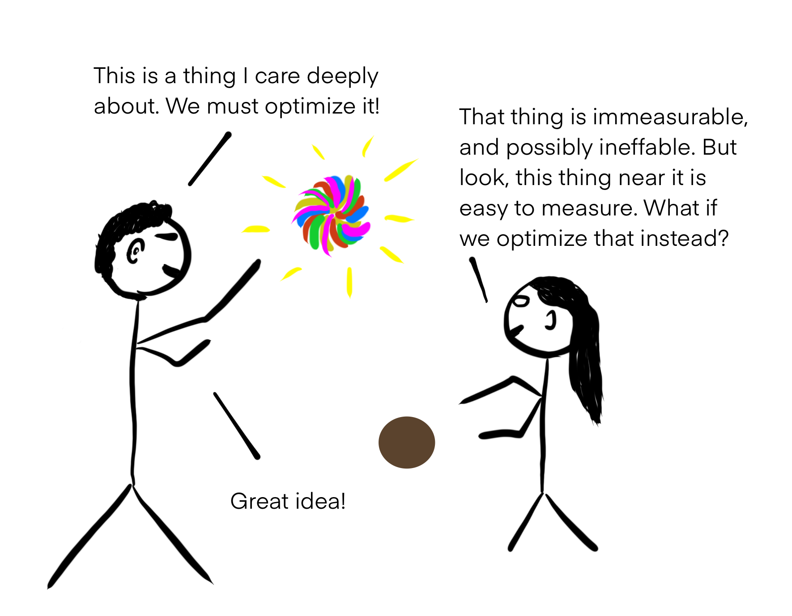
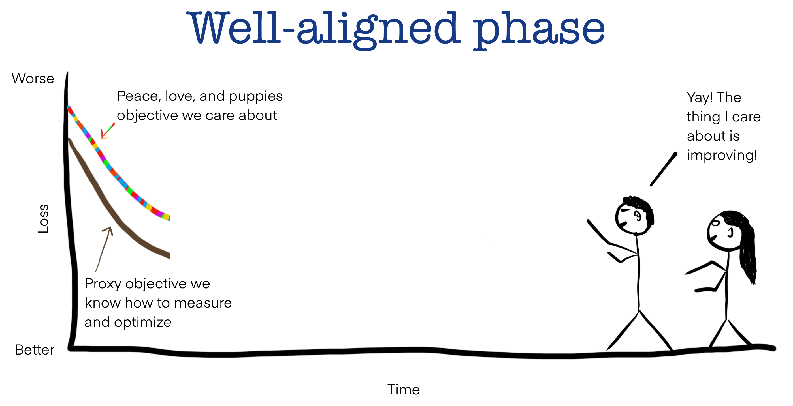
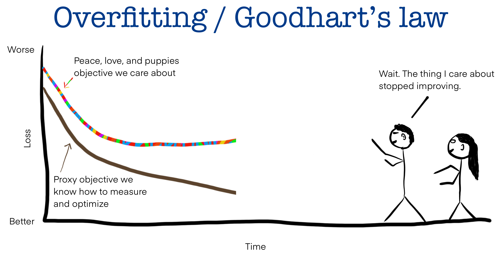
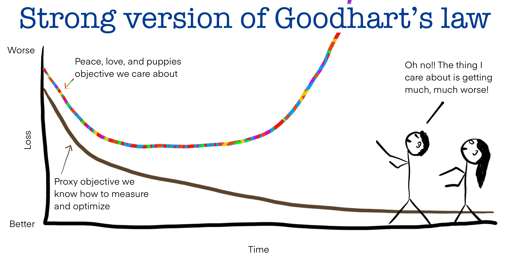

+++
date = '2026-04-06T23:20:00+08:00'
draft = false
title = '见贤思齐'
isCJKLanguage = true
+++

本文致力于 build up 一个能动、主观筛选的关注列表，用于 track 一些我认为值得认真学习的人物，整理 ta 们的博客、访谈与论文等等高质量思考和成果。

见贤思齐、共同进步。

## sohl dickstein

### who is this

### what struck me

网址：[Click here to open the link](https://sohl-dickstein.github.io/2022/11/06/strong-Goodhart.html#endnote-notoverfitting)

非常有意思的一篇文章，把货币政策背景下的 Goodhart's Law 推广到机器学习的训练过程中。
Goodhart's Law 最有代表性的描述：
> When a measure becomes a target, it ceases to be a good measure

我们手中的训练集好比用于衡量政策有效性的指标，让模型学习训练集中特征的过程，可以和要求提高指标的过程相对照。

由于在实际应用中，和真实场景高度符合的数据集是极难获取的，特征维度不足、数量不足都是问题，因此我们很难通过训练让模型完美学习到真实世界的情况，往往只能用最接近真实场景的数据集进行模型训练。

随着时间发展，刚开始模型在测试集（可以用来抽象替代真实世界情况）上的表现会随着训练集上的表现提升而提升，就好比指标作为目标效果的 proxy ，倘若提升了，那么我们目标的效果也会提升。

但随着模型越来越熟悉训练集，它会呈现出“过拟合”的趋势，在训练集上表现越来越好，但是在测试集上的表现停滞不前（cease），这正和 Goodhart's Law 所描述的“手段被当成目标时，真正要优化的对象停止进步了”的规律相吻合。

如果我们无视这一切呢？于是模型

（Coming Soon）

附作者所画示意图：

相关概念：
- Campbell's law（任何定量社会指标被用于社会决策越多，它就越容易受到腐败压力的影响）
- McNamara fallacy（不要忽略定性指标）

### follow up/trace back

