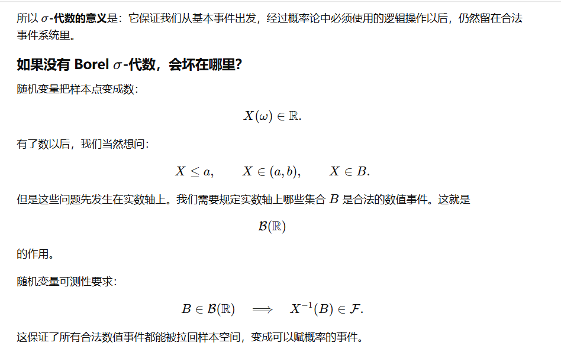
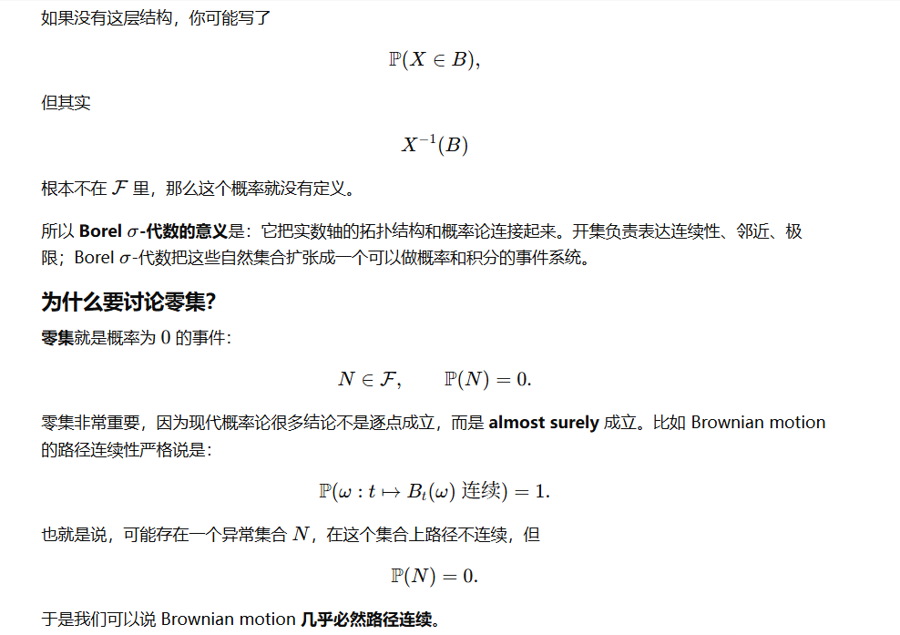
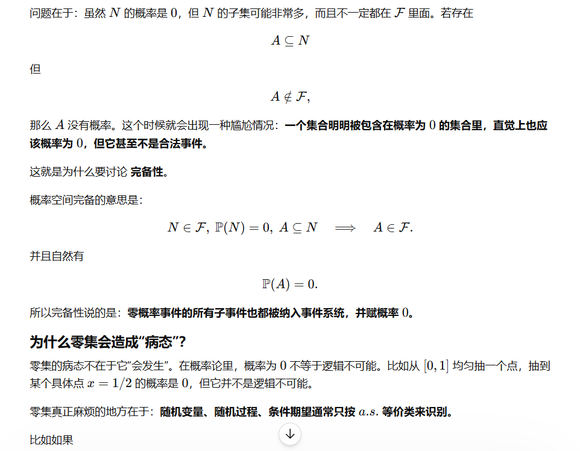
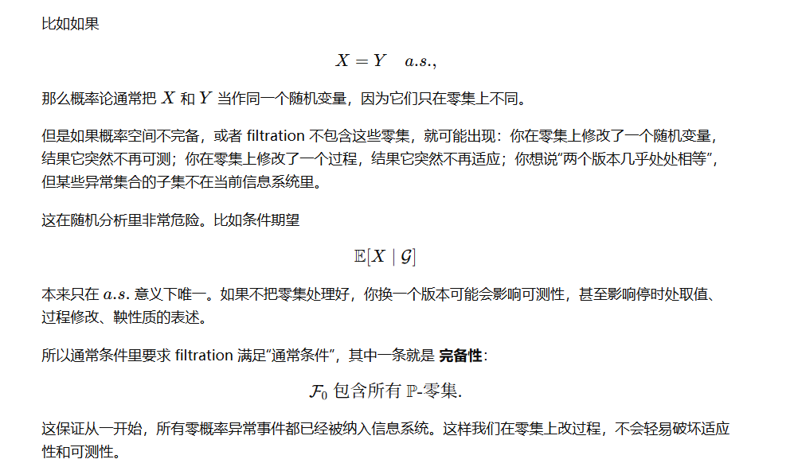

+++
date = '2026-06-08T03:20:00+08:00'
draft = false
title = '*The Art of Fixing'
isCJKLanguage = true
math = true
+++

大学第一课，$\varepsilon$-语言。

最基础地，我们讨论连续函数的定义，先用 $\varepsilon$ 固定自变量范围，再用 $\delta$ 控制因变量的幅度。

实数连续统中，我们发现实轴上有非有理数的点，这些点可以用有理数去逼近得到，把这个非有理数点集合有理数点集并起来，就可以得到“完备”的实轴，再也没有空的地方了（也许）。

在这个过程中，我们也引入了可列/不可列的概念，我们经常用数列来表示极限。

在实变函数中，我们不满足于在实数轴上讨论连续性，我们还要讨论更抽象的集合、拓扑结构，有意思的是，条件上先与后的调整，往往会带来意想不到的效果。

另外，实变函数的学习中，把定义和其背后的意义摸清楚是非常重要的，有时候理解比死记硬背更重要。

# 附：金随中的实变函数（测度论）

## 例1 σ-代数流的右连续性理解

由于我们讨论 σ-代数的时候，有一个很好用的性质叫做可列并/可列交封闭，所以我们一般把不可列的问题先转化为可列进行处理。

首先这里表达右连续性和实变中我们学过的测度论入门的知识异曲同工，通过递减的性质，利用实数连续统，用有理来代替无理，然后用可列并代替不可列并。

这里相等的证明非常有意思，体现了先后的艺术——无理点更多，那么理应是不可列并要大过可列并的，可是无穷的世界是神秘的，如果我们先固定好一个无理点s，任何一个s都可以，满足s < t，我们总能找到一个有理点 t-1/n 比它要大。也就是说，对于所有s都是这样，有 \(\mathcal{F}_s\subset \mathcal{F}_{t-\frac{1}{n}}\) ，那么我们可以通过定义证出这个不可列并是可列并的子集。

## Borel σ-代数

### 是什么？

所有开集生成的σ-代数

> 问：所有开集指的是哪里的开集，如果不只是讨论 \(\mathcal{R}^n\) 的子集的话，以及这个 \(\mathcal{R}^n\) 的作用是什么，我们讨论的空间由什么组成？换句话说我们讨论的对象是什么，以及我们要讨论和这些对象有关的哪些东西，需要赋范吗？需要距离吗？
> 
> 答：（待思考）

意义在于？

### 在概率论中的意义

出现在随机变量\随机过程的定义中：

在概率空间三元组 \((\Omega,\mathcal F,\mathbb P)\) 中，我们称映射 \(X:\Omega\to \mathbb{R}\) 为随机变量，若满足：

- 对于 \(\forall\) Borel集 \(B \subset \mathbb{R}\)，有
  \[X^{-1}(B)\in \mathcal{F}\]

  \(i.e. \) 对于 \(\mathbb{R}\) 中所有开集生成的 σ-代数 \(\mathscr{B}(\mathbb{R})\)，有
  \[X^{-1}(\mathscr{B}(\mathbb{R}))\subset \mathcal{F}\]

它规定了实数轴上哪些数值集合是合法的“观测事件”，能够拉回样本空间找到对应的东西，是有意义的。为什么会没有意义呢，比如说如果关于可列并不封闭，那么我们就无法讨论极限。比如前面举出的例1.

可以把 Borel σ-代数理解成：由拓扑上自然可观察的集合生成出来的最小概率事件系统。

以下待整理：

