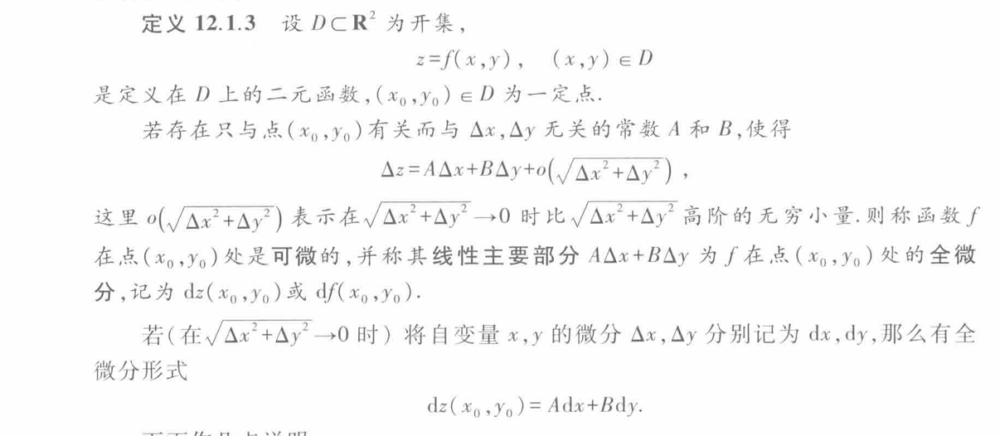

+++
date = '2026-05-18T13:00:00+09:00'
draft = false
title = '微分的前世今生'
isCJKLanguage = true
math = true
+++

我们首先通过微分，以及极限，定义了导数。

在可微的基础上，我们有公式:$$y(x+\Delta x)-y(x)=A(x+\Delta x-x)+o(\Delta x)$$$$\Delta y=A\Delta x+o(\Delta x)$$

(说明待补充)

但不是所有函数都可微、可导的，什么是可微？可以写成一个微分形式就叫可微，什么叫可导？导数的表达式是一个极限，这个极限存在就是可导，由于极限分为左极限和右极限，我们也存在单侧可导的概念，我们称两侧极限为左导数和右导数。

那么什么时候可导呢？左右导数都存在且相等是可导的充分必要条件。左右导数至少有一个不存在，或者两个都存在，但两侧导数不相等（$|x|$），我们都无法得出可导条件。

一元函数中，可微和可导是等价的

（说明待补充）

然后我们讨论多元函数。

一元函数的时候，输入向量为1维，我们此时还只需要在一个轴上讨论左右两个方向。

但多元函数，以二元函数为例，顺理成章地，我们会想到，我们是不是需要在XY平面中讨论每一个方向上的导数是否存在呢（？）

