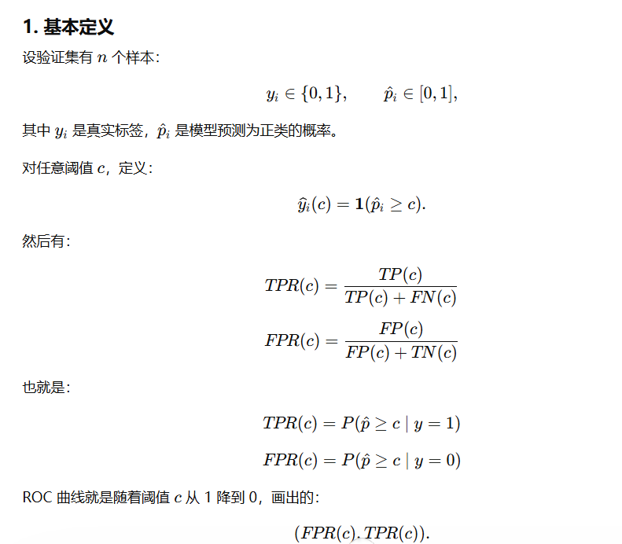

+++
date = '2026-06-10T13:00:00+09:00'
draft = true
title = '组会周记'
isCJKLanguage = true
math = true
+++
# 0610

## 时间地点
- 0610 23:40-1:40
- 宿舍走廊

## Questions：

### 老师提出的

#### AUC是怎么算的？

AUC是ROC曲线下的面积，范围0.5-1（因为ROC曲线可以关于对称轴翻转）

AUC一般用于讨论分类问题的优劣，首先横轴是FPR假阳性率，所有真实值为阴性的群体中，被错误地判定为阳性的比例；纵轴是TPR真阳性，所有真实值为阳性的群体中，被正确地判定为阳性的比例。我们设定一个阈值c，如果预测出来为正类的概率 \(\hat{p}_i\) ，那么把概率大于c的判为正类，把概率小于c的判为负类。

由于我们的两个目标，最大化 1-FPR 和 TPR 二者不可兼得，例如，所有样本我都说它是阳性，那么TPR就是1，FPR也是1；所有样本我都说它是阴性，那么TPR就是0，FPR也是0，因此我们要根据分类问题的目的做取舍，哪种错误更加不能容忍？

Generally，当我们把这个阈值c从0到1都取一遍，得到的就是ROC曲线，每一个点可以写作 \[(FPR(c),TPR(c))\]

- sensitivity matrix是怎么算的？

用的是Jacobian，对潜变量z做一个小扰动，看 \(\hat x\) 的变化怎么样（x是什么？），以此来研究“敏感”程度，以观察潜变量对变量的贡献。

> 看 decoder reconstruction \(\hat X_{\text{expo}}\) 对 latent perturbation 的响应。

不用loading matrix了，因为loading matrix是：但是这两个完全无法对应起来。

我们用score matrix，记得调整一下顺序

- 关于supervised，想清楚具体是怎么学习的，哪阶段做什么，头是什么意思.

### 自己发现的

- 代码熟悉程度

- data leakage
所以这些数据究竟是什么，是怎么来的，是怎么算的，pre1、2、3 能精准推出 preall 吗

masking的讨论，它的reconstruction具体来说是怎么讨论的，结论是什么

## 小结

接下来首先做score matrix，

然后尝试RNN，具体是怎么做的？

## To-do

# 0613

## 时间地点

planned：20-21 图书馆6楼

actural：20:30-21:40 图书馆7楼

## 准备：

### 任务：

- 确认结果中的异常情况；
- 跑6个misspecification
- 画图
- 同步到texpage

### 执行

#### 行动1

花了3h左右梳理实验和一些参数的问题。

实验设计：一共有5个层级，分别为SES,EXP,PERI,DEH和结局，大小为4,5,4,6,1.

我们上次设计constraint的逻辑是：
- None 什么也没有
- Strong：所有违反时间层级的边都进黑名单
- Weak：只有结局不能指向其他变量一个黑名单
- Misspecified：在strong的基础上，true DAG 中有 10% 的正确边进了黑名单
- Graphical Lasso

我们看的指标是：
- Recall, Precision and F1 (两个意义下，一个skeleton，一个directed)：越高越好，我们更想要“宁愿有错边也不要漏掉正确边/宁愿漏掉边也不要错边”
- Reversal Rate
- true_arc_strength：true DAG 中真实边在 bootstrap 网络里出现的平均稳定性
- false_arc_strength：false edges 在 bootstrap 网络里出现的平均稳定性
- n_est_edges_mean

参数：
- 样本量 n = 5000
- bootstrap次数 = 200
- runs = 100：生成多少次新的一个DAG和新的一组数据，比如第一个run是DAG1，然后这个DAG对应有5000个样本，我们bootstrap是在这5000个样本中抽？
- p = 20：一共20个节点
- edge_multiplier = {1, 2} 
  - |E| = {p, 2p} ：边(edge)的条数是节点个数的多少倍
- rho = {0.2, 0.8}：自相关系数，具体是什么？怎么参与进去？
- tau = {0.4, 0.8}：threshold，只有200次boot中，这条边出现的比例超过tau，这条边才能进入这一个run的图里（那么方向是怎么决定的呢？
- core 边：有12条边是作为一个防止随机生成的DAG没意义而一直存在的，其他8条边是随机出现。

我希望包含以下内容，不要太多没必要的东西。首先是我们上次的进度，到哪里了

生成了演讲稿

#### 行动2

生成了ppt

#### 行动3

生成了提词器

### 讨论的问题：

true DAG在生成过程中的问题：只有跨层级的边，没有层级内部的边

misspecified要怎么设计

## 组会小结

## 下一步任务
格式：
预计用时、ddl、准备工作（降低启动门槛）
产出物+描述+具体操作+可能发生的拓展

### 一段可以给intro参考的文字

- 预计用时：30min
  - 10min心理准备
  - 20min正式工作
- ddl：6/14晚上
- 准备工作：拿到潘老师的转写
- 产出物：一段可以给intro作参考的文字，潘老师存下来。
- 描述：梳理华南农业大学的文章用于参考写introduction。
- 具体操作：让gpt整理潘老师讲的内容，发一小段给潘老师保存，重点拆解论文中 CBN 模型的方法学优劣势，​​通过它为我们的方法学研究背书​​，有这样的需求，我们系统地讨论它
- 可能发生的拓展：找一找其他的论文看

#### 重跑实验

- 预计用时：
  - 15min心理准备
  - 2h正式工作，整理和梳理代码
  - 45min+5h+5h+5h+5h+5h+4h跑代码
    > 意味着明天必须早早就把实验跑上，因为长虹老师那边的论文还要跑实验
- ddl：6/18晚上(完成上次总共100个run了)
- 准备工作：有持续电源的电脑，清晰的大脑，完好的网络，一件可以同时干的事情
- 产出物：
  - result_summary.csv：用于分析指标，这个图和true DAG比较起来，学得好不好
  - edges.csv：用于画DAG图
  - 
- 描述：根据我们这次的讨论重新整理和跑实验
- 具体操作：整理好代码，管理好版本，给每一份代码+结果都命名好，加上一份README。
- 可能发生的拓展：（暂无）

# 0620

## 准备

## 组会小结

##

# 0701

## 时间地点
- 0610 23:40-1:40
- 宿舍走廊
